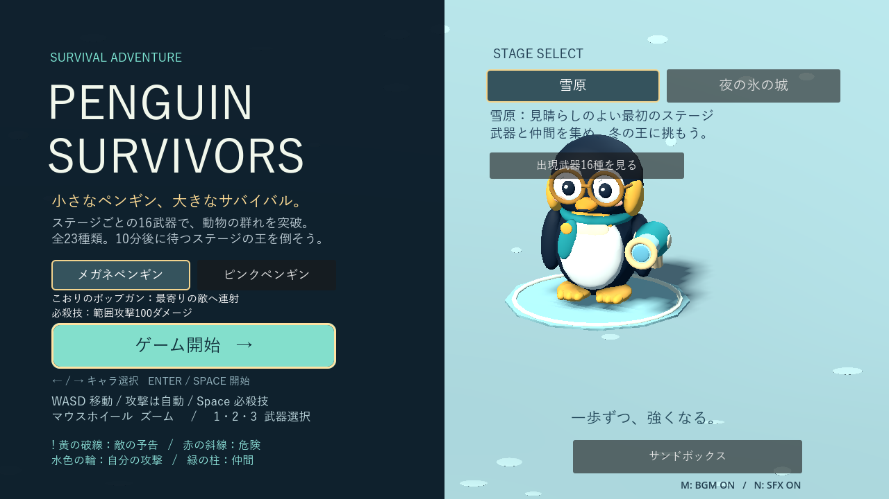
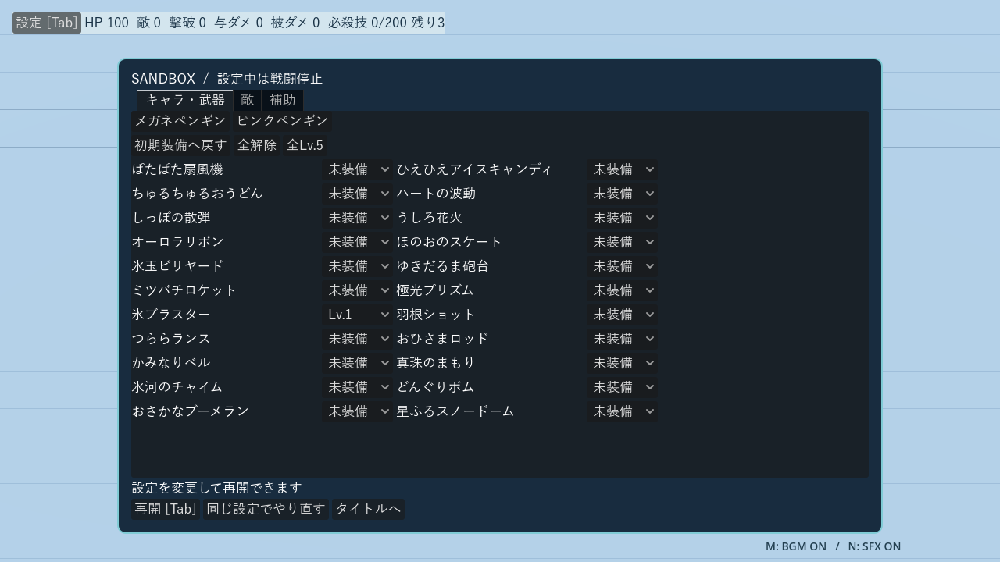
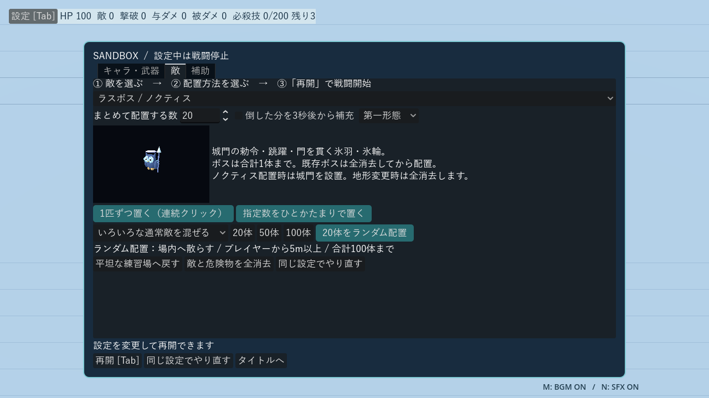
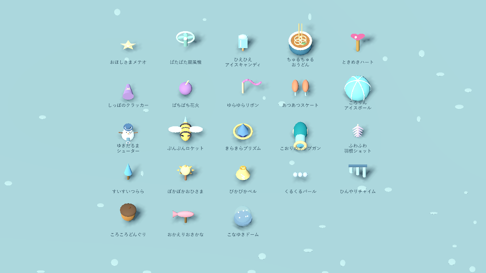
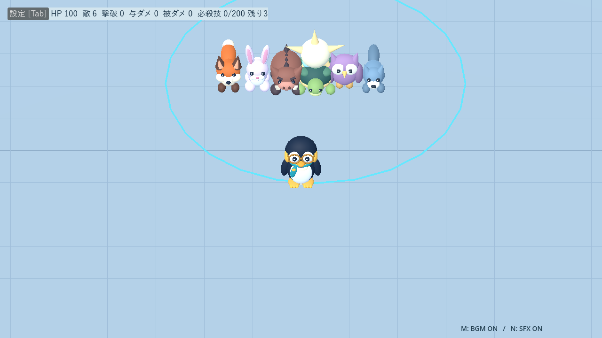
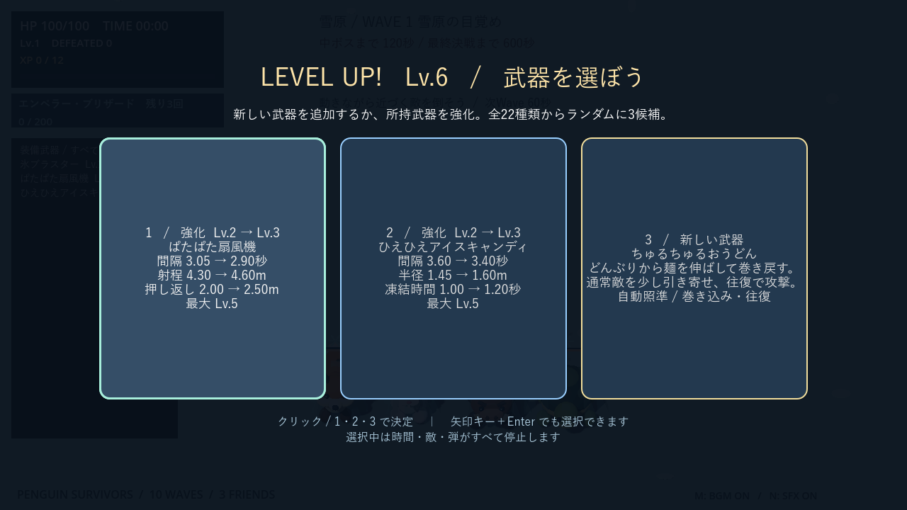
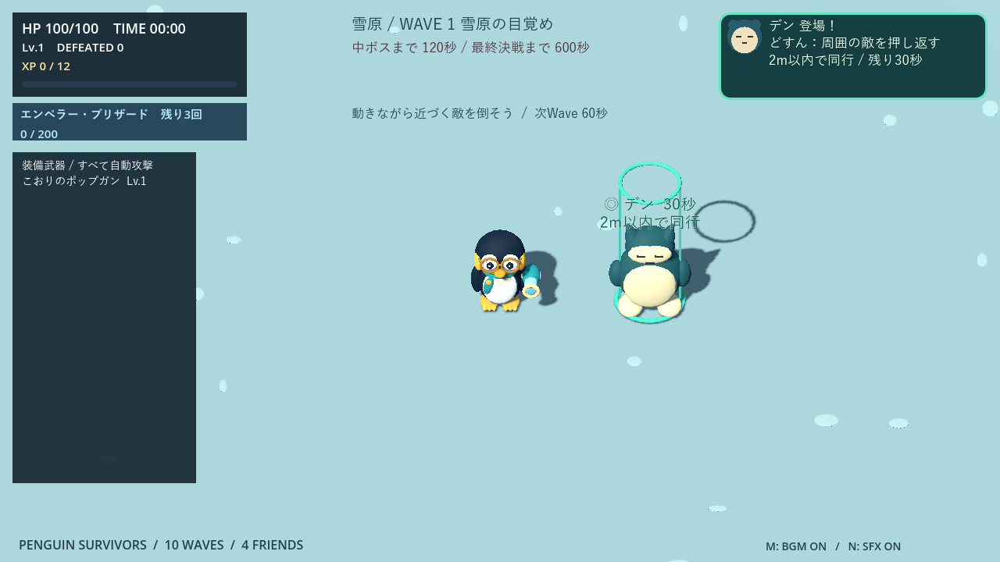
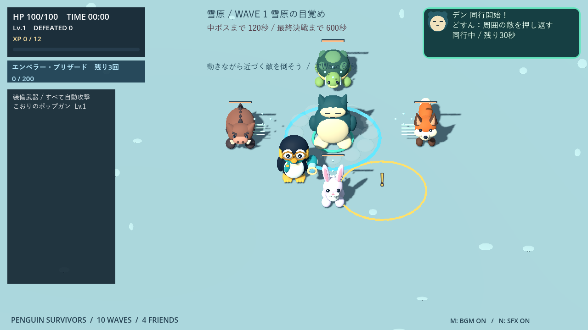
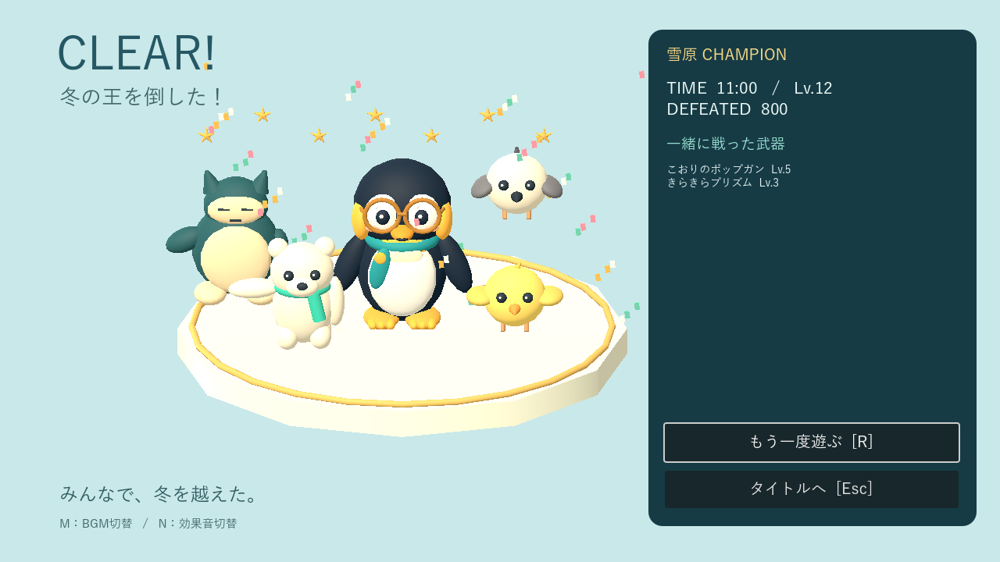
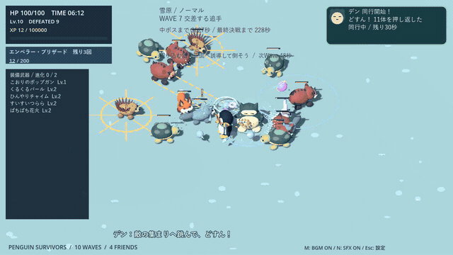

# Penguin Survivors

Godot 4 + GDScriptで作った、見下ろし視点の3Dサバイバルゲームです。ペンギンを動かして動物の群れをかわし、武器を集めて10分後のラスボスに挑みます。

**2キャラ・2ステージ・23武器・4匹のサポート**。キャラクターと背景はPrimitive Meshで構成し、BGM・効果音も同梱しています。外部アセット・プラグイン・Blenderは不要です。

## ガイド

- [起動・操作](#起動操作)
- [ゲームの流れ](#ゲームの流れ)
- [サンドボックス](#サンドボックス)
- [キャラクターと必殺技](#キャラクターと必殺技)
- [サポート](#サポート)
- [武器一覧・アップグレード方針・特殊効果](docs/weapons.md)
- [武器の見た目・新旧名称の対応](docs/weapon-appearance.md)
- [ステージ・Wave・敵・ボス](docs/stages.md)
- [開発・テスト・音源生成](docs/development.md)
- [過去の仕様・検証記録](docs/development-history.md)

## 起動・操作

確認環境は**Godot 4.7.2 / Compatibilityレンダラー**です。

1. Godotで `project.godot` を開きます。
2. **F5**でタイトル画面を起動します。
3. キャラとステージを選び、「ゲーム開始」またはEnter／Spaceで開始します。

すべてのキャラ・ステージは最初から選択可能。同一起動中は選択を保持し、再挑戦は同じキャラ・ステージで成長をリセットします。

| 操作 | 内容 |
|---|---|
| WASD | 移動。前方・後方武器の向きも決まる |
| 攻撃 | 装備した武器が自動で発動。照準方式は武器ごとに異なる |
| Space | ゲージ満タン時にキャラ固有の必殺技 |
| クリック／1・2・3 | レベルアップ時の武器選択。矢印＋Enterも対応 |
| マウスホイール | ズーム |
| M／N | BGM／効果音のミュート |
| R | ゲームオーバー・クリア後に再挑戦 |
| Esc | ゲームオーバー・クリア後にタイトルへ戻る |

タイトルではクリック／左右キーでキャラ、ステージボタンでステージを選びます。通常プレイにPythonは不要です。

## サンドボックス

タイトルの「サンドボックス」から、自由に戦闘を試せる練習場へ入れます。**Tab／設定ボタン**で一時停止し、2キャラ・23武器の未装備〜Lv.5・敵編成を変更できます。

- **キャラ・武器**：個別に装備・レベルを指定。「初期装備へ戻す」「全解除」「全Lv.5」も利用できます。
- **敵**：全通常敵・手下・両ステージの中ボスとラスボスを選択。「1匹ずつ置く」では床を連続クリックして配置。「指定数をひとかたまりで置く」も選べます。配置中も戦闘停止。赤い輪は配置不可、右クリックまたは完了ボタンで設定へ戻ります。
- **ランダム配置**：選んだ種類だけ、またはいろいろな通常敵を混ぜて一括追加。20・50・100体のボタンで数を選び、配置ボタンを押します。壁・他の敵を避け、プレイヤーから5m以上離れた床へ散らします。追加後も停止したままなので、確認して「再開」できます。
- **補充**：通常敵・手下は撃破3秒後から補充可能。配置済みの編成ごとに切り替えられます。敵総数100体、ボスは合計1体までです。
- **補助**：無敵、全回復、必殺技の充填・回数回復、敵の行動停止、0〜10分相当の敵の強さを設定。強さの変更は次の生成から適用します。
- **試験情報**：HP・敵数・撃破数・実際に与えた／受けた累計ダメージ・必殺技ゲージを表示。各計測をリセットできます。

通常のWave・武器抽選・自動増援・自動サポート・クリアは停止し、ラスボスの形態も選択した状態で固定します。ノクティスの配置を開始すると城壁と4門が現れ、門操作や跳躍を試せます。通常敵を追加しても城壁は維持されます。「平坦な練習場へ戻す」またはグレイシャーの配置開始で解除できます。**地形変更は敵と攻撃を全消去し、プレイヤーを中央へ戻します。**

武器変更では味方の攻撃・設置物を消去して装備を作り直します。キャラ変更では装備構成を維持してHPと必殺技を初期化します。死亡時は設定画面の「同じ設定でやり直す」で編成を再配置できます。設定は同一起動中だけ保持し、本編の選択・成長には影響しません。

## ステージ別の武器

本編は共通9種＋限定7種の**各16種類**。きらきらプリズムは両ステージ共通です。雪原では常時周回する「くるくるパール」、城では長い待ち時間の後に巨大な星を落とす「おほしさまメテオ」を使えます。タイトルの一覧ボタンで所属を確認でき、サンドボックスでは全23種類を利用できます。

## ゲームの流れ

1. **敵を倒してXPを獲得。** 必要XPは12、22、34、48、65…と増えます。
2. **最大3候補から新武器または強化を選択。** 選択中は戦闘停止。武器は蓄積し、各Lv.5まで強化できます。
3. **60秒ごとにWaveが変化。** 通常は2・4・6・8分に中ボスが登場します。
4. **10分でラスボス戦へ。** HP半分で第二形態へ移行。ボスを倒すと、ペンギンとサポートたちの祝勝画面になります。

新規取得は攻撃の種類を増やし、強化は威力・射程・範囲・弾数・持続などを伸ばします。最大強化した武器は候補から外れます。詳しい数値と設計方針は[武器ガイド](docs/weapons.md)へ。

### 危険と味方の見分け方

| 表示 | 意味 |
|---|---|
| 黄色い破線・「！」・縮む輪 | 敵の攻撃予告 |
| 赤橙の太い境界・床の斜線 | 発動中の危険範囲 |
| 赤橙の芯・暗い縁・進行方向の尾 | 敵弾 |
| 細い水色の境界 | プレイヤー側の範囲攻撃 |
| 友好色のビーコン・顔アイコン | サポートの待機位置 |
| 白青の鍵・点滅 | 城門の閉鎖予告。閉鎖自体にダメージはない |

## キャラクターと必殺技

HP100・移動速度・当たり判定は共通。初期装備と必殺技が異なります。

| キャラ | 外見 | 初期武器 | 必殺技 |
|---|---|---|---|
| メガネペンギン | 黒白の体・丸メガネ・青緑のマフラー | こおりのポップガン | エンペラー・ブリザード：100ダメージ |
| ピンクペンギン | ピンクの体・眼鏡なし・薄いチークと化粧 | ときめきハート | ラブリー・ブルーム：80ダメージ＋HP20回復 |

必殺技は**撃破報酬200XP分で充填、Spaceで発動、1プレイ最大3回**。武器用XPは消費しません。満タン時には通知音と技名を表示します。

発動位置を中心に半径12mへ一度だけダメージを与え、範囲内の敵弾・毒雲を消去し、被弾無敵を最低1秒に延長。壁越しにも有効ですが、潜行中のモグラは対象外で、ボスの予告・突進は解除しません。回復の蓄積や復活はありません。

## ステージ

| ステージ | 特徴 | ラスボス |
|---|---|---|
| 雪原 | 内部障害物のないフィールド。10種の通常敵を段階的に紹介 | 冬の王・グレイシャー |
| 夜の氷の城 | 開閉する4門と低い城壁。11種の通常敵、専用中ボス4体 | 氷城の梟王・ノクティス |

各ステージは独立した10分間の道中＋決戦です。装備・成長は他ステージへ持ち越しません。城ではゴーストが門と城壁を通過し、ノクティスが門を飛び越え、閉門を貫通する攻撃を使います。

[Wave表・敵の特徴・城門とボスの詳しいルール](docs/stages.md)

## サポート

出現後30秒以内に**2mまで近づくと、30秒間同行**します。武器枠は使いません。右上カード・ビーコン・画面外案内が目印です。

| キャラ | 援護 |
|---|---|
| シマエナガ | 同行開始と6秒ごとにHP＋5、最大25回復 |
| シロクマ | 同行中の被ダメージを30%軽減 |
| ひよこ | 0.65秒ごとに自動射撃。威力は `3 + floor(Wave番号 / 3)` |
| デン | お腹で着地し、半径5mへ威力2＋3mの押し返し。最大5回 |

4匹を重複なしで一巡し、一巡の境界でも同じキャラは連続しません。最初は75〜95秒、以後は退出から110〜140秒後に出現。通常出現は9:30までで、決戦には第一形態1回・第二形態最大2回の専用枠があります。同時に1匹、安全な場所がないときは延期します。武器選択・ボス演出中は同行時間も止まります。

### デンの「どすん」援護

青緑の丸い体とクリーム色のお腹、眠そうな目が特徴。同行開始0.6秒後から6秒間隔で、最大5回着地します。着地時のデンを中心に半径5mへ2ダメージを1回与え、通常敵と決戦の手下を0.6秒で3m押し返します。中ボス・ラスボスにはダメージだけ。潜行中の敵と壁・閉門越しには当たりません。

扇風機と押し返しの待ち時間を共有し、凍った敵も押せます。敵弾・毒雲は消しません。倒した敵の報酬は通常どおり加算され、専用効果音はNミュートに対応します。祝勝画面には出会っていなくても4匹全員が登場します。

## デモ動画

**[音声付きMP4を見る（60秒・720p/60fps）](docs/videos/penguin-survivors-demo.mp4)**

デンの押し返し援護、新しい武器モデル、両キャラの必殺技、雪原と氷の城、ノクティスの第二形態、4匹の祝勝画面を収録しています。撮影用に時間・装備・敵配置・HPを設定しており、通常プレイの攻略記録ではありません。**終盤・クリア画面のネタバレを含みます。** [収録方法](docs/videos/README.md)

掲載画像もGodot実画面を撮影用の配置で収録しています。ゲームの詳細は各ガイド、過去の比較数値やスクリーンショットは[検証記録](docs/development-history.md)にまとめています。
