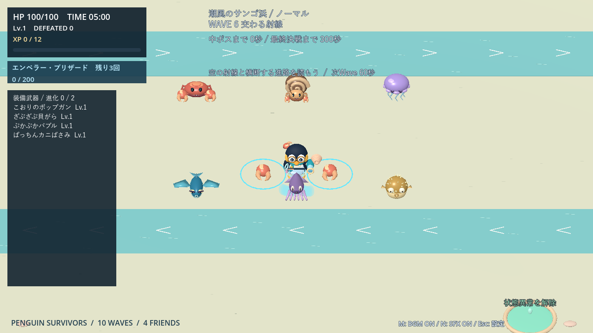

# Penguin Survivors

ペンギンを動かして動物の群れをかわし、武器を集めて10分後のラスボスに挑む、Godot 4製の3Dサバイバルゲームです。

**2キャラ・3ステージ・基本26武器＋進化11種・4段階の難易度**。Primitive Meshで作ったキャラクターと、オリジナルのBGM・効果音を収録しています。

## デモ動画

**[音声付きデモを見る（72秒・720p／60fps）](docs/videos/penguin-survivors-demo.mp4)**

デンの跳躍援護、進化武器、両キャラの必殺技、雪原と氷の城、ノクティスの移動氷壁、ステージ・同行した仲間・使用武器を反映したリザルトを紹介します。撮影用に装備・進行・配置を調整した実機映像です。**ボス第二形態とクリア画面のネタバレを含みます。** [収録内容・方法](docs/videos/README.md)

## 起動する

1. **Godot 4.7.2**で `project.godot` を開きます（Compatibilityレンダラーで確認）。
2. **F5**でタイトル画面を起動します。
3. キャラ・ステージ・難易度を選び、「ゲーム開始」またはEnter／Spaceで開始します。

外部アセット・プラグイン・Blender・Pythonの追加は不要です。すべてのキャラとステージを最初から選べます。

## 基本操作

| 操作 | 内容 |
|---|---|
| WASD | 移動。装備した武器は自動で攻撃 |
| Space | ゲージ満タン時に必殺技（1プレイ最大3回） |
| クリック／1・2・3 | レベルアップ時の武器選択。矢印＋Enterにも対応 |
| Esc／パッドStart | ポーズ・設定 |
| マウスホイール | ズーム |
| M／N | BGM／効果音のミュート |
| R | クリア・ゲームオーバー後に再挑戦 |
| Tab | サンドボックスの設定を開閉 |

ゲームパッドにも対応。音量・味方エフェクトの濃さ・画面の揺れ・キー配置は設定で変更できます。[設定とパッド操作の詳細](docs/play-guide.md#ポーズ設定)

## 遊び方

1. **敵を倒す**：XPを集め、最大3候補から新武器・強化・進化を選びます。選択中は戦闘が止まります。
2. **構成を育てる**：基本武器はLv.5まで。単体進化はLv.2から、合体は素材2武器がLv.1から選択可能。進化・合体は合計2枠です。
3. **援護を迎える**：サポートへ近づくと30秒間同行。回復・防御・射撃・押し返しで助けてくれます。
4. **決戦に挑む**：60秒ごとにWaveが変わり、中ボスを経て、9:30から30秒の掃討、10分でラスボス戦へ。残った通常敵と中ボスのHPに応じてボスHPが増えるため、決戦前に敵を減らしましょう。終了後はリザルトで武器と援護の活躍を確認できます。

ステージごとの基本武器プールは共通9種＋ステージ別7種の16種類。**きらきらプリズムは全ステージ共通**です。強化は威力だけでなく、射程・範囲・弾数など武器に応じて成長します。[武器一覧](docs/weapons.md) · [進化レシピ](docs/evolutions.md)

### キャラクターとステージ

| キャラ | 初期武器 | 必殺技 |
|---|---|---|
| メガネペンギン | こおりのポップガン | エンペラー・ブリザード：強力な範囲攻撃 |
| ピンクペンギン | ときめきハート | ラブリー・ブルーム：範囲攻撃＋回復 |

| ステージ | 特徴 |
|---|---|
| 雪原 | 障害物のないフィールド。群れを誘導して戦う |
| 夜の氷の城 | 開閉する門と城壁でルートが変わる上級ステージ |
| [潮風のサンゴ浜](docs/beach.md) | 潮で流れる浅瀬、状態異常を解除する泉、巡回する海の敵 |

難易度は**やさしい／ノーマル／ハード／エキスパート**。初回はノーマルで、途中変更はできません。再挑戦は同じキャラ・ステージ・難易度で成長をリセットします。[難易度の詳細](docs/difficulty.md)

### 危険の見分け方

| 表示 | 意味 |
|---|---|
| 黄色の破線・「！」 | 敵の攻撃予告 |
| 赤橙の境界・斜線・弾 | 発動中の敵の攻撃 |
| 細い水色の境界 | 味方の範囲攻撃 |
| 友好色のビーコン・顔アイコン | 近づくと同行するサポート |
| 白青の鍵・点滅 | 城門の閉鎖予告。閉鎖自体にダメージなし |

## 自由に試す：サンドボックス

タイトルから練習場へ入り、キャラ・基本26武器と進化11種・全敵・ボス両形態を自由に試せます。武器レベル、ランダムな敵の一括配置、無敵、敵の行動停止、必殺技の再充填に対応しています。

**Tabで設定を開くと戦闘停止。** 本編の成長や選択には影響しません。[配置方法・補助機能・地形の切り替え](docs/play-guide.md#サンドボックス)

## 詳細ガイド

| 調べたいこと | ガイド |
|---|---|
| 設定・サンドボックス・キャラ・サポート | [プレイガイド](docs/play-guide.md) |
| 武器の性能・強化・特殊効果 | [武器一覧](docs/weapons.md)／[進化・合体](docs/evolutions.md) |
| Wave・敵・門・ボス | [ステージと敵](docs/stages.md) |
| 難易度の倍率 | [難易度](docs/difficulty.md) |
| リザルトの貢献集計 | [リザルト](docs/results.md) |
| モデル・見た目 | [武器](docs/weapon-appearance.md)／[敵](docs/enemy-refresh.md) |
| 開発・テスト・比較記録 | [開発ガイド](docs/development.md)／[過去の記録](docs/development-history.md) |

掲載画像と動画はGodotの実画面です。詳しい仕様と検証結果は各ガイドへまとめています。
