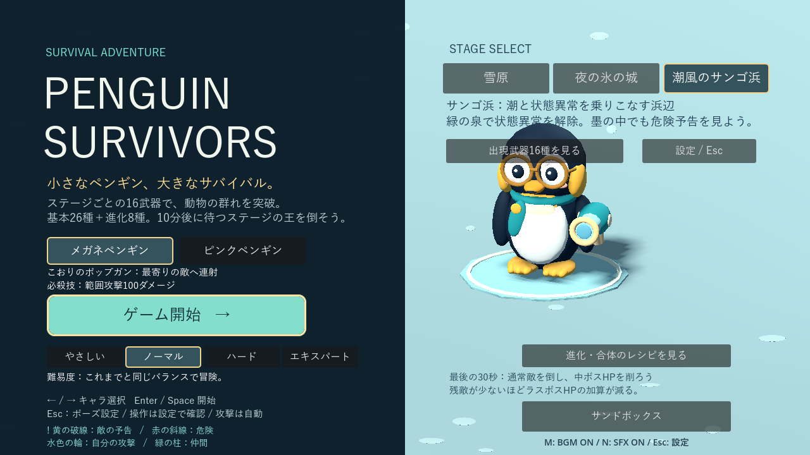
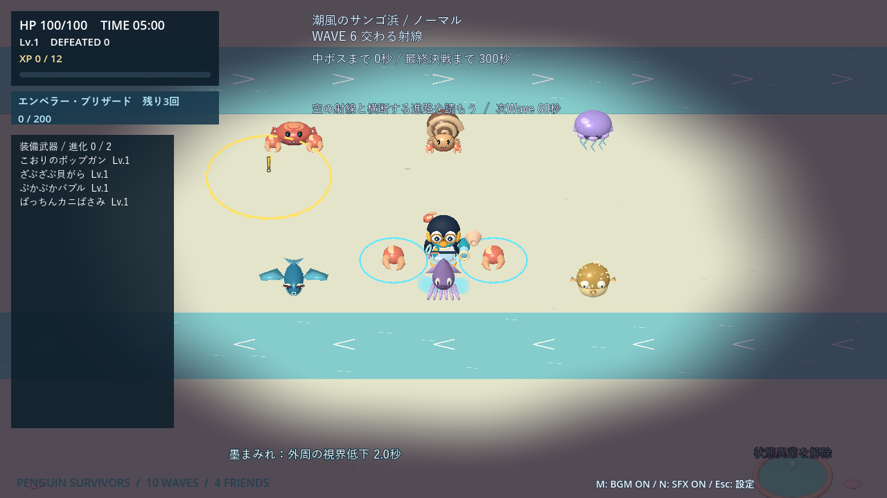
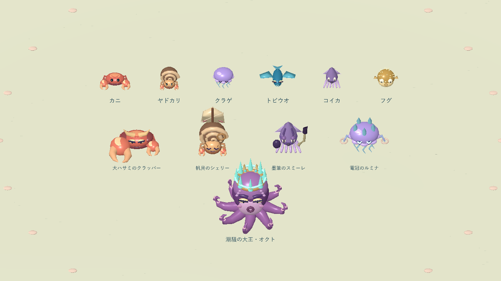
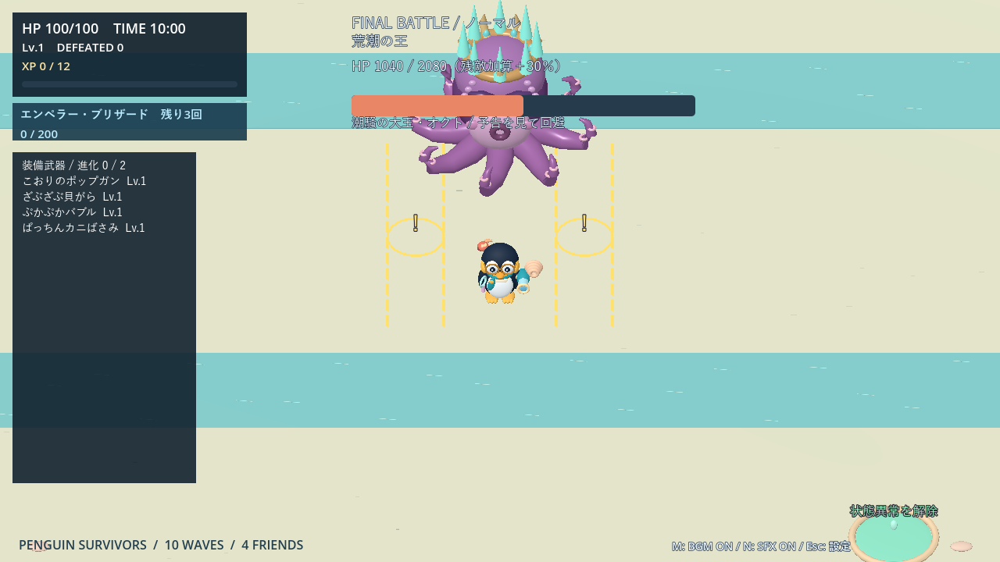
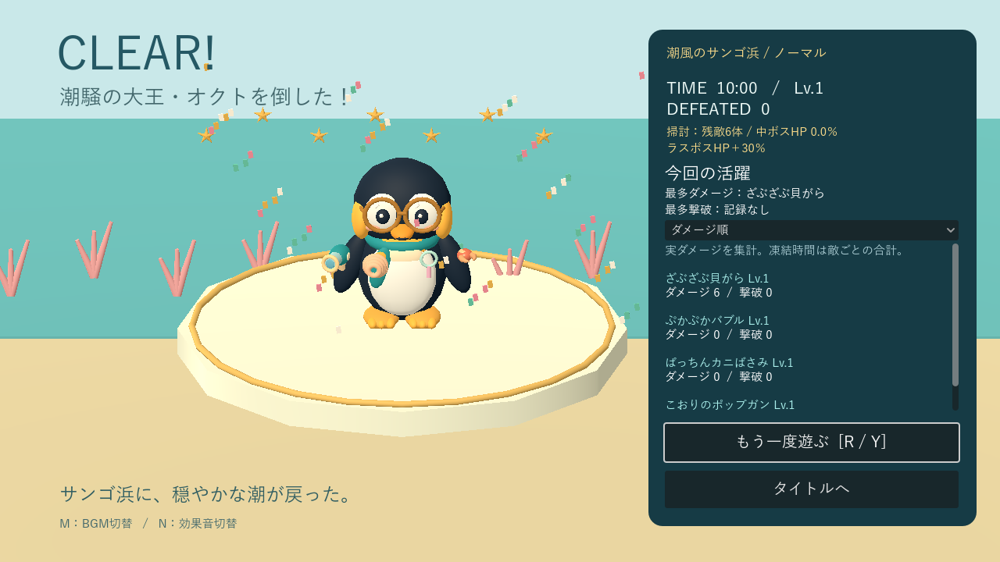

# 潮風のサンゴ浜

[README](../README.md) · [ステージと武器プール](stages.md) · [武器の成長](weapons.md)

タイトルの3番目から最初から選べる独立した10分ステージです。雪原・城から装備やレベルは引き継ぎません。2キャラ、4難易度、サポート4匹、必殺技、進化、9:30からの掃討と残敵によるラスボスHP加算に対応します。

## 潮と泉

浅瀬はZ＝±8m、幅4mの2本。開始60秒まで潮は止まり、その後は**白い矢印で2秒予告→6秒流れる→12秒休止**。2本の流れは逆向きで、周期ごとに反転します。潮は1.2m/秒、ダメージはなく、外周から押し出されません。

- ペンギンと地上の通常敵が流れます。クラゲ・トビウオ・中ボス・ラスボス・サポートは流れません。
- 凍った敵、ノックバック中の敵は潮より状態異常を優先します。
- 通常の飛翔弾・設置物は流れません。新武器のバブルだけは流れに乗ります。
- 中ボス戦と撃破後休息、9:30の掃討では停止。決戦中はオクトが潮を操作します。

緑の泉は(-14,-16)、(14,16)の2か所。半径1.5mへ入ると状態異常をすべて解除し、その泉は15秒待機します。**HP回復はありません**。異常がなければ待機時間を消費しません。

## 状態異常

| 状態 | 効果 | 持続 |
|---|---|---|
| 砂まみれ | 入力による移動速度−20％ | 2.5秒 |
| しびれ | 次の自動発射までの待ち時間の進行が1/1.2倍 | 2.5秒 |
| 墨まみれ | 画面外周を最大70％の濃さで隠す | 2秒 |

被弾が成立した時だけ付与され、被弾無敵・サンドボックス無敵では付与されません。再被弾で延長しません。解除後3秒は同じ異常への耐性。砂としびれは共存しますが、墨と他の異常は重なりません。ダメージ自体は通常どおり受けます。

墨はペンギンを中心に、画面幅・高さの55％を直径とする楕円を空けます。HUDは隠さず、敵の危険境界・警告記号・弾の輪郭を上に描画します。しびれは発射済みの弾・継続中の扇風機・パール・必殺技の性能を変えません。異常の秒数は難易度で変わらず、ポーズ・武器選択・登場演出中は停止。死亡・再挑戦・ラスボス登場で解除します。

## 新しい通常敵6種

プレイヤーを常に追う敵とは違い、自分の巡回ルートを持ちます。掃討中は次の巡回範囲を現在位置付近へ縮め、追いかけ続ける負担を抑えます。

| 敵 | 基礎HP / 速度 / 接触 | 動きと攻撃 | コスト・XP / 上限 |
|---|---|---|---|
| カニ | 4 / 2 / 10 | 横12mを往復。端で0.5秒休止 | 1 / 4体 |
| ヤドカリ | 5 / 1.4 / 10 | 三角形に巡回。10m以内へ1秒予告、方向固定の砂弾 | 2 / 3体 |
| クラゲ | 4 / 1 / 8 | 円形の巡回。1.2秒予告、半径2.5mのしびれ放電 | 2 / 3体 |
| トビウオ | 3 / 4 / 8 | 1秒予告した方向へ横断。端で1秒休止 | 2 / 3体 |
| コイカ | 5 / 1.8 / 10 | 巡回しながら10m以内へ1秒予告、墨弾 | 2 / 3体 |
| フグ | 8 / 1.2 / 10 | 膨らむ1.4秒予告後、6方向へ砂の泡 | 3 / 2体 |

速度はm/秒。新敵HPは時間倍率の平方根、速度は既存速度曲線の比率、接触・特殊攻撃は既存時間補正を使用し、その後に難易度を適用します。特殊敵合計12体、通常弾32発、クラゲの同時予告2個。砂・墨弾は基本8ダメージ、速度5m/秒、寿命2.4秒。フグの泡は基本8、速度3m/秒、寿命4秒。放電は基本8。砂・墨の再使用待ち5秒、放電・フグは6秒です。

| Wave / 開始 | 主役＋相棒 |
|---|---|
| 1 / 0:00 | カニ＋キツネ、0:30からウサギ |
| 2 / 1:00 | ヤドカリ＋カメ |
| 3 / 2:00 | トビウオ＋ウサギ |
| 4 / 3:00 | クラゲ＋カニ／キツネ |
| 5 / 4:00 | コイカ＋ヤドカリ／カメ |
| 6 / 5:00 | フクロウ＋トビウオ／カニ |
| 7 / 6:00 | コイカ＋クラゲ／トビウオ＋ヤドカリ |
| 8 / 7:00 | フグ＋カニ／カメ |
| 9 / 8:00 | フグ＋トビウオ／クラゲ＋フクロウ |
| 10 / 9:00 | フグ＋コイカ／ヤドカリ＋クラゲ |

通常枠のキツネ・ウサギ50％、主役30％、相棒20％。同じ編成は連続しません。初登場後10秒は同種の追加を止め、中ボス中の紹介は休息後へ延期します。サンゴ浜ではイノシシの先行紹介を行いません。

### モデルの見分け方

通常敵は、カニの段差のある甲殻と曲がったハサミ、ヤドカリの渦巻き殻、クラゲの傘と波打つ触手、トビウオの折り目付きのひれ、コイカの長い胴と腕、フグの立体的な針で区別します。目もカニは小さな黒い粒、ヤドカリは縦長のボタン、クラゲは閉じた三日月、トビウオは細い鋭い目、コイカは縦長の瞳、フグは離れた丸い白目と小さな瞳に分けています。中ボスには鋭い目つき・笑い目・半目・白い切れ長の目を使い、オクトは横長の金色の目と太い眉で威厳を出しています。

中ボスはクラッパーの左右非対称の大ハサミ、シェリーの帆、スミーレの墨筆と墨壺、ルミナの結晶冠を強調。オクトには巻き上がる8本の腕と吸盤、眉・口・頬、宝石を埋め込んだ王冠を付けました。攻撃性能と当たり判定は従来どおりです。

静止部分を動く関節ごとに一つのメッシュへまとめ、通常敵のモデルを共有して生成負荷を抑えています。凍結中は個体専用の氷色へ切り替え、解凍後に元の配色へ戻します。

## 中ボスとオクト

2・4・6・8分以降に、前の中ボスがいなければ順に登場します。最初は通常カニの紹介から最低20秒待ちます。

| 中ボス | 攻撃 |
|---|---|
| 大ハサミのクラッパー | 1.2秒予告、前方120度・半径4mのハサミ、18ダメージ |
| 帆貝のシェリー | 1.2秒予告、3発の砂弾、各10ダメージ |
| 墨筆のスミーレ | 1.2秒予告、3発の墨弾、各10ダメージ |
| 電冠のルミナ | 1.5秒予告、半径4mのしびれ放電、16ダメージ |

基礎HPは100／180／260／340、XP8。攻撃後1.5秒休止、次の攻撃まで4秒待機。既存の撃破後休息・回復と難易度補正を使用します。

**潮騒の大王・オクト**は基礎HP1600、速度1.8m/秒、接触18。HP半分で「荒潮の王」へ移行し、結晶の冠を展開。登場・移行は2秒の戦闘休止演出です。

| 攻撃 | 第一形態 | 第二形態 |
|---|---|---|
| 潮の操作 | 2秒予告→6秒流れる | 流れの開始3秒後に触手を重ねる |
| 触手の横断 | 長さ10m・幅2m、1.5秒予告、24ダメージ | 左右3mに2本、0.8秒ずらす。間に4mの隙間 |
| 墨の扇 | 1.2秒予告、固定方向へ5発 | 7発。速度5、各10＋墨 |
| 水たまり | 付近の固定地点に半径3m、2秒予告、24ダメージ | 半径2.5mの2地点 |

順番は潮→触手→墨→水たまり、終了後2秒。第二形態は潮の中で触手を使い、次は墨へ進みます。触手・水たまりは砂と逆向きの潮でも予告中に歩ける4m以内に、安全な床がある場合だけ生成します。判定と表示は同じ固定地点を使用します。

手下は既存の氷アザラシ／氷ユキヒョウ、サポートは第一形態1回・第二形態2回。予告・潮の操作中は新規出現を延期します。オクトだけ倒せばクリアです。

## 武器・音・サンドボックス

専用武器は**ざぶざぶ貝がら／ぷかぷかバブル／ぱっちんカニばさみ**。[26武器の性能・成長表](weapons.md)を参照。海の3武器はそれぞれ[真珠の大波・泡のアクアリウム・カニうどんへの合体](evolutions.md#サンゴ浜の合体進化)に対応します。海辺の16武器にはパール・ドーム・花火・メテオも含まれ、元の2ステージのプールは変更しません。

通常曲とオクト第一・第二形態の48秒ループ、潮・泉・海の攻撃音を同梱。形態別曲は再生位置を引き継いで切り替え、M/Nと音量設定に対応します。

サンドボックスで新敵6種・中ボス4体・オクト両形態と新武器を選べます。オクト配置時は浅瀬と泉を設置します。地形変更は既存の敵・攻撃を消し、プレイヤーを中央へ戻します。

リザルトも海とサンゴの背景になり、使った装備と援護キャラを表示します。

## 検証

Godot 4.7.2 / Compatibility / RTX 4060 Laptopで確認。`beach_test.gd`、`beach_combat_test.gd`で状態の排他・耐性・泉・潮・停止・新武器の単発判定・貫通・安全地点・オクトの形態・サンドボックスを確認します。

seed 17 / 28 / 99の紹介テストでは、新敵は開始後2秒、62秒、121秒、181秒、240秒、420秒に初登場。各Wave開始10秒以内で、イノシシを追加せず、予算を超えませんでした。敵を毎秒除去して紹介経路を検証する条件であり、通常プレイの敵数を測ったものではありません。

新規2本と既存の掃討・難易度・武器・進化・サポート・サンドボックス・設定・リザルトなど、計17テストスイートが失敗0件。墨・敵予告・新武器・タイトル・ボス・リザルトを実画面で撮影しました。

描画確認は新敵96体を配置し、海の3武器＋ポップガンLv.3、静止・無敵のサンドボックスで180フレーム。モデル刷新前は平均2.78ms／95パーセンタイル5.70ms、刷新後は平均1.86ms／4.06msでした。各1回の計測で実行時のばらつきがあるため、速度向上を保証する比較ではありません。最新の生データは[描画記録](benchmarks/beach-performance.json)、固定経路で60秒戦わせる比較は[戦闘記録](benchmarks/beach-combat.json)。後者はHPを毎フレーム戻す測定用の自動操作で、人間によるクリア難易度の保証ではありません。

モデル刷新後は海辺・海辺戦闘・制御武器・サンドボックスの4スイートを再実行。共有モデルの凍結が別個体へ波及しないことと、解凍後の色の復元も確認しています。モデル一覧・戦闘・オクトの実画面を更新しました。

テスト環境には既存の証明書ストア警告と終了時ObjectDB/RID解放警告があります。デモ動画は今回更新していません。
