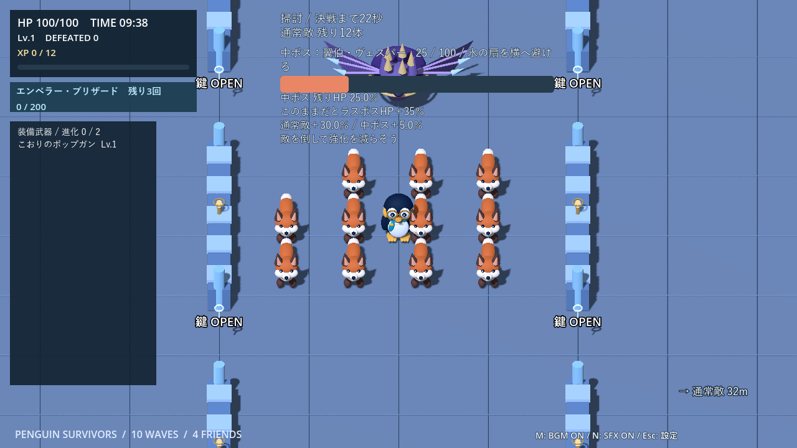
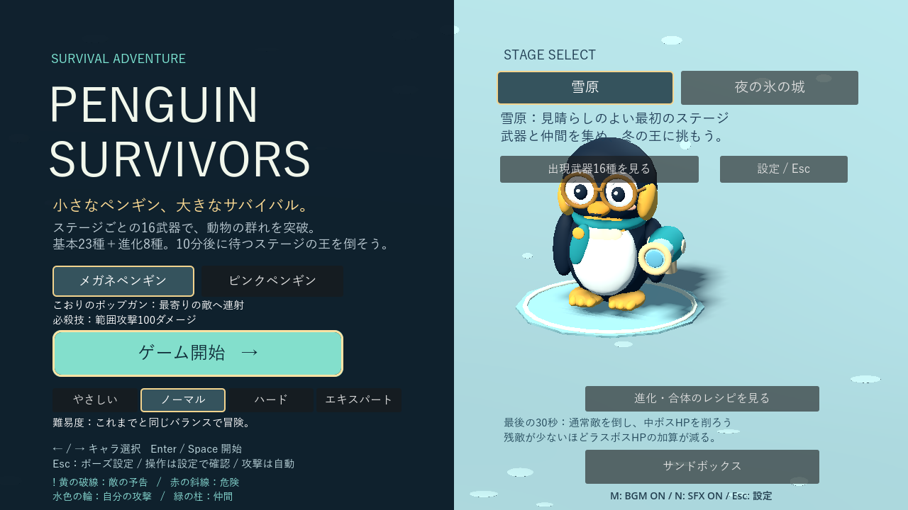

# 掃討の検証

[開発ガイド](development.md) · [仕様](play-guide.md) · [測定データ](benchmarks/cleanup.json)

Godot 4.7.2 / Compatibility。`cleanup_test`、`contributions_test`、`wave_test`、`difficulty_tiers_test`、`finale_showcase_test`、`castle_rules_test`、`sandbox_test`、`settings_test`、`result_scene_test` を確認。設定保存テストは `.godot/cleanup-test-user` をAPPDATAに指定して実行し、ユーザー設定への書き込みを避けました。環境の証明書・描画キャッシュ保存警告と終了時のリソース警告は残ります。

## 同条件の自動操作比較

`tests/cleanup_audit.gd`：ノーマル、seed 73、9:30開始、通常キツネ24体＋HP半分の中ボス。4種の自動照準・範囲武器Lv.3、Lv.10から開始。逃走は外周移動、掃討は近い敵へ接近。決戦中は両者ともボスの周囲7mを移動。無敵・HP回復の強制は行っていません。

| ステージ／キャラ | 行動 | 残敵 | 中ボスHP | 加算 | 通常敵XP | 選択 | 決戦結果 |
|---|---|---:|---:|---:|---:|---:|---|
| 雪原／メガネ | 逃走 | 0 | 0.0% | +0% | 24 | 0 | 撃破 65.0秒 |
| 雪原／メガネ | 掃討 | 0 | 0.0% | +0% | 24 | 0 | 撃破 65.6秒 |
| 雪原／ピンク | 逃走 | 0 | 0.0% | +0% | 24 | 0 | 撃破 67.5秒 |
| 雪原／ピンク | 掃討 | 0 | 0.0% | +0% | 24 | 0 | 撃破 65.0秒 |
| 城／メガネ | 逃走 | 1 | 15.0% | +5% | 23 | 0 | 死亡 78.5秒 |
| 城／メガネ | 掃討 | 2 | 0.0% | +3% | 22 | 0 | 死亡 83.4秒 |
| 城／ピンク | 逃走 | 0 | 43.0% | +9% | 24 | 0 | 死亡 78.5秒 |
| 城／ピンク | 掃討 | 1 | 0.0% | +2% | 23 | 0 | 死亡 73.5秒 |

城では掃討で中ボスを倒し、両キャラとも加算率が下がりました。雪原はこの装備なら逃走中の自動攻撃でも全滅でき、差が出ませんでした。城の決戦は全ケース死亡したため、ボス撃破時間は未測定です。

これは固定配置・固定装備の自動操作比較であり、人が序盤から育成するプレイの検証ではありません。武器選択は全ケース0回で、最後30秒の増援停止が10分間全体の成長機会に与える影響までは確認できていません。XP曲線・報酬・敵の性能への追加調整は行っていません。

タイトル、掃討HUD、画面外案内、ポーズ、登場演出、リザルトを `tools/capture_cleanup.gd` で撮影して表示を確認しました。

