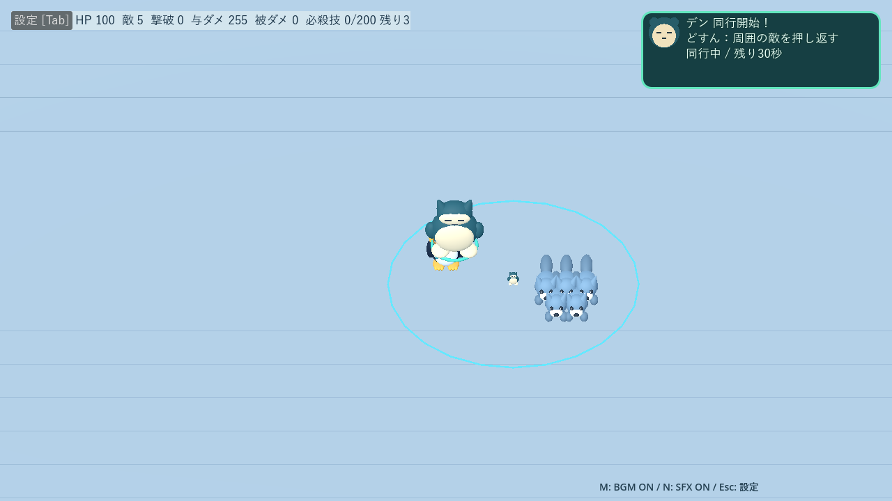
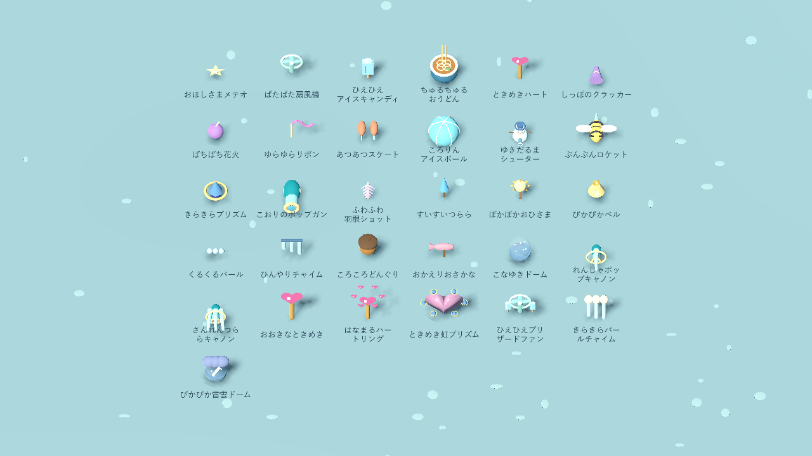
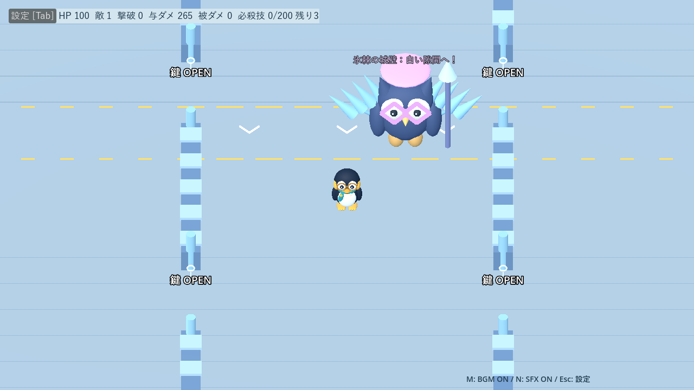
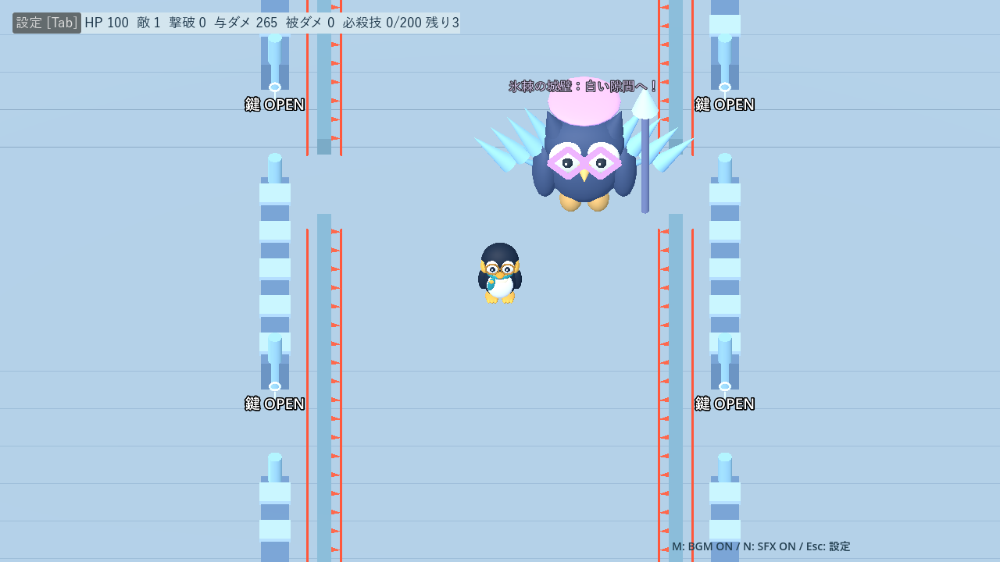

# デン・進化武器・ノクティスの改善

[README](../README.md) ／ [進化](evolutions.md) ／ [城ステージ](stages.md)

## デン：敵の集まりへ跳ぶ

プレイヤーから8m以内の標的可能な敵を探し、6m以内の安全な着地点から、半径5mで最も多く巻き込める場所を選びます。同数ならプレイヤーに近い地点を選択。壁内部・壁を飛び越える軌道・歩いて到達できない地点は除外します。城では同行中も開いた経路を辿ります。

0.2秒踏ん張って0.4秒跳び、固定地点へ着地。初回0.6秒、以後は着地から6秒間隔、30秒の同行で最大5回。敵がいなければ0.5秒ごとに再確認し、空振りや連続した埋め合わせ発動はしません。

- 着地で半径5mへ2ダメージを1回。生存した通常敵・手下を0.6秒で**4m**押し返します。
- ボスはダメージのみ。壁遮断・潜行除外・再適用待ち・凍結併用・撃破報酬を共用。
- 水色の着地点、顔印、跳躍、二重の立体衝撃波、土煙と音を同期。
- 右上に「どすん！ ○体を押し返した」を1.5秒表示。成功した押し返しだけ数えます。
- 停止中は動作も停止し、退出・死亡・勝利では未発動分を取り消します。

## 進化武器の演出

性能・成長値・命中数を変えず、装備・発射・判定の脈動を同期。固定個数の表示を再利用し、味方エフェクト濃度設定と停止・消去処理へ接続しました。新たな凍結・防御能力はありません。

| 武器 | 見た目 | 実画面 |
|---|---|---|
| れんしゃポップキャノン | 銃口の発光と反動、氷片の命中演出 | [画像](screenshots/evolution-rich-pop_cannon.png) |
| さんれんつららキャノン | 3つの発射口、長い槍と貫通の光跡 | [画像](screenshots/evolution-rich-triple_cannon.png) |
| おおきなときめき | 多面体の立体ハートと白金の縁 | [画像](screenshots/evolution-rich-big_heart.png) |
| はなまるハートリング | 6方向へ開く立体ハート | [画像](screenshots/evolution-rich-heart_ring.png) |
| ときめき虹プリズム | ハート結晶、花冠、虹の層と螺旋、最後のハート輪・結晶片 | [画像](screenshots/evolution-rich-prism-finale.png) |
| ひえひえブリザードファン | 通常の風と別に、噴射時の冷気・雪片 | [画像](screenshots/evolution-rich-blizzard_fan.png) |
| きらきらパールチャイム | 揺れる管と、真珠から立ち上る薄い冷気 | [画像](screenshots/evolution-rich-pearl_chime.png) |
| ぴかぴか雷雲ドーム | 高低差のある雲、枝分かれする放電と着弾の輪 | [画像](screenshots/evolution-rich-thunder_dome.png) |

## ノクティス：氷棘の城壁

地形としての城壁は固定。そこから攻撃用のトゲ付き氷壁を切り離し、床を横断させます。予告2.4秒、共通の幅4mの隙間、南北の外周に退避可能。隙間はプレイヤー付近のZ座標から3〜6mずらした候補を選び、境界へ収め、予告後は追従しません。

| 形態 | 列数 | 速度 | 基本ダメージ |
|---|---:|---:|---:|
| 第一 | 近い側の1列 | 3m/秒 | 24 |
| 第二 | 左右から2列 | 3.5m/秒 | 28 |

門を全開にし、予告時間内に歩いて逃げられる配置のみ採用。氷壁は移動や経路探索を塞がず、既存の壁・門を通過します。判定はトゲを含む厚さ1.2m、各列につき1回まで。難易度→シロクマ軽減・被弾無敵を適用し、通常の弾消去では消えません。

攻撃順は「門・跳躍→氷棘の城壁→氷羽→氷輪」。氷壁が消えるまでボス移動・他の攻撃・新規手下／サポートを保留し、終了後2秒休止。既存の手下は動きます。通常技の待ち時間は3秒へ短縮しました。停止中は予告・移動も停止し、形態移行・死亡・勝利で解除します。

## 検証（2026-09-19）

### 自動テスト

- デンの群れ選択・固定着地・空振り保留・最大5回・4mの押し返し・単発ダメージ・凍結併用・ボス耐性・死亡／停止・報酬。
- 氷壁の両形態×4シード×9位置（中央・左右・門付近・四隅）で退避可能性、予告2.4秒、速度、隙間、低FPSの移動区間判定、休止、形態移行時の解除。
- 実被弾でエキスパート＋シロクマの計算と、各列の再命中防止。速度と隙間は全難易度共通です。
- 進化8武器の全レベルの性能を変更前 `190faa4` と比較して一致。既存進化テストで連続判定・壁遮断・潜行除外・停止・構成変更を確認。
- 城・城の行動・城門跳躍、雪原決戦、演出、サポート、貢献集計、サンドボックス、設定、4難易度を回帰確認。

### デンの比較

同じ24体の追手と円運動を30秒実行。武器なし、敵とプレイヤーのHPを1000にした継続測定です。旧方式の後方追従＋その場着地を比較対象にしました。

| 方式 | 命中数 | 成功した押し返し | 被ダメージ |
|---|---:|---:|---:|
| 旧方式 | 89 | 89 | 374 |
| 狙って跳躍 | 104 | 104 | 319 |

### ノクティスの比較用試行

ノーマル・第二形態から開始し、3武器Lv.3、手下・形態専用サポートを有効にして最大60秒測定。通常時は円運動を目指し、氷壁中は隙間へ経路探索で向かいます。育成済みの通常プレイを再現するものではありません。

| キャラ | 構成 | 生存秒数 | 被ダメージ | 氷壁回数 | 手下出現数 |
|---|---|---:|---:|---:|---:|
| メガネ | 近接 | 32.2 | 100 | 1 | 12 |
| メガネ | 後方 | 50.1 | 100 | 2 | 16 |
| メガネ | 自動照準 | 60.0 | 62 | 2 | 20 |
| ピンク | 近接 | 32.2 | 100 | 1 | 12 |
| ピンク | 後方 | 50.1 | 100 | 2 | 16 |
| ピンク | 自動照準 | 60.0 | 62 | 2 | 20 |

近接・後方構成では手下を含む圧力で死亡し、自動照準構成では60秒生存しました。全構成でのクリアを保証する結果ではありません。城壁の幾何学的な退避可能性と、既存手下がいる実戦の難しさは別に確認しています。

[個別結果](benchmarks/den-noctis-2026-09-19.json) ／ `tests/den_noctis_audit.gd`

### Compatibilityの描画負荷

RTX 4060 Laptop GPU、Godot 4.7.2、1280×720。固定した敵24体＋合体エフェクト12個を120フレーム表示。攻撃数を変えず、更新前後の表示処理を比較しました。

| 表示 | 平均フレーム時間 | 最大描画コール |
|---|---:|---:|
| 更新前 | 8.43ms | 998 |
| 更新後 | 15.51ms | 1214 |

通常の進化枠上限2を超える負荷試験です。固定メッシュによって生成数の増え続ける処理は避けていますが、演出追加により描画負荷は増加しています。値は実行環境や他プロセスの負荷で変わります。

[描画測定結果](benchmarks/evolution-visuals-2026-09-19.json) ／ `tools/profile_evolution_visuals.gd`。比較元はコミット `190faa4` の `fusion_attack.gd` と `evolution_catalog.gd` を `.godot/fusion_before.gd`・`.godot/evolution_before.gd` に用意して実行します。

画像は表示確認用の配置です。環境の証明書警告・終了時の既存リソース解放警告は残っています。デモ動画は再収録していません。
