# 過去の仕様・検証記録

[READMEへ戻る](../README.md)

2026-09-17の整理前READMEを保存した資料です。**旧仕様・変更前の数値・当時のスクリーンショットが混在します。現行仕様はREADMEと武器・ステージガイドを参照してください。** 自動操作の比較条件、描画負荷の測定値、開発の経緯を確認するために残しています。

---

# Penguin Survivors

Godot 4 + GDScriptの、見下ろし視点3Dサバイバルです。
丸みのある立体パーツを組み合わせたキャラクターで、雪原と「夜の氷の城」の2ステージを遊べます。
外部アセット・プラグイン・Blenderは不要です。

## デモ動画

[](videos/penguin-survivors-demo.mp4)

**[音声付きデモ動画を見る（MP4・32秒・720p/60fps）](videos/penguin-survivors-demo.mp4)**

雪原の通常戦闘・サポートの同行・必殺技から、ラスボス登場、第二形態の大氷震、祝勝画面までを紹介します。氷の城はこの動画には含まれません。最新の必殺技と満タン通知を収録しています。上のプレビューは冒頭8秒・30fps・音声なしです。滑らかな60fpsの本編はMP4リンクから再生できます。

Godot実行画面を収録しています。短い動画にまとめるため、撮影用スクリプトで経過時間・装備・敵配置・ゲージ・移動を設定し、HPを維持してボスの形態移行と撃破を進めています。通常プレイの攻略記録ではありません。**終盤・クリア画面のネタバレを含みます。**

## プレイ画面

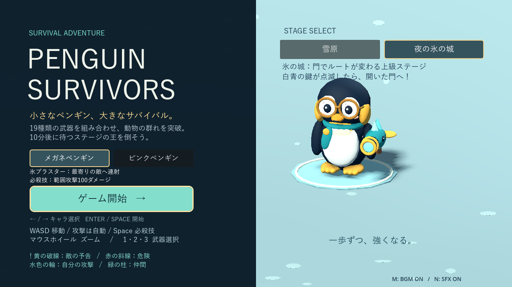

実際のGodot実行画面です。撮影用に経過時間・装備・敵の配置を設定しています。


全22種類から、新しい武器と所持武器の強化をランダムな3候補で選びます。


<details>
<summary>ラスボス戦の画面を見る</summary>


</details>

## 起動・操作

Godot 4で `project.godot` を開き、**F5（プロジェクト実行）**でタイトル画面を表示します。
クリックまたは左右キーで「メガネペンギン」「ピンクペンギン」を選べます。右上のボタンで「雪原」「夜の氷の城」を選べます。どちらも最初から使用可能。同一起動中は両方の選択を保持し、再挑戦は同じキャラ・同じステージで成長をリセットします。
動くペンギンとBGMのある画面で、**「ゲーム開始」をクリック／Enter／Space**を押すと新しいゲームが始まります。開始するまで敵や戦闘時間は進みません。

- **WASD**：移動（斜め移動も同じ速度）
- **射撃**：12m以内の最寄りの敵へ自動射撃
- **マウスホイール**：ズーム（12〜30、初期値20）
- **R**：ゲームオーバー・クリア後に再挑戦
- **Esc**：ゲームオーバー・クリア後にタイトルへ戻る
- **M**：BGMのミュート切り替え
- **N**：効果音のミュート切り替え（武器選択中も操作可能）
- **クリック / 1・2・3**：レベルアップ時に武器を1つ選択（矢印キー＋Enterも対応）

`scenes/character_gallery.tscn` を開いて **F6** で、キャラクターを大きく表示するモデル一覧を起動できます。

## BGM・効果音

- **雪原BGM**：ベルのメロディー、ベース、軽いリズムを重ねた32秒ループ。
- **ラスボス専用BGM**：48秒ループ。第二形態では同じ再生位置から強化アレンジへ0.8秒でクロスフェード。
- **祝勝BGM**：ファンファーレに続く明るい48秒ループ。
- **中ボスBGM**：中ボスの登場時に切り替わる、速いテンポの約27秒ループ。中ボス撃破後は雪原BGMへ戻ります。
- **効果音22種類**：射撃、魔法、命中、撃破、被弾、爆発、落雷、薙ぎ払い、レベルアップ、選択確定、ボス警告、勝利、ゲームオーバー、サポート登場・同行開始・回復・防御・退出、ラスボスの咆哮・変身・大氷震の溜め・発動。
- 武器選択中はBGMを小さくして継続し、選択の効果音を再生します。敗北時はBGMを停止して終了曲を鳴らします。勝利時はファンファーレ後に祝勝曲へつなぎます。
- 通常効果音は最大8音＋重要な通知用1音。連続命中などの発音間隔を制限し、大群戦でも音が重なりすぎないようにしています。
- M／Nの状態は画面右下に表示。同じ起動中の再挑戦でもミュート状態を維持します。

音源は本プロジェクト用に合成したオリジナルで、外部音源のダウンロードは不要です。`assets/audio/` にWAVを同梱しています。
再生成する場合は Python 3 で `python tools/generate_audio.py` を実行してください（標準ライブラリのみ使用、通常のプレイにはPython不要）。

## プレイヤー・武器

二頭身のコウテイペンギン。丸メガネ、黒と白の体、黄色い耳・首元、短い足、青緑のマフラーが特徴です。
歩くと体・翼・足が動き、停止中も頭がわずかに動きます。

魚型の氷ブラスター「Frostfin」は、銃身・金色のリング・背びれ・氷の結晶で構成しています。
体の向きと独立して照準を合わせ、銃口から氷弾を発射。反動とマズルフラッシュも付きます。
命中時は敵が縮み、氷の破片が散ります。撃破時は動物の色に合わせた破片が散ります。

## 経験値・武器の追加

通常敵の撃破で経験値を獲得します（既存4種は1、新敵は2、シカは3）。最初は12体撃破でレベルアップし、ランダムな3候補から1つ選んで武器を追加します。
選択中はゲーム全体が停止するので、説明を読んでゆっくり選べます。

- 各レベルの必要経験値は **12 → 22 → 34 → 48 → 65 → …**。現在レベルをLとして `12 + 8×(L−1) + ceil(1.3×(L−1)²)` で計算し、装備の増加に合わせて入手間隔を延ばします。余った経験値は次のレベルに持ち越します。
- **全22種類を同じ抽選対象にして、重複なしで3候補を選びます。** 未入手なら新規獲得、所持済みなら強化です。最初のレベルアップから氷ブラスターの強化も出現し、新武器だけ／強化だけの3択になることもあります。
- 獲得した武器は置き換わりません。最大22種類を同時装備し、それぞれ独立した間隔で自動攻撃します。
- 武器の上限は**Lv.5**。最大強化済みの武器は抽選から外れ、残り候補が2種類以下ならその数を表示します。全武器MAX後のレベルアップはHP20回復に変わり、余剰XPは持ち越します。
- 強化は威力・射程・範囲・弾数・持続など武器に合わせて成長します。選択カードに変更前後の数値を表示。詳細は末尾の「武器の個別強化・おうどん・ゴースト」を参照してください。
- 画面左に経験値、レベル、装備一覧、各武器のレベルを表示します。追加武器の小さなモデルがプレイヤーの周囲に浮かびます。
- 再挑戦時は経験値・武器・レベルも初期状態に戻ります。

### 武器22種類（初期武器を含む）

| 武器 | 攻撃 | 初期ダメージ | 初期間隔 |
| --- | --- | --- | --- |
| ちゅるちゅるおうどん | 11m以内へ麺を伸ばし、周囲を巻き込んで戻る | 往路1＋復路1 | 2.4秒 |
| ぱたぱた扇風機 | 前方160度・6mの敵を3m押し返す | 1 | 2.6秒 |
| ひえひえアイスキャンディ | 自動照準の直進弾。半径1.3mを1秒凍結 | 1 | 3.8秒 |
| 氷ブラスター | 最寄りの敵への連射。初期装備 | 1 | 0.28秒 |
| 羽根ショット | 体の前方へ扇状に5発を同時発射 | 2 / 発 | 1.25秒 |
| つららランス | 体の前方へ発射し、直線上の敵を貫通 | 5 | 1.8秒 |
| おひさまロッド | 前方8mの固定地点に0.7秒後に落下・爆発。半径3.2m | 6 | 2.1秒 |
| かみなりベル | 画面内のランダム3地点へ予告付き落雷。各半径3m | 5 / 落雷 | 1.65秒 |
| 真珠のまもり | 半径2.2mを2つの真珠が周回 | 2 / 命中 | 4秒ごとに更新 |
| 氷河のチャイム | 半径4.2mまで広がる全方位の輪 | 2 / 体 | 2.8秒 |
| どんぐりボム | 足元に設置。0.65秒後に作動可能、接近で半径3mの爆発 | 4 | 2.3秒 |
| おさかなブーメラン | 最寄りの敵の方向へ固定楕円を一周して手元へ帰還。往路・復路に各1回命中 | 2 / 命中 | 2.2秒 |
| 星ふるスノードーム | 最寄りの敵の位置に半径2.6m・3.2秒間の固定攻撃範囲を設置 | 1 / 0.6秒 | 3.8秒 |
| オーロラリボン | 前方120度・約3.8mを薙ぎ払い。発動時の向きを保持 | 7 / 体 | 1.6秒 |
| ほのおのスケート | 移動中の足元に半径1.25mの炎。4秒持続、0.8m以上離して設置 | 2 / 0.6秒 | 0.65秒 |
| 氷玉ビリヤード | 最寄りへ撃ち、アリーナ外周で反射。5秒間の貫通弾 | 3 / 命中 | 2.7秒 |
| ゆきだるま砲台 | 8秒間固定され、12m以内の敵へ0.55秒ごとに射撃 | 2 / 発 | 8秒 |
| ミツバチロケット | 3発の追尾弾。3秒間飛行し、標的が倒れると再探索 | 2 / 発 | 2.5秒 |
| 極光プリズム | 最寄りに向けて長さ12mの固定光線。1.3秒間、直線上を継続貫通 | 3 / 0.6秒 | 3.4秒 |
| しっぽの散弾 | 体の背後へ5発を扇状に発射 | 3 / 発 | 1.7秒 |
| うしろ花火 | 背後4.5mへ弧を描いて投げ、0.65秒後に半径3mで爆発 | 8 / 体 | 2.7秒 |

後方武器は発射時の体の向きから背後を決定します。停止中は最後の向きを使い、敵がいなくても発動します。発射後に移動・旋回しても弾道や着地点は変わりません。
追尾しない分、後方散弾は1発3ダメージ、花火は8ダメージに設定し、追手を誘導して当てる立ち回りに向けて調整しています。

極光プリズムは六角形の結晶、白い芯・水色の内層・紫の外層、流れる光の輪と粒子で描画します。攻撃範囲・威力・自動照準は従来のままです。


真珠の同じ敵への再命中には0.6秒の間隔があります。地雷は8秒で消滅します。
全方位攻撃と爆発は1回の発動につき同じ敵に1回だけダメージを与えます。

### 組み合わせで変わる立ち回り

- **逃走・誘導**：スケート＋ボム＋ブーメラン。炎と爆弾へ敵を誘導し、戻る弾も当てます。
- **後方迎撃**：しっぽの散弾＋うしろ花火＋スケート。敵から離れながら、背後の弾道・爆心へ追手を誘導します。
- **近接突破**：リボン＋真珠＋羽根。群れへ向き直って道を開き、攻撃の合間に距離を取ります。
- **拠点防衛**：砲台＋スノードーム＋プリズム。設置した攻撃の周囲へ敵を集めます。
- **遠距離移動**：ハチ＋ビリヤード＋ブラスター。自動照準を任せて回避に集中できます。

すべて既存の新規獲得／強化の混合3択に含まれます。候補は全22種類から抽選し、選んだ武器を蓄積するため、毎回の候補と選択で構成が変わります。
追加武器もLv.5まで個別に強化できます。砲台は威力・射程・持続が伸び、複数同時に設置できます。

### 照準と威力の配分

- **自動照準・追尾7種**：氷ブラスター、おさかなブーメラン、星ふるスノードーム、氷玉ビリヤード、ゆきだるま砲台、ミツバチロケット、極光プリズム。
- **ランダム1種**：かみなりベル。発動時にカメラに映るアリーナ内の地面から3地点を抽選し、0.25／0.37／0.49秒後に落雷します。敵の位置には依存せず、敵がいなくても発動します。空振りを補うため威力5・半径3mに強化しています。
- **向きで狙う4種**：羽根ショット、つららランス、おひさまロッド、オーロラリボン。WASDで移動して体の向きを合わせます。停止中も最後の向きを使い、敵がいなくても発動します。
- **後方固定2種**：しっぽの散弾、うしろ花火。
- **周囲・足元4種**：真珠のまもり、氷河のチャイム、どんぐりボム、ほのおのスケート。

前方攻撃は命中させる操作が必要な分、羽根の威力を1→2、つららを3→5、火球を3→6に強化しました。
つららの命中幅と火球の爆発半径も拡大しています。発動後に向きを変えても、弾の進路や火球の落下地点は変わりません。
自動照準は発動時に敵を選ぶ仕組みで、すべての弾が飛行中も敵を追い続けるわけではありません。スノードームも設置後は移動しません。

## 動物の敵：10種類


| 種類 | 役割・見た目 | 基礎HP | 特殊攻撃・対処 |
| --- | --- | --- | --- |
| キツネ | 白い頬と大きな尾。ジグザグ接近 | 2 | 追手を正面にまとめる |
| ウサギ | 長い耳。跳躍と着地休止 | 2 | 着地の隙に攻撃 |
| イノシシ | 大きな牙。直線突進 | 5 | 0.8秒の予告後に突進、終了後1.1秒休止 |
| カメ | 模様のある甲羅。低速・高耐久 | 8 | 進路を塞がれないよう回り込む |
| フクロウ | 丸い顔盤と羽ばたく翼。遠距離射撃 | 4 | 約8mを保ち、0.9秒予告後に固定方向へ10ダメージの弾。射撃後4秒休止 |
| オオカミ | 青灰色の毛・細長い鼻と尾。回り込み | 4 | 5m以内で左右へ回り込みながら接近。突進せず、接触12ダメージ。端で回り込み方向を反転 |
| スカンク | 白い背中の筋と立った尾。経路妨害 | 5 | 4秒ごとに半径1.4m・3秒持続・8ダメージの臭い雲 |
| ハリネズミ | 背中の針。放射状射撃 | 7 | 1秒予告後に8方向・10ダメージの針。発射後5秒休止 |
| モグラ | 大きな掘る手と小さな目。潜行奇襲 | 5 | 0.4秒かけて手で掘って潜行（この間は攻撃可能）。潜行後に出現地点を1.2秒予告。半径1.5m・12ダメージ、出現後は最低2秒攻撃可能 |
| シカ | 枝角から遠距離の三日月衝撃波 | 10 | 12m以内で停止、1.2秒予告で方向固定。速度6m/秒、射程14m、幅2.4m、基本12ダメージ。1.2秒休止＋4秒再使用待ち |

特殊攻撃のダメージは出現時刻の倍率で補正されます。新敵6種の基礎接触ダメージは10。HPは既存4種が通常倍率、新敵6種は倍率の平方根を使います。
モグラは潜行中のみ自動照準・被弾対象から外れ、出現数には数え続けます。出現地点は完全に潜った時点で固定し、20%がプレイヤー位置、80%が周囲1.5〜4mのランダム地点です。アリーナ外は最大16回再抽選します。シカの加速能力と周囲の光る輪は撤去しました。衝撃波の黄色い進路予告を見て横へ避けます。予告は同時1体までで、衝撃波も通常敵弾32発の上限に含みます。
敵は14〜19m離れて出現し、プレイヤーの被弾後0.8秒の無敵は接触・弾・雲・ボス攻撃に共通です。

## Waveと難易度

**60秒×10Wave**。新敵の初登場順は固定し、各Waveの編成を開始時に抽選します。同じ編成は連続しません。画面上部にWave名・残り時間・攻略ヒントを表示します。

| Wave / 開始 | 編成候補（主役＋相棒） | 立ち回り |
| --- | --- | --- |
| 1 / 0:00 | キツネ、0:30からウサギ | 基本移動と射撃 |
| 2 / 1:00 | カメ＋フクロウ（1:30に通常イノシシ1体を先行紹介） | 射撃役を優先し、突進予告を覚える |
| 3 / 2:00 | イノシシ＋オオカミ | 突進を横へ避け、回り込むオオカミから離れる |
| 4 / 3:00 | スカンク＋ウサギ、スカンク＋キツネ | 臭い雲を避けてルートを変える |
| 5 / 4:00 | ハリネズミ＋フクロウ、ハリネズミ＋カメ | 距離を取って針の間を抜ける |
| 6 / 5:00 | モグラ＋フクロウ、モグラ＋スカンク | 足元の予告から移動 |
| 7 / 6:00 | オオカミ＋フクロウ、イノシシ＋ハリネズミ | 射線と突進方向を分ける |
| 8 / 7:00 | シカ＋オオカミ、シカ＋カメ | 角の衝撃波を横へ避ける |
| 9 / 8:00 | シカ＋フクロウ、モグラ＋ハリネズミ | 優先する相手を選ぶ |
| 10 / 9:00 | シカ＋イノシシ、モグラ＋スカンク、オオカミ＋ハリネズミ | 総合戦からラスボスへ |

- 通常枠50%（キツネ・解禁済みウサギ）、主役30%、相棒20%。同じ種類が通常枠と重なる場合は割合を加算します。上限に達した種類は抽選対象から外れます。
- 初登場は開始10秒以内に1体ずつ紹介し、その後10秒間は同種を追加しません。中ボス中の紹介は撃破後の休息終了まで保留します。紹介のための予算を優先して確保します。
- 既存敵はWaveをまたいで残ります。通常敵＋ボスは最大100体、特殊敵は計12体。フクロウ・ハリネズミ・スカンクは各3体、シカは2体まで。
- 通常敵の弾は32発、臭い雲は6個まで。潜行開始・出現予告中のモグラは合わせて同時1体に制限します。
- 出現は**予算制**。既存4種はコスト1、新敵は2、シカは3。同じ出現予算でも特殊敵が多いWaveでは総数が減ります。経験値も1／2／3です。
- 予算は0.38/秒から段階的に増え、9分で5/秒。貯蓄は最大6で、大量の一斉出現を防止します。開始3秒までは出現せず、最初の30秒は最大10体です。
- 中ボス戦中は予算の供給速度が半分、撃破後8秒間は出現と予算供給が停止します。

## 攻撃と予告の見分け方

| 表示 | 意味 |
|---|---|
| 黄色の破線・「!」・縮む輪 | 敵の攻撃予告。発動前に離れる |
| 赤橙の太い輪・斜線・「毒」 | 敵の危険範囲。紫の煙は薄く、境界を優先表示 |
| 赤橙の芯・暗い外縁・長い尾 | 敵弾（通常敵・中ボス・ラスボス共通） |
| 水色の細い輪・小さな尾 | プレイヤー／ひよこの攻撃。触れても安全 |
| 緑の柱・顔アイコン | サポート。近づくと同行 |

範囲の輪は攻撃そのものの半径です。プレイヤーの体にも半径があるため、危険な輪に体が重ならないよう避けます。武器固有の色と形は残しています。


## サポートキャラ

**近づいて迎えると30秒間同行**する、武器枠を使わない味方です。緑のビーコンと友好アイコンが目印です。右上16px内側の344×112pxカードに顔・効果・残り時間を表示。登場時4秒、同行開始時3秒は枠を強調し、その後も通常表示で情報を残します。画面外では顔・方向・距離・残り時間で案内します。

| キャラ | 援護 | 特徴 |
| --- | --- | --- |
| ♥ シマエナガ | 同行開始・6・12・18・24秒後にHP＋5、計最大25回復 | 白い丸い体、長い尾、羽ばたきとハート |
| ◆ シロクマ | 同行中の被ダメージを30%軽減 | 王冠のない小さなクマ、青緑のマフラー、防御の輪 |
| ★ ひよこ | 0.65秒ごとに12m以内の最寄りへ援護弾 | 黄色い体と星形の弾。威力は `3 + floor(Wave番号 / 3)` |


- 最初の出現は75〜95秒、以後は前の退出から110〜140秒後。3匹を重複なしで一巡し、同じキャラは連続しません。
- 通常の新規出現は9:30まで。ラスボスには第一形態1回・第二形態2回の専用援護枠があります。新敵紹介・ボス登場の通知から10秒間は待機します。
- プレイヤーから6〜9mの画面内に出現し、敵・危険範囲を避けます。安全な位置がなければ2秒後に再試行します。
- 出現後30秒待機。2m以内へ近づくと自動同行し、30秒後に退場します。迎えなくても罰則はありません。
- 味方は無敵・非衝突。サポート専用の選択や強化はありません。画面上部に効果と残り時間を表示します。
- 回復はHP100までで、満タン分は蓄積せず死亡後の復活もしません。軽減は端数切り上げ・最低1ダメージで、被弾無敵が優先されます。
- ひよこの撃破も経験値と撃破数へ加算。潜行中のモグラは狙いません。
- 武器選択中は全タイマーと援護が停止します。ラスボス戦へは同行済みの味方のみ残り時間を引き継ぎ、待機中の味方は退場します。
- 勝利・死亡・再挑戦・タイトル移動では援護を解除します。

## 中ボス

中ボスは最初が2分、以降は前の登場から2分で次の登場予定になります。通常イノシシは1:30以降に1体だけ先行紹介し、2:00までは追加しません。最初の中ボスは通常イノシシの実際の初登場から最低20秒待ちます。出現上限で紹介が遅れても順番は逆転しません。
生存中の中ボスがいる場合や撃破直後の休息中は次を待機させ、同時には出しません。

- **牙王・ブリストル**：王冠付きの巨大イノシシ。予告付き直線突進と、周囲への踏みつけ。
- **甲羅王・モスバック**：王冠付きの巨大カメ。踏みつけに加え、8秒周期で2.4秒間の甲羅防御（初回は5秒後）。青緑の輪が出ている間は被ダメージを半減します（端数切り上げ、最低1）。
- **狐姫・アンバー**：桃色の王冠を持つ巨大キツネ。ジグザグ移動し、0.85秒の照準予告後に3方向の弾を発射。予告後に横へ動くと回避できます。
- **月兎・ルナ**：紫の王冠を持つ巨大ウサギ。0.95秒前に着地点を表示し、0.7秒かけて大跳躍。半径3.2mに24ダメージを与え、着地後は1.4秒休止します。
- この順に4種類が一度ずつ登場し、同じ中ボスは繰り返しません。通常は2・4・6・8分に登場し、HPは100・180・260・340です。戦闘が長引いた場合は後続が遅れ、10分でラスボス戦に移行します。
- イノシシとカメの踏みつけの橙色の輪は半径4.2m。1.25秒の予告中に外へ出ると回避できます。突進も進路を先に表示します。
- 中ボスが生きている間は通常敵の出現予算の供給速度が半分になります。
- 撃破すると **HPを25回復（最大100）、XPを8獲得**。増援が8秒間停止します。既存の敵との戦闘は続きます。
- 画面上部に進行段階・中ボスまでの時間・中ボスHP・撃破後の休息時間を表示します。

## ラスボスとクリア

**戦闘時間10分で、巨大なホッキョクグマ「冬の王・グレイシャー」が登場します。**
残っている通常敵・中ボス・攻撃は報酬なしで撤退し、通常の増援が止まります。装備とHPを引き継いで最終決戦に入ります。

- HP1400。氷の王冠を持つ専用モデルです。
- 半径5.2mの叩きつけには1.3秒の予告があります。
- 狙いを定める予告の後、7方向へ氷弾を発射します。
- **第一形態は3回に1回ダッシュ**：黄色の破線で進路を1秒予告し、速度16m/秒で11m突進。命中時は28ダメージで、終了後は1.2秒停止します。予告時に進路が固定されるので、横へ回避できます。アリーナ外周に達すると停止します。
- 第二形態のダッシュは予告0.8秒、速度20m/秒、距離13m、終了後の停止1秒。ダッシュ中は他の攻撃を行わず、同じ突進での多重ダメージもありません。
- HP半分以下で一度だけ2秒の形態移行演出。氷の装甲と伸びる王冠を追加し、専用曲を第二形態アレンジへ切り替えます。移動・攻撃が速くなり、氷弾は12方向になります。
- 倒すと **CLEAR!** の祝勝ステージと成績を表示し、戦闘を停止します。ボタンまたはRで最初から再挑戦できます。
- 武器選択中は10分のタイマーやラスボスの攻撃も停止します。
- プレイヤーが同時に倒れた場合はゲームオーバーを優先します。

## 構成

- `scenes/title.tscn` / `scripts/title_screen.gd`：起動時のタイトル画面・開始操作・ペンギン展示
- `scenes/main.tscn`：開始後のゲームシーン（直接F6でも動作）
- `scenes/character_gallery.tscn`：モデル一覧の起動シーン
- `scripts/main.gd`：出現管理・標的選択・カメラ・HUD・再開
- `scripts/game_audio.gd`：BGM切り替え・効果音の再生数制限・個別ミュート
- `assets/audio/`：オリジナルBGM5曲（第二形態アレンジ含む）・効果音22種類
- `tools/generate_audio.py`：音源の再生成
- `tools/capture_screenshots.gd`：README用の実画面撮影（描画可能な環境で `godot --path . --script res://tools/capture_screenshots.gd`）
- `scripts/player.gd`：移動・HP・歩行・武器照準と反動
- `scripts/enemy.gd`：種類別ステータス・移動・突進の状態遷移・ダメージ
- `scripts/difficulty.gd`：時間別の出現予算・能力補正・経験値曲線
- `scripts/wave_director.gd`：10Waveの編成抽選・初登場・出現予算・種類別上限
- `scripts/special_enemy.gd` / `scripts/enemy_cloud.gd`：新敵6種の行動と臭い雲
- `scripts/support_director.gd` / `scripts/support_friend.gd`：サポートの抽選・安全な配置・同行・援護
- `scripts/creature_models.gd`：追加の敵6種と味方3匹のモデル
- `scripts/boss_minion.gd` / `scripts/final_battle_director.gd`：氷アザラシ・氷ユキヒョウと決戦専用の出現管理
- `scripts/deer_shockwave.gd`：シカの固定方向・幅付き衝撃波
- `scripts/weapon_flourish.gd`：武器の表示専用エフェクト
- `scripts/miniboss.gd`：重複しない中ボス4種類・王冠・突進／防御／扇状弾／跳躍
- `scripts/final_boss.gd`：ホッキョクグマのラスボス・2段階の攻撃
- `scripts/boss_projectile.gd`：ボス共通の氷弾・プレイヤーへの命中判定
- `scripts/character_models.gd`：ペンギン、魚型ブラスター、4種類の動物の形状
- `scripts/visuals.gd`：形状生成と共通マテリアル・球メッシュのキャッシュ
- `scripts/projectile.gd`：氷弾と移動区間を使った命中判定
- `scripts/hit_effect.gd`：命中・撃破の破片演出
- `scripts/arena.gd`：照明・雪面・外周の木と装飾
- `scripts/character_gallery.gd`：モデル展示
- `scripts/weapon_catalog.gd`：22種類の名前・説明・性能・強化計算
- `scripts/weapon_system.gd`：追加武器の装備・独立した発射間隔・画面内の落雷位置抽選
- `scripts/weapon_attack.gd`：拡散・貫通・爆発・周回・往復・継続攻撃
- `scripts/advanced_attack.gd`：薙ぎ払い・炎の道・反射・砲台・追尾・固定光線
- `scripts/prism_visual.gd`：プリズムの結晶、多層光線、流れる光の輪と粒子
- `scripts/weapon_choice.gd`：日本語の3択画面・マウス／キーボード操作
- `tests/smoke_test.gd`：基本機能の統合テスト14項目
- `tests/animal_behaviors_test.gd`：動物の動作・耐久力・武器の統合テスト19項目
- `tests/weapons_test.gd`：経験値・3択・一時停止・蓄積・全武器の攻撃・強化・再開の統合テスト
- `tests/balance_test.gd`：敵の解禁・強化・中ボスの出現制御・回避・報酬・休息の統合テスト
- `tests/balance_simulation.gd`：静止／周回移動による最大6分の進行テスト（物理刻みは1/60秒のまま6倍速）
- `tests/finale_direction_test.gd`：混合抽選・前方固定攻撃・威力・ラスボス移行・第二形態・クリアと再開
- `tests/lightning_roster_test.gd`：ズーム・外周での落雷位置、予告と停止、範囲ダメージ、中ボス4種の固有攻撃と重複防止
- `tests/weapon_variety_test.gd`：追加武器の方向、移動条件、反射、射撃、標的再探索、持続ダメージ
- `tests/special_enemy_test.gd`：新敵の予告・固定照準・潜行・ダメージと上限
- `tests/wave_test.gd`：40シードでの編成、初登場、予算、上限、ボスとの遷移
- `tests/support_test.gd`：抽選・安全配置・同行・回復・防御・援護射撃・終了処理
- `tests/tactics_simulation.gd`：Wave 4・6・8を3構成で動かす自動戦闘監査
- `tools/capture_wave_support.gd`：新モデル一覧とサポート付き混成戦の撮影

モデルはGDScriptから生成されます。`Head`、`WingLeft`、`Tail`などの名前付きNode3Dを関節として動かします。
色と形状は `character_models.gd`、敵の性能は `enemy.gd` の `STATS` で調整できます。

## 検証

敵・Wave・サポートの追加では、専用テストと既存機能の回帰テストを実行しています。近接・後方誘導・自動照準の3構成でWave 4・6・8を援護なしで動かし、出現上限と攻撃の重なりを点検しました。自動操作の生存時間は人間の攻略を保証するものではありません。

音声追加時は `tests/audio_test.gd` で読み込み、ループ、発音制限、一時停止中の操作、ボス曲と終了曲への切り替えを検証しています。実画面はWindowsのWASAPI出力で起動して撮影しています。

Godot 4.7.2で統合テストを実行。18武器の混合抽選・強化・同時動作・寿命・再開と、後方2武器を含む追加武器の個別命中判定を確認しています。
OpenGL Compatibilityの実画面で追加武器、19種類の装備欄と武器選択画面を確認済みです。
OpenGL Compatibilityの実画面でランダム落雷と中ボス4種類の表示を確認済みです。
自動テストは再現可能な機能・ダメージ判定の確認です。攻略難度は武器選択や操作で変わるため、実プレイに合わせて調整できます。

`godot` をGodot 4の実行ファイルのパスに置き換えて実行できます。

```powershell
godot --headless --path . --editor --import --quit
godot --headless --path . --script res://tests/smoke_test.gd
godot --headless --path . --script res://tests/animal_behaviors_test.gd
godot --headless --path . --script res://tests/weapons_test.gd
godot --headless --path . --script res://tests/balance_test.gd
godot --headless --path . --script res://tests/finale_direction_test.gd
godot --headless --path . --script res://tests/lightning_roster_test.gd
godot --headless --path . --script res://tests/weapon_variety_test.gd
godot --headless --path . --script res://tests/audio_test.gd
godot --headless --path . --script res://tests/final_dash_test.gd
godot --headless --path . --script res://tests/title_test.gd
godot --headless --path . --script res://tests/special_enemy_test.gd
godot --headless --path . --script res://tests/wave_test.gd
godot --headless --path . --script res://tests/support_test.gd
godot --headless --path . --script res://tests/tactics_simulation.gd
godot --headless --path . --script res://tests/balance_simulation.gd
```

### 視認性改善の実画面と検証


`tools/capture_readability.gd` で上記の実画面を再撮影できます。`special_enemy_test.gd` は潜行の0.4秒／予告1.2秒、潜行中の被弾除外、オオカミの接近と端での反転を検証。`support_test.gd` は30秒待機／30秒援護、5回の回復、画面外案内、通知の一時停止、ボス移行と死亡解除を検証します。

## シカ・成長曲線の調整


必要経験値は序盤の12／22を維持し、Lv.5で76→65、Lv.8で166→132、Lv.10で246→190へ緩和。敵の強化速度、出現予算、経験値報酬、武器性能は変更していません。同じ900XPで武器選択は旧曲線9回→新曲線10回でした。

`tests/deer_growth_test.gd` は角攻撃の方向・範囲・単発ダメージ・休止・軽減、20シード4000回のモグラ出現比率と面積分布、境界内配置、経験値曲線、HUD配置を検証します。`tools/capture_deer_growth.gd` で上の実画面を再撮影できます。

### 終盤の変更前後比較

`tests/endgame_comparison.gd`：9:00開始、シード73、HP100、Lv.8・持ち越しXP100、初期武器を含む5武器を各ランク3、敵16体を半径11mに配置。援護・中ボスなし、最大22秒、同じ自動回避操作で比較しました。

| 構成 | 生存秒数 変更前→後 | 追加選択 変更前→後 | 撃破 変更前→後 |
|---|---|---|---|
| 近接 | 9.4→9.4 | 0→0 | 17→17 |
| 後方攻撃 | 10.8→10.8 | 0→1 | 30→31 |
| 自動照準 | 6.9→6.9 | 0→0 | 12→12 |

この短い固定条件では3構成とも死亡しました。後方構成で選択は増えましたが、生存改善や10分通しの難易度は保証しません。敵・弾・雲の上限違反はありませんでした。通常プレイでは中盤から増える選択の積み重ねがあるため、この終盤からの比較とは条件が異なります。

## ラスボス演出・大氷震・祝勝ステージ

登場時は「冬の王・グレイシャー」、HP50%到達時は「第二形態 — 吹雪の王」を約2秒かけて表示。氷片・王冠の輝き・咆哮・カメラ演出中は戦闘、ダメージ、経過時間、サポート時間が停止します。変身では進行中の攻撃と敵弾を解除し、形態移行は一度だけ発生します。致死ダメージは変身を挟まず撃破し、プレイヤーとの同時死亡では敗北を優先します。


第二形態は **大氷震 → 放射弾 → ダッシュ → 叩きつけ** の順（叩きつけの間合い外では放射弾）。移行演出後2秒で最初の大氷震の予告を開始します。

- **白夜の大氷震**：3秒間停止して溜め、予告開始時のプレイヤー位置から半径0〜2.5m内を面積均等に抽選した地点を中心に、半径9mへ40ダメージを一度だけ与えます。予告地点は追従しません。黄色の破線の外へ逃げてください。
- 発動後2秒は休止。赤橙の境界・斜線・氷柱と衝撃波は約0.45秒で消え、残留ダメージはありません。被弾無敵とシロクマの30%軽減は有効です。


クリア時は独立した祝勝ステージに切り替わり、ペンギン・シマエナガ・シロクマ・ひよこ全員がお祝いします。実際に出会ったかにかかわらず3匹とも参加し、戦闘の援護効果は解除されます。クリア時間・撃破数・レベル・全取得武器を表示。「もう一度遊ぶ」「タイトルへ」のボタン、R／Esc、M／Nが使えます。


`tests/finale_showcase_test.gd` は演出休止・形態移行の一回性・攻撃解除・大技の予告／範囲／軽減／休止・祝勝画面と各遷移を検証します。`tools/capture_finale_showcase.gd` で実画面を再撮影できます。音源は `tools/generate_audio.py` に再生成処理を含み、第一／第二形態のループ長・音割れ・切り替え位置を検証しています。


## 決戦の手下・援護と武器の新しい演出

| 形態 | 手下 | 固定性能 | 出現周期 |
|---|---|---|---|
| 第一形態 | 氷アザラシ | 腹滑り追跡、HP10・速度2.2m/秒・接触8・XP2 | 演出終了6秒後、以後12秒ごと |
| 第二形態 | 氷アザラシ＋氷ユキヒョウ | 各2体ずつ。ユキヒョウは回り込み、HP14・速度3.2m/秒・接触10・XP3 | 演出終了6秒後、以後9秒ごと |

- 第一形態は一度に2体・合計6体、第二形態は一度に4体・合計8体まで。プレイヤーから12〜16m離れた同じ120度の方向から登場します。上限中の出現は貯めません。
- ボスの予告・ダッシュ中は延期。配置できなければ2秒後に再試行します。時間経過による追加強化はありません。
- 変身時に旧手下を報酬なしで退場させ、第二形態の時計を開始。ボスだけ倒せばクリアし、残った手下も報酬なしで退場します。通常の撃破は経験値と撃破数に加算します。
- 各形態の最初のサポートは演出終了8秒後以降。第一形態1回・第二形態2回まで呼びます。既存の味方の退出完了から3秒待って次を呼び、同時登場は1匹です。抽選袋・30秒待機／30秒同行・援護性能は通常時と共通です。
- 同行中の味方が残っている場合は退出まで新規登場を保留し、持ち越した味方はその形態の枠を消費しません。第一形態の未使用枠は第二形態へ持ち越しません。
- サポートは画面内の6〜9m先で、ボスの接触・現在の予告・敵弾・手下を避けて配置。ボス予告・ダッシュ中や安全な場所がない場合は待機します。
- 大氷震はプレイヤー付近の固定地点へ遠隔発動します。アリーナ外は最大16回再抽選。王冠から予告地点へ氷粒が流れ、予告・発動・氷柱・判定が同じ中心を使います。
- 登場・変身演出と武器選択中は、手下・サポートの時計と武器エフェクトも停止します。


星ふるスノードームに薄い半球・回転する雪片・渦の帯、オーロラリボンに白い芯を持つ連続した曲面の帯、ほのおのスケートに揺らぐ炎の面と火の粉を追加しました。氷河のチャイムは二重の波紋と散る氷片、うしろ花火は着弾時の放射状の火花と短い光跡を追加。攻撃性能・間隔・当たり判定は変更していません。

表示専用の `scripts/weapon_flourish.gd` にまとめ、固定数のメッシュを再利用します。毎フレームのノード生成はありません。Compatibilityレンダラーで実画面を確認しています。


### 今回の検証

`final_battle_test.gd` は12シードのイノシシ登場順・20秒の間隔、20シードの大氷震の面積分布・境界・中央／辺／角からの退避、手下の頻度・上限・報酬・形態変更・停止、サポートの独立枠と持ち越しを検証します。`shockwave_visual_test.gd` はシカの同時予告・弾数上限・幅・最大距離・単発ダメージ、5演出のノード数がアニメーション中に増えないことを確認します。


前回（初回14秒・手下上限4体）の `boss_tactics_audit.gd` による操作スクリプトの点検（シード73、HP100、氷ブラスター＋各系統4武器をLv.5、初期プレイヤーレベル12）。各行は別の開始条件で、第一形態からの試行は自然な第二形態移行も含みます。

| 開始形態 | 構成 | 戦闘時間 | 結果 / 残HP | 撃破数 | 手下最大数 | 全方向が手下で塞がった最長時間 |
|---|---|---:|---|---:|---:|---:|
| 第一 | 近接 | 52.8秒 | 敗北 / 0（ボス残HP70） | 4 | 2 | 0秒 |
| 第一 | 後方攻撃 | 52.7秒 | 勝利 / 56 | 3 | 2 | 0秒 |
| 第一 | 自動照準 | 41.3秒 | 勝利 / 82 | 5 | 2 | 0.17秒 |
| 第二 | 近接 | 29.4秒 | 勝利 / 40 | 3 | 2 | 0秒 |
| 第二 | 後方攻撃 | 29.1秒 | 勝利 / 68 | 3 | 2 | 0秒 |
| 第二 | 自動照準 | 18.3秒 | 勝利 / 84 | 2 | 2 | 0秒 |

この点検は48方向の直近2mの進路と手下との距離を測る局所的な検査です。手下による継続的な全方向封鎖はありませんでしたが、近接構成は第一形態からの試行で敗北しています。人間の操作や全ての装備・地形状況での攻略を保証する結果ではありません。この表は増援頻度を引き上げる前の記録です。


前回の描画負荷は `tools/profile_weapon_visuals.gd` で、40個の表示エフェクトと49体の敵を重ねて120フレーム測定しました。1280×720・Compatibility・RTX 4060 Laptop GPUでは平均6.94ms/フレーム、最大4,254描画呼び出しでした。固定配置での描画点検であり、低スペック機や戦闘全体の最低FPSを保証する値ではありません。黄色いシカの射線とペンギンは重なりの中でも確認できました。


撮影は `tools/capture_battle_update.gd`、モデル一覧は `tools/capture_wave_support.gd`。Godot 4.7.2で新規テスト2本と既存回帰テスト11本が成功し、実画面の実行ログにもスクリプトエラーはありませんでした。


## 決戦の増援・6武器・コンパクトHUDの更新

- 手下は初回6秒、第一形態12秒／第二形態9秒間隔、上限は第一形態6体／第二形態8体。第二形態はアザラシとユキヒョウを各2体。空き1枠なら少ない種類を補充し、同数なら交互に選びます。
- 第二形態はサポートを最大2回呼びます。30秒同行を維持し、次の登場は退出完了の3秒後から。持ち越した仲間は登場枠を消費しません。短い決戦では2回目が間に合わない場合があります。
- 左上を300×108pxへ縮小。HP・時間／レベル・撃破数／XPの3行と8pxのXPバーに整理しました。左側の武器一覧は維持しています。

| 武器 | 最新の表示・軌道 |
|---|---|
| つららランス | 多面体の氷槍、白い芯、水色の長い残像。貫通命中で氷片と光の輪 |
| おひさまロッド | 前方8mへ固定着弾。白熱した芯、橙色の外殻、炎と火の粉。威力6・0.7秒待機・半径3.2mは維持 |
| かみなりベル | 白い芯と青紫の外光、枝分かれする稲妻。局所的に光り0.3秒で減衰。画面内ランダム3地点は維持 |
| オーロラリボン | 帯を1.5倍にし、彩度と白い芯を強化。床から持ち上げて見やすく |
| うしろ花火 | 導火線・飛翔の光跡、中心閃光、24本の色付き火花が立体的に開き、垂れて0.8秒で消滅 |
| おさかなブーメラン | 前方9.1m・左右1.6mの固定楕円。往路0.65秒＋復路0.65秒、その後は速度14m/秒で現在の手元へ帰還。総寿命2.4秒 |

ブーメランは発射後に楕円の位置や向きを変えず、外周でも反射しません。敵への命中は往路1回、復路と手元への帰還を合わせて1回。曲線を細分化して判定するため、大きな時間刻みでも曲線の内側を誤って攻撃しません。ロッドの着弾距離とブーメランの軌道以外は攻撃性能を変更していません。

`weapon_detail.gd` は表示専用です。飛行中の残像は10区間を再利用し、独立した命中・爆発の追加演出は同時16個まで。演出のために追加ダメージは発生せず、武器選択とボス演出中は停止します。


### 今回の確認結果

`final_battle_test.gd` で6秒の初回、12秒／9秒周期、上限6／8体、混成と空き1〜3枠の補充、サポート2回・退出後3秒・持ち越し・停止を確認。`ellipse_hud_test.gd` で楕円の四半周・半周・一周、移動後の手元への帰還、低FPS相当の往復命中判定、8m着弾、HUDの枠内配置を確認しました。既存の武器・援護・形態移行・勝利・再挑戦も回帰テストに成功しています。

90秒分の第二形態の時計を進める `boss_support_endurance_test.gd` では、サポートが8.1秒・41.8秒に登場し、手下は上限8体に収まりました。この試験は援護の接近・同行と時計を検証するため、敵の移動・攻撃を停止しています。

同じ装備条件の決戦点検（シード73、HP100、氷ブラスター＋各系統4武器をLv.5、プレイヤーLv.12、最大60秒）は以下のとおりです。第一形態開始の試行は自然な第二形態移行を含みます。

| 開始形態 | 構成 | 戦闘時間 | 結果 / 残HP | 撃破数 | 手下の総出現数 | 手下最大数 | 全方向が塞がった最長時間 |
|---|---|---:|---|---:|---:|---:|---:|
| 第一 | 近接 | 60.0秒 | 継続中 / 24（ボス残HP197） | 9 | 9 | 2 | 0秒 |
| 第一 | 後方攻撃 | 44.6秒 | 勝利 / 42 | 7 | 7 | 2 | 0秒 |
| 第一 | 自動照準 | 38.3秒 | 勝利 / 76 | 7 | 6 | 2 | 0.07秒 |
| 第二 | 近接 | 36.5秒 | 勝利 / 45 | 7 | 8 | 2 | 0秒 |
| 第二 | 後方攻撃 | 33.9秒 | 勝利 / 68 | 7 | 6 | 2 | 0秒 |
| 第二 | 自動照準 | 18.6秒 | 勝利 / 84 | 4 | 4 | 2 | 0秒 |

48方向の直近2mを調べる局所的な進路検査では、継続的な全方向封鎖はありませんでした。近接構成の第一形態開始は60秒で未決着です。これは自動操作の限定的な点検で、人間のプレイや全装備の攻略結果を保証しません。

描画点検は1280×720・Compatibility・RTX 4060 Laptop GPU、49体の敵＋40個の表示で120フレームを測定。前回と同じ演出構成では平均6.94ms・最大4,252描画呼び出し（前回6.94ms・4,254）。今回の6種類へ置き換えた構成では平均6.94ms・最大3,827でした。表示同期を含む固定配置の測定値です。


撮影は `tools/capture_weapon_revision.gd`。描画点検の新構成は `tools/profile_weapon_visuals.gd -- --new-weapons` で再現できます。


## 冷気・オオカミ・決戦増援・必殺技（最新仕様）

- **Space：エンペラー・ブリザード**。撃破報酬200XP分で充填、初期0、1プレイ最大3回。武器XPは消費せず、満タン中の余剰は破棄。半径12mに100ダメージを1回与え、範囲内の敵弾・毒雲を消去し、無敵を最低1秒へ延長します。地下のモグラは対象外。ボスの攻撃予告は解除しません。
- チャイムは冷気12個・氷片16個が上昇。ダメージは従来どおり0.65秒まで、冷気のみ0.9秒まで。火球・花火には冷気を付けません。
- オオカミは基礎HP4を維持。移動係数1.3、接近0.75＋横移動0.85、接触12。6分未満は3体、以後5体まで。回り込む狼を正面へ誘導して倒しましょう。
- 第二形態の手下は初回6秒、その後9秒ごとにアザラシ2体＋ユキヒョウ2体、上限8体。空き1〜3枠は少ない種類から補充。第一形態の2体／12秒／上限6体は維持。
- 必殺技は武器選択・演出・死亡・勝利中に発動不可。押しっぱなしのリピート入力は受け付けません。ボス移行でゲージを保持し、再挑戦で初期化します。


### 今回の検証

`ultimate_test.gd`：200XP／余剰破棄／3回制限、撃破報酬、範囲と潜行除外、毒雲消去、無敵、停止・死亡優先、形態移行・ラスボス撃破、チャイムの判定と表示寿命、狼のHP・速度・接近成分・時刻別上限を確認。
`final_battle_test.gd`：4体混成、上限8、空き1〜3枠、延期・形態変更・報酬・サポート枠を確認。90秒の援護時計試験では8.1秒と41.8秒に登場、最大8体でした。

決戦の自動操作（seed73、レベル12、初期武器＋4武器をランク5、最大60秒）。使用ケースは開始時にゲージ200を与えて即使用、以後は通常報酬で充填します。以下は第二形態から開始した実測です。

| 構成 | 温存：終了秒／HP／総出現数 | 使用：終了秒／HP／総出現数／使用回数 |
|---|---|---|
| 近接 | 30.4／40／12 | 32.1／22／12／1 |
| 後方 | 33.2／74／11 | 38.2／64／16／1 |
| 自動照準 | 20.3／84／8 | 20.2／84／8／1 |

上記は全て撃破で終了。退路48方向の全閉鎖は最長0.40秒でした。第一形態からの使用ケースでは近接58.4秒、後方44.6秒で死亡した試行もあります。攻撃周期・移動経路が分岐するため、必殺技による生存時間改善を保証する比較ではありません。

Wave 3・7・8・10を各3構成、武器ランク3固定で試験。Wave 3・7は22秒の試験区間を生存、Wave 8・10は6.3〜20.9秒で死亡。出現上限違反はありませんでしたが、固定の低ランクと自動周回では終盤を安定攻略できない結果です。通常プレイの成長や人間の回避判断を含む難易度評価には限界があります。

Compatibility実画面：40組の冷気＋49体の敵という高負荷条件で平均18.49ms、最大5777 draw calls（RTX4060 Laptop、1280×720、表示待ち時間込み）。通常同時数を大きく超えるストレス試験です。既存40組の別武器混成6.94msとは演出構成が異なるため直接の性能差とは扱いません。


### 必殺技の演出・満タン通知

- 発動時は王冠が頭上へ浮かび、3重の衝撃波、18本の光、6本の螺旋状の冷気、36個の雪片・星が約2.2秒かけて広がります。ダメージは発動時の1回のみで、威力・範囲・使用回数は維持しています。
- 200XPへ到達すると専用チャイムと画面下の「必殺技 READY! [Space]」を4秒表示。左上の必殺技欄とゲージが金色になり、使用まで緩やかに明滅します。満タン中の撃破では通知を繰り返しません。
- 通知音は専用の音声プレイヤーを使い、通常の撃破音やレベルアップ音で途切れません。Nの効果音ミュートに従います。ボス演出中に満タンになった場合は戦闘再開まで通知を保留し、武器選択中は表示時間を停止します。
- `ultimate_test.gd` で満タン通知の一度だけの発火・保留・停止・発動時解除と、既存のダメージや回数制限を検証しています。

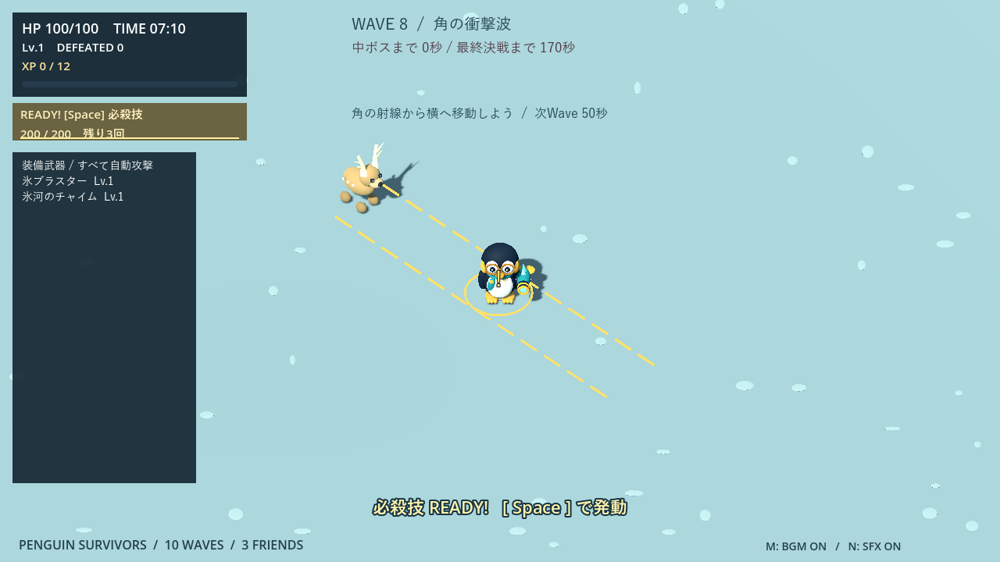


## プレイアブルキャラクター

| キャラ | 外見 | 初期武器 |
|---|---|---|
| メガネペンギン | コウテイペンギン、丸眼鏡、青緑のマフラー | 氷ブラスター Lv.1 |
| ピンクペンギン | ピンクの頭・背中・翼、白い顔とお腹、眼鏡なし。薄いチーク・アイシャドウ・まつ毛 | ハートの波動 Lv.1 |

両方とも最初から選択可能。HP100・移動速度・当たり判定は共通です。必殺技はキャラクターごとに異なります。ピンクはハート飾りの杖を持ち、クリア時のお祝いにも選んだキャラが登場します。モデル一覧にも2人を掲載しています。

**ハートの波動**：12m以内の最寄りの敵へ、発射時の方向に固定したハートを放ちます。基礎威力2、間隔0.65秒、速度13m/秒、最大飛距離12m、判定半径0.35m、最大3体貫通。1発につき同じ敵への命中は1回で、潜行中のモグラには命中しません。強化曲線は既存武器と共通です。

初期装備だけがキャラ固有です。開始後は両キャラとも22種類すべてを抽選で入手・強化できます。ピンクに氷ブラスターが自動で付くことはなく、入手後に射撃を開始します。

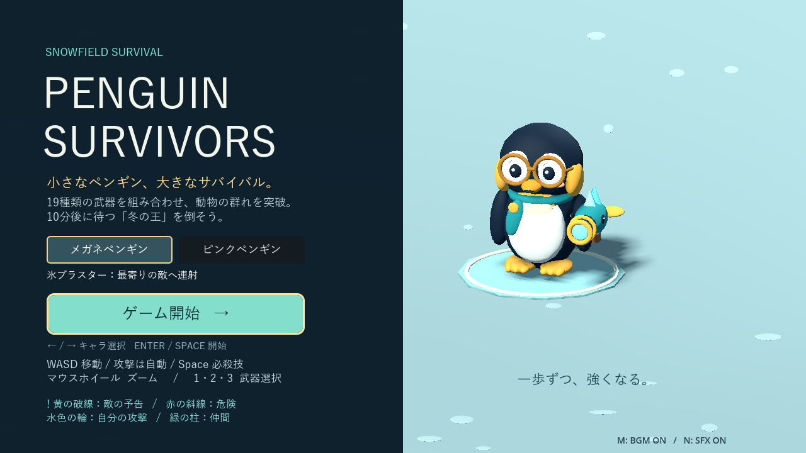
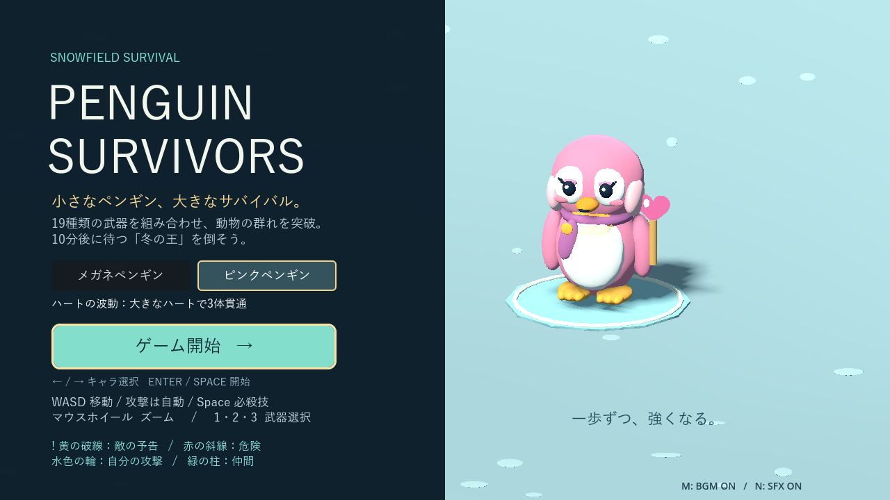
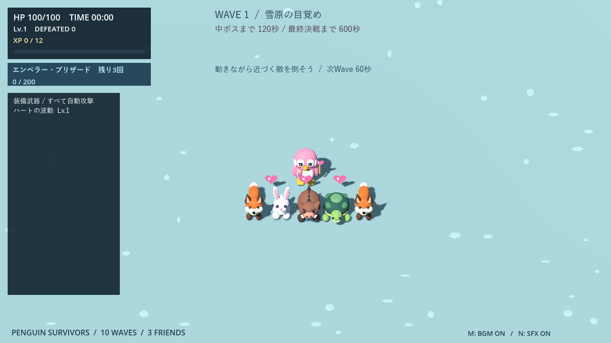


### キャラ追加の検証

`pink_character_test.gd`：選択・連打防止・再挑戦・タイトル復帰、初期装備、後から取得する氷ブラスター、低FPSで3体貫通と射程上限、全19武器、祝勝画面への外見の引き継ぎを確認。既存の移動・武器・タイトル・必殺技・ボス演出・死亡優先の回帰テストも実施しました。

`character_pacing_audit.gd` の90秒自動周回（seed73、通常の武器選択あり）：メガネはHP100・41撃破・選択2回、ピンクはHP100・43撃破・選択2回。どちらも被ダメージ0でした。選ばれた追加武器は異なるため、初期武器だけの厳密な性能比較ではありません。

デモ動画は以前のキャラクター構成の収録を維持しています。

`--starter-only` では追加武器の代わりに初期武器のみを強化して比較。90秒時点でメガネはHP100・39撃破、ピンクはHP100・42撃破、どちらも強化2回・被ダメージ0でした。自動周回による限定条件の検証であり、すべての遊び方の難易度を保証するものではありません。


## ピンク専用必殺技：ラブリー・ブルーム

| キャラクター | 必殺技 | ダメージ | 回復 |
|---|---|---:|---:|
| メガネペンギン | エンペラー・ブリザード | 100 | なし |
| ピンクペンギン | ラブリー・ブルーム | 80 | HP＋20（上限100） |

半径12m、撃破報酬200XPで充填、Spaceで発動、最大3回は共通。敵弾・毒雲の消去と最低1秒の無敵も維持します。回復は発動時に即時適用し、満タン分の蓄積や復活はありません。ダメージは1回だけで、潜行中のモグラは対象外です。

ラブリー・ブルームは杖を持ち上げ、大きな立体ハート、24個のハート、32枚の桃色・白金色の花びらを約2.2秒広げます。頭上の「HP +数値」は実際に回復した量のみ表示。演出は表示専用で追加ダメージなし。敵の黄色い予告と区別できる細い水色の境界を使います。

満タン通知にはキャラ別の技名を表示。専用発動音はNミュートに対応。武器選択・ボス演出中は演出を停止し、死亡・勝利時は回復表示も含めて解除します。

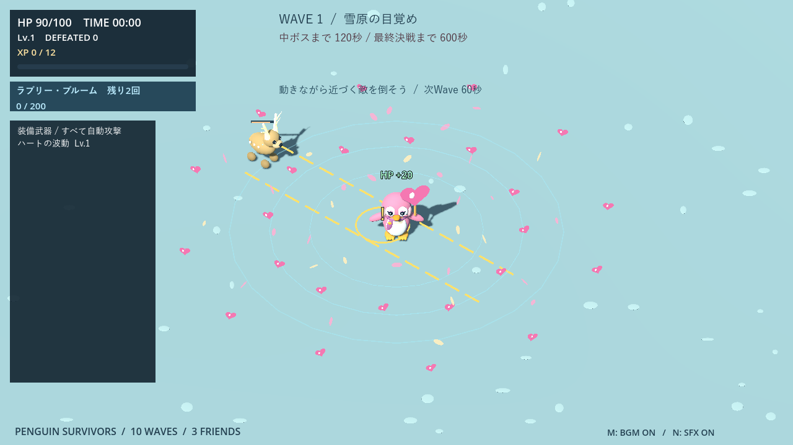
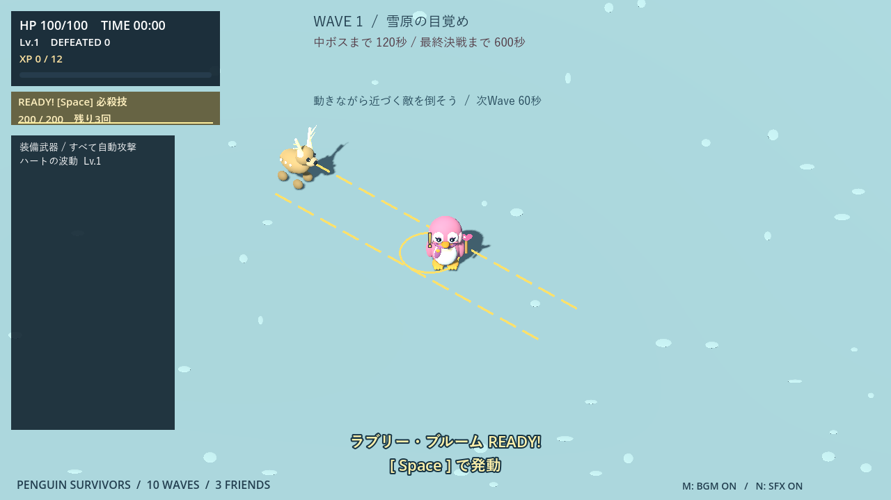
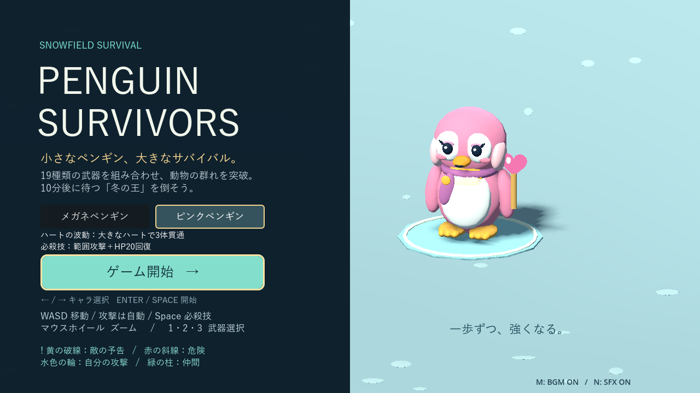

`bloom_test.gd` で80ダメージ単発、回復量・上限・満タン・死亡、回数制限、固定数の表示、死亡時解除を検証。既存必殺技の100ダメージ・回復なし、および必殺技・キャラ選択・音声の回帰テストも通過しています。Compatibilityの実画面で敵予告との重なりと文字の収まりを確認しました。デモ動画は再収録していません。


## ステージ2：夜の氷の城

独立した10分間の上級ステージです。2人のキャラ・22武器・3匹のサポート・キャラ別必殺技を使えます。雪原から装備やレベルは持ち越しません。


### 氷の門と戦い方

- X＝±8mの低い壁に各2門。門は幅6m、壁の南北端には常時通れる迂回路があります。
- 開始60秒までは全開。その後は対角2門を交互に「白青の鍵で2秒予告→8秒閉鎖→10秒全開」。占有中は最大2秒待ち、空かなければその門の閉鎖を中止します。挟み込みや閉鎖ダメージはありません。
- 中ボス戦と撃破後8秒は全開。武器選択・登場演出中は門の時計も止まります。
- 通常の地上敵は通行グリッドで迂回し、突進は壁で停止。ゴーストは門・城壁を通過し、ノクティスは専用動作で門を飛び越えます。
- 弾・追尾弾・光線は壁で止まり、氷玉ビリヤードは反射、ブーメランは消滅します。地上の範囲攻撃は中心から壁越しに届きません。上空の落下攻撃は壁の向こうの床へ着弾でき、必殺技は壁を越えます。
- サポートは壁外・到達可能な安全地点へ出現します。

### 城の新しい動物

| 通常敵 | 基礎HP / 速度 / 接触 | 特徴 |
|---|---|---|
| コウモリ | 3 / 2.2m毎秒 / 8 | 羽ばたきながら左右に揺れる。壁は越えない |
| アライグマ | 5 / 1.6m毎秒 / 10 | 10m以内へ氷玉。固定地点・1.5秒予告・半径2m・基本12ダメージ。壁で不発、6秒間隔 |
| オコジョ | 4 / 2.4m毎秒 / 10 | 5m以内で0.6秒予告、横へ1.5m跳躍。追加ダメージなし、4秒間隔 |
| ヤギ | 8 / 1.8m毎秒 / 12 | 6m以内で1秒予告、方向固定の6m突進。速度9m毎秒・基本16ダメージ。1.2秒休止＋4秒待機 |

HPには既存時間倍率の平方根、速度には既存曲線の開始値からの比率、ダメージには時間補正を適用。各3体・ヤギ2体、特殊敵合計12体、氷玉予告2個、通常敵弾32発まで。出現コスト・経験値は2、ヤギは3です。

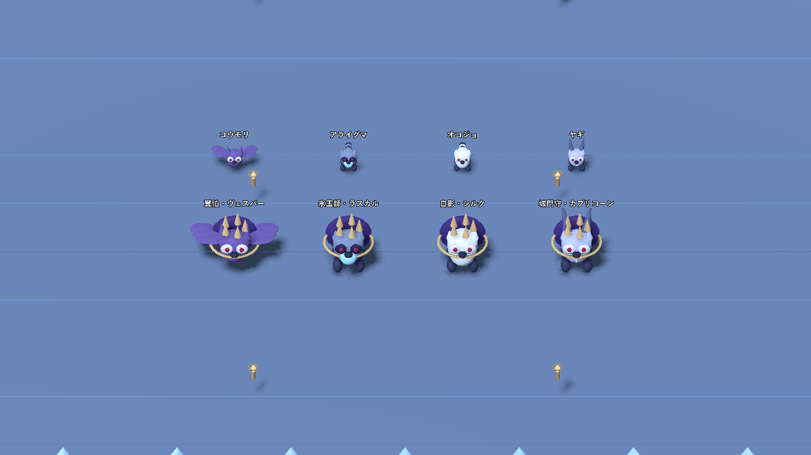

### 雪原とは異なる中ボス4体

追加の要望を反映し、城には専用中ボスを用意しました。2・4・6・8分に登場。HPは従来と同じ100／180／260／340で、増援半減と撃破時の回復・報酬・休息も共通です。

| 時刻 | 中ボス | 避け方 |
|---|---|---|
| 2:00 | 巨大コウモリ「翼伯・ヴェスパー」 | 1.2秒の予告から7発の氷の扇。射線を横へ外す |
| 4:00 | アライグマ「氷玉師・ラスカル」 | 左右2地点の氷玉着弾予告から離れる |
| 6:00 | オコジョ「白影・シルク」 | 予告された着地点へ跳躍。半径2.6mの着地攻撃を避ける |
| 8:00 | ヤギ「城門守・カプリコーン」 | 1.1秒予告後の8m突進。横移動や壁を利用する |

王冠・紫のマント・金の襟で通常敵と区別。通常イノシシの1:30先行紹介と、最初の中ボスまでの最低20秒間隔も維持します。

### 10Waveの編成

| Wave | 主役＋相棒の候補 |
|---|---|
| 1 | キツネ＋コウモリ。0:30からウサギ |
| 2 | カメ＋アライグマ |
| 3 | イノシシ＋オコジョ |
| 4 | オコジョ＋フクロウ／アライグマ＋ウサギ |
| 5 | オオカミ＋アライグマ／カメ＋フクロウ |
| 6 | ゴースト＋オオカミ／ゴースト＋アライグマ |
| 7 | イノシシ＋フクロウ／オオカミ＋オコジョ |
| 8 | ヤギ＋アライグマ／ヤギ＋カメ |
| 9 | ヤギ＋フクロウ／オコジョ＋オオカミ／ゴースト＋アライグマ |
| 10 | ヤギ＋オオカミ／アライグマ＋フクロウ／コウモリ＋オコジョ／ゴースト＋ヤギ |

通常枠50%・主役30%・相棒20%、新敵の初登場保証・10秒の同種追加禁止、既存の出現予算・XP曲線を維持。ヤギは7分で解禁します。

### 氷城の梟王・ノクティス

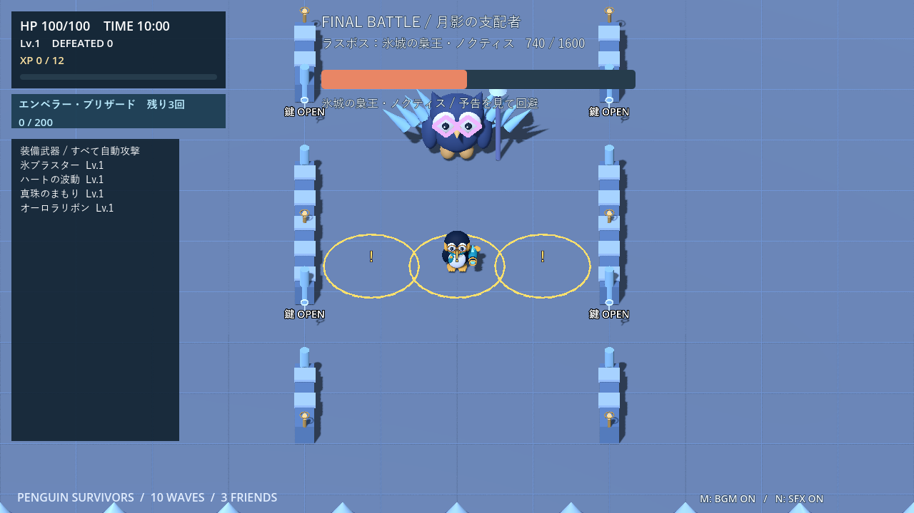

HP1600、接触18、速度2.0m毎秒。HP50%で第二形態へ移行し、速度2.4m毎秒、結晶の翼が展開します。登場・変身は2秒間の戦闘休止演出です。

1. **門の勅令→城門跳躍**：対角2門を2秒予告後に閉鎖。第一形態6秒、第二形態8秒。閉鎖後に0.8秒の着地予告を出し、0.9秒かけて門の反対側へ飛び越えます。
2. **氷羽の扇**：1.2秒予告、固定方向へ5発／第二形態7発。速度6m毎秒、12ダメージ。閉じた門を貫通しますが、城壁では止まります。
3. **月影の氷輪**：2秒予告、固定地点に24ダメージ。第一形態は半径3mの1地点、第二形態はプレイヤー付近と左右4.5mに半径2.5mの3地点。閉じた門越しにも届きますが、城壁は遮蔽として有効。壁内や逃げ道のない配置は延期。

氷羽・氷輪の後は1.5秒休止。跳躍の着地後は0.8秒休止して氷羽へつなぎます。門の閉鎖処理中は他の技を重ねません。氷アザラシ／氷ユキヒョウの手下、第一形態1回・第二形態最大2回のサポートは雪原と共通です。手下を残していても王の撃破でクリアできます。

城の道中・ノクティス第一形態・第二形態に専用48秒ループBGMを追加。形態変化は再生位置を引き継ぐ0.8秒クロスフェード。門・氷玉・詠唱・咆哮の効果音もオリジナル生成で、M／Nの設定に従います。

### 検証記録

Godot 4.7.2 / Compatibilityで確認。城の自動テストは `castle_test.gd`、`castle_rules_test.gd`、`castle_behavior_test.gd`。12シードの解禁順、門の占有中止、実際の迂回、壁衝突、武器配置・遮断・反射、氷玉・横跳び・突進、ノクティスの技順・範囲・安全な退避・形態移行、選択保持と成長リセットを検証します。雪原の移動・19武器・両キャラ・必殺技・サポート・ボス・音声・タイトルの回帰テストも実行しています。

自動操縦の比較（シード73、Lv.12、初期武器＋各構成4武器をLv.5、必殺技は温存）。道中は7:00から最長60秒、決戦は第二形態から開始。自然な通しプレイや人の攻略結果ではありません。

| キャラ | 構成 | 道中の生存秒 / 終了HP | 第二形態撃破秒 / 終了HP | 手下出現 / 最大同時 | サポート登場 |
|---|---|---|---|---|---|
| メガネ | 近接 | 58.3 / 0 | 38.1 / 80 | 16 / 5 | 1 |
| メガネ | 後方 | 51.2 / 0 | 43.6 / 90 | 20 / 6 | 2 |
| メガネ | 自動照準 | 58.0 / 0 | 23.1 / 92 | 8 / 4 | 1 |
| ピンク | 近接 | 41.7 / 0 | 45.3 / 93 | 20 / 5 | 2 |
| ピンク | 後方 | 38.8 / 0 | 41.0 / 36 | 16 / 6 | 1 |
| ピンク | 自動照準 | 60.3 / 2 | 28.4 / 92 | 12 / 6 | 1 |

12ケースすべてで壁への侵入0、周囲の全移動候補が塞がる時間0秒。道中はこの限定装備・自動操縦では厳しく、死亡したケースも記録しています。通しプレイの成長や人の回避を含めた難易度保証ではありません。

描画負荷はRTX 4060 Laptop GPU、1280×720、同じ48体・19武器で各180描画フレームを測定。平均フレーム時間は雪原6.99ms／城9.58ms、最大描画呼び出し数は4254／4393。VSync・実行環境・攻撃の発動時刻で変わる参考値です。`tools/profile_castle.gd` で再測定できます。

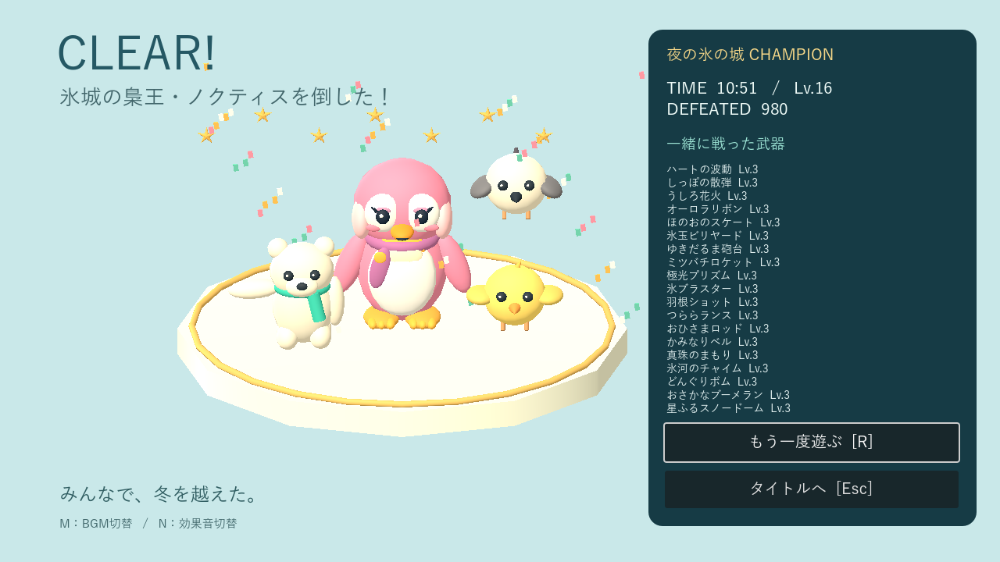

実画面は `tools/capture_castle.gd` で撮影。時刻・装備・敵配置を撮影用に設定しています。デモ動画は再収録していません。

### ステージ2の実装ファイル

- `scripts/stage_catalog.gd`：選択状態・ステージ設定・城のWave表
- `scripts/castle_obstacles.gd`：壁・門・占有判定・通行グリッド・分散した経路更新・攻撃遮断
- `scripts/castle_models.gd`：夜の城と新動物4種のPrimitive Mesh
- `scripts/castle_enemy.gd` / `castle_bomb.gd`：城の通常敵と氷玉
- `scripts/castle_miniboss.gd`：城専用中ボス4体
- `scripts/noctis.gd`：梟王の行動・形態・安全な氷輪配置
- `tests/castle_tactics_audit.gd`：両キャラ×3構成の自動走行


## 武器の個別強化・おうどん・ゴースト

### 武器アップグレード方針

**1回の強化が、新しい武器を1つ取ることと同じくらい魅力的な選択になること**を目標にします。新規取得は攻撃方向や対処できる状況を増やし、強化は得意な攻撃の威力・届く距離・巻き込める数を伸ばします。少数の武器を育てる構成と、多種類を組み合わせる構成の両方を成立させる方針です。

- **武器の特徴に合わせて伸ばす。** 直線弾は威力・射程・貫通数、散弾や追尾弾は威力・発射数、範囲攻撃は威力・半径、設置武器は威力・持続を中心に強化します。往復武器は到達距離も伸ばし、元の攻撃方式を保ちます。
- **連射速度だけに頼らない。** 間隔短縮に加えて、届かなかった敵に届く、群れをまとめて倒せるなど、使い勝手にも変化を付けます。
- **複数の倍率が重なる武器は成長を分散する。** 威力・弾数・範囲・持続を同時に大きく増やすと強くなりすぎるため、多発系は威力を伸ばす段階と数を増やす段階を分けます。範囲拡大も、半径以上に面積が増えることを考慮します。
- **完成形をLv.5に置く。** 新規取得のLv.1から4回の強化で完成。最大強化後は抽選対象から外し、別の武器を取得・育成する余地を残します。
- **選ぶ前に効果が分かる表示にする。** 強化候補には、今回変わる威力・間隔・射程・半径・数・持続・貫通数などの変更前後を表示します。

バランスは、同じ選択回数を使った構成同士で比較します。単体への火力だけでなく、群れの処理、攻撃の当てやすさ、前方・後方の対応、城の壁との相性も評価します。「全武器の数値上の火力を同じにする」という意味ではなく、状況と遊び方によって新規取得と強化のどちらにも選ぶ理由がある状態を目指します。現時点の比較条件と実測値は、この章末尾に記載しています。

### 最大Lv.5、武器に応じて成長

初期性能は維持し、強化時の威力上昇を大きくしました。射程・範囲や攻撃数も増やし、新武器で攻撃方向を増やすか、得意な武器へ集中投資するかを選べます。既存20武器の間隔短縮は最大20%（氷ブラスター・真珠は10%）に抑えています。制御用の2武器は、後述の専用成長表を使用します。

| 武器・系統 | Lv.1 → Lv.5の主な変化 |
|---|---|
| 氷ブラスター | 威力1→5、照準射程12→16.8m |
| ハートの波動 | 威力2→6、射程12→16.8m、貫通3→5体 |
| 羽根ショット／しっぽの散弾 | 威力2→4／3→6、5→7発、射程13.6→19.04m |
| つららランス | 威力5→15、射程19.5→27.3m |
| おひさまロッド／うしろ花火 | 威力6→18／8→24、爆発半径3.2→3.968m／3→3.72m |
| かみなりベル | 威力5→9、3→5地点、半径3→3.72m |
| オーロラリボン | 威力7→21、薙ぎ払い距離3.8→5.32m |
| ほのおのスケート | 威力2→6、半径1.25→1.55m、持続4→5.2秒 |
| 氷玉ビリヤード | 威力3→9、持続5→6.5秒 |
| ゆきだるま砲台 | 威力2→6、照準射程12→16.8m、持続8→10.4秒 |
| ミツバチロケット | 威力2→4、3→5匹、照準射程12→16.8m、持続3→3.9秒 |
| 極光プリズム | 威力3→9、射程12→16.8m、持続1.3→1.69秒 |
| 真珠のまもり | 威力2→4、2→4個、旋回半径2.2→3.08m |
| 氷河のチャイム | 威力2→6、半径4.2→5.208m |
| どんぐりボム | 威力4→12、半径3→3.72m、待機8→10.4秒 |
| おさかなブーメラン | 威力2→6、到達距離9.1→12.74m、寿命2.4→3.12秒 |
| 星ふるスノードーム | 威力1→3、半径2.6→3.224m、持続3.2→4.16秒 |
| ちゅるちゅるおうどん | 威力1→3（往復各1回）、射程11→15.4m、巻き込み半径1.2→1.488m |

多発系はLv.2・4で威力、Lv.3・5で数を伸ばし、同じレベルで両方を急増させない設計です。最大強化武器は候補から外れます。全22武器MAX時だけ、レベルアップをHP20回復へ置き換えます。


### ちゅるちゅるおうどん

両キャラで入手できる20番目の武器。どんぶりから麺を最寄りの敵へ伸ばし、先端付近を巻き込んで手元へ戻します。0.35秒で伸び、0.9秒で巻き戻り、同じ敵に往路・復路で各1回まで命中。最初につかんだ通常敵を最大4m引き寄せますが、プレイヤーから3m以内へ無理に引き込みません。ボスは引き寄せず、潜行中のモグラは狙いません。壁・閉じた門で麺が止まり、引き寄せも通常敵は壁を越えません（ゴーストは城壁も通過します）。

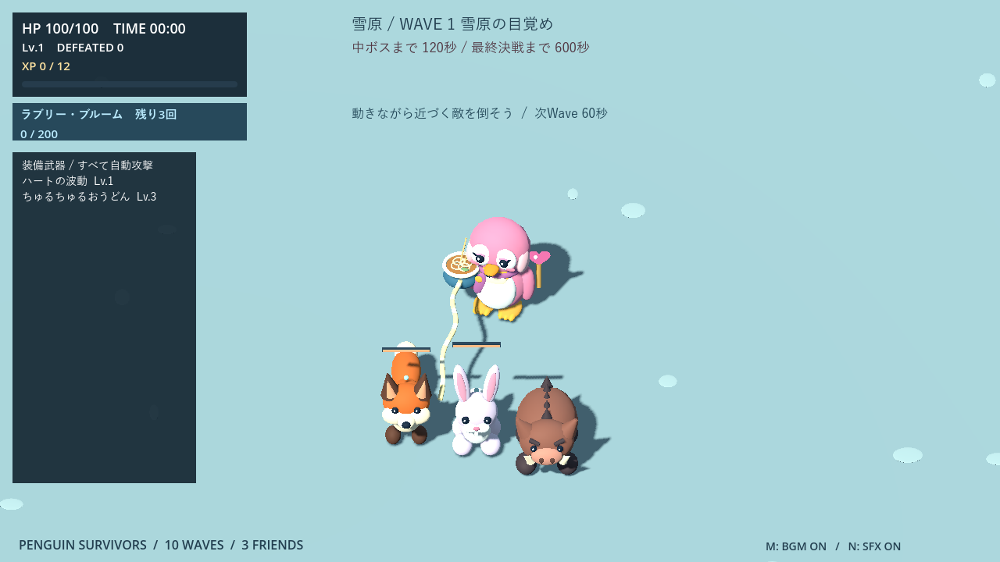

### 城のゴースト

Wave 6（5:00）から登場。紫の半透明の体、赤い目、尖った裾で識別します。**閉じた門も城壁も**すり抜けて接近。門を閉じる際の占有判定にも含めません。HP4・速度1.75m/秒・接触10を基礎とし、城の通常敵と同じ時間補正を適用。出現コスト2・経験値2、同時3体、特殊敵全体12体の上限を共有します。雪原には出現しません。

城は既存6種＋城固有5種の計11種類へ増えました。Wave 6で紹介し、Wave 9・10の混成にも登場します。

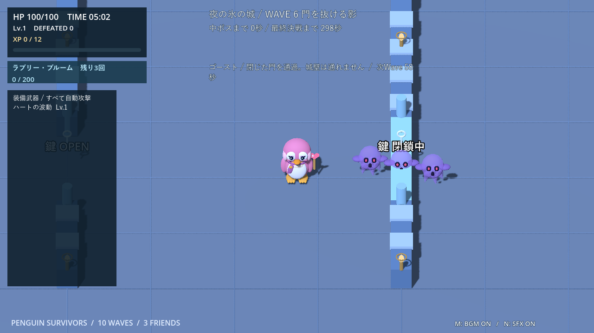

### 今回の検証

Godot 4.7.2で `upgrade_udon_ghost_test.gd` と既存の武器・両キャラ・武器バリエーション・楕円軌道・城・必殺技・Wave・サポートのテストを実行。Lv.5上限、候補の枯渇、余剰XP、実際の強化後の弾数・射程・範囲・持続、低FPS相当の麺の往復命中と引き寄せ、門通過と城壁遮断を確認しました。`castle_rules_test.gd` は12シードの解禁順と全20武器の城壁ルールを確認しています。

Compatibilityの実画面で、どんぶりと麺・強化数値・ゴースト・20武器の結果表示を確認しました。撮影スクリプトは `tools/capture_udon_upgrade.gd`。過去の章にある試験数値・動画は、当時の武器性能による記録です。

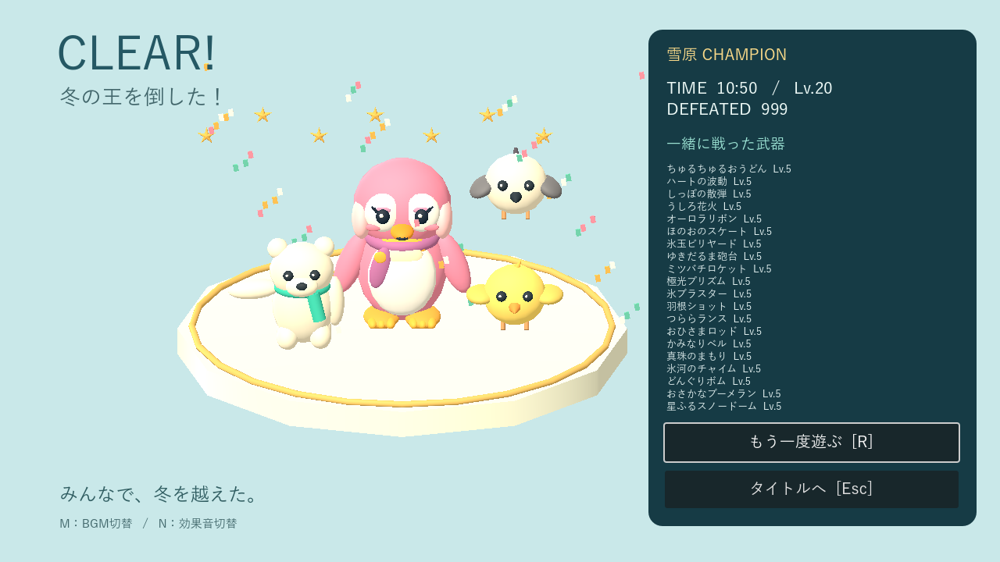

#### 同じ選択回数での集中強化と新規取得の比較

`tests/weapon_growth_audit.gd`：雪原3:00開始、メガネ、seed73、半径12mの自動周回、60秒。4回分の選択を開始前に割り当て、試験中の追加選択・必殺技はなし。

| 割り当て | 60秒後HP | 撃破数 |
|---|---:|---:|
| 氷ブラスターLv.5（4回強化） | 100 | 55 |
| 氷ブラスターLv.1＋羽根・氷玉・つらら・火球を各Lv.1 | 89 | 37 |

集中強化が新規取得に埋もれないことを確認しました。これは特定構成・自動操作の結果で、全武器の等価性や通しプレイの難易度を保証するものではありません。


## ノックバックと凍結：低火力の制御武器

両キャラ・両ステージで、新規取得と強化の混合抽選から選べます。全22武器、上限Lv.5。既存20武器と初期装備の性能は変更していません。**特殊効果は通常敵と決戦の手下に有効。中ボス・ラスボスにはダメージだけを与えます。**

### ぱたぱた扇風機

発動時の位置・向きを固定して、前方160度の敵へ1回攻撃。0.6秒かけて外向きに押し返します。敵がいなくても発動するため、発動に合わせて追手へ向き直ると退避路を作れます。

| 武器Lv. | 1 | 2 | 3 | 4 | 5 |
|---|---:|---:|---:|---:|---:|
| ダメージ | 1 | 2 | 2 | 3 | 3 |
| 間隔（秒） | 2.6 | 2.45 | 2.3 | 2.15 | 2.0 |
| 到達距離（m） | 6 | 6.5 | 7 | 7.5 | 8 |
| 押し返し（m） | 3 | 3 | 3.5 | 4 | 4.5 |

同じ敵への重ね掛けはなく、終了後0.6秒は再ノックバック不可。城壁・閉じた門・アリーナ端で止まり、追加の衝突ダメージはありません。ゴーストは門と城壁を通過できます。うどんの引き寄せよりノックバックを優先します。

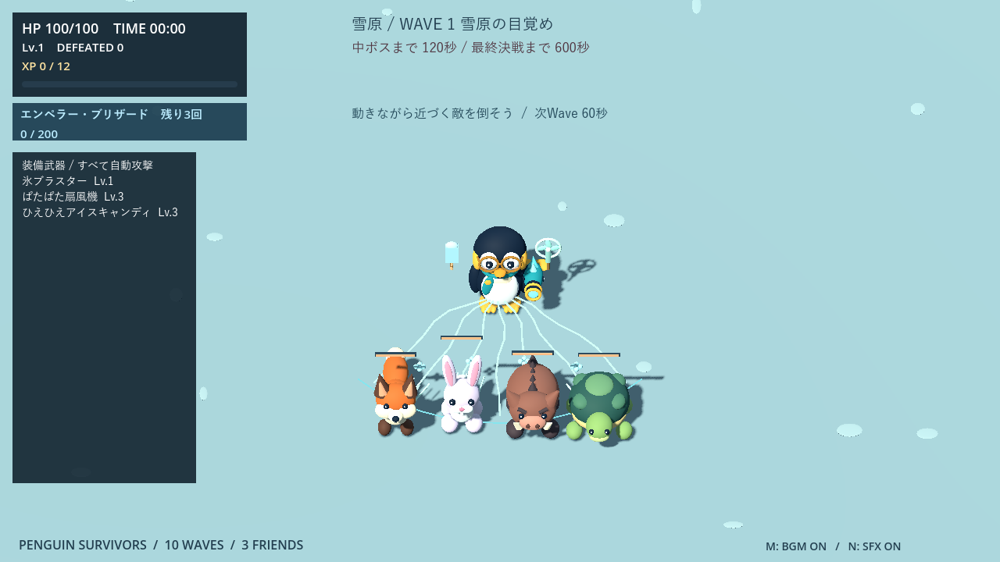

### ひえひえアイスキャンディ

12m以内の最寄りの敵へ、発射方向を固定した氷菓を1発放ちます。速度11m/秒・判定半径0.3m・最大飛距離12m。最初に命中した敵の位置で砕け、周囲へ1回だけダメージと凍結を与えます。直撃と破裂の二重ダメージはありません。

| 武器Lv. | 1 | 2 | 3 | 4 | 5 |
|---|---:|---:|---:|---:|---:|
| ダメージ | 1 | 2 | 2 | 3 | 3 |
| 間隔（秒） | 3.8 | 3.6 | 3.4 | 3.2 | 3.0 |
| 破裂半径（m） | 1.3 | 1.45 | 1.6 | 1.75 | 1.9 |
| 凍結時間（秒） | 1.0 | 1.0 | 1.2 | 1.2 | 1.4 |

凍結中の命中で時間は延びず、解凍後2秒は再凍結不可。ダメージは受け続けます。壁・閉じた門・射程終端では破裂せず消え、爆風も壁を越えません。


### 状態異常のルールと強化方針

- 凍結中は移動・攻撃・行動タイマー・接触ダメージを停止。敵を狙うこととダメージを与えることは可能です。攻撃を受けても解凍しません。
- ノックバック中も通常行動と接触ダメージを停止。効果を受けた敵は、自身の予告・突進・横跳びを中断して1秒休止します。凍結中は休止の時計も止まります。
- 発射済みの敵弾・毒雲・独立した着弾予告は消しません。凍った敵も押し返せますが、凍結時間は延長しません。
- 完全に潜ったモグラには無効。潜り始めの演出中なら中断し、地上へ戻します。
- 武器選択とボス演出中は状態と表示も停止。死亡・退場・勝利・再挑戦で解除します。
- 火力を専用の低い成長表に制限し、範囲・押し返し距離・凍結時間へ強化価値を配分。強化カードには特殊効果の変更前後も表示します。
- 氷の結晶は凍結中に表示し、解凍時に砕けます。再凍結待ち中は小さく薄い雪の結晶だけ残ります。専用の風音・発射音・破裂音はNミュートに対応。


### 検証

`tests/control_weapons_test.gd` で扇形、固定方向、押し返し距離、壁・門・外周、ゴースト、低FPSでの最初の命中、単発ダメージ、凍結と再適用待ち、接触停止、予告解除、モグラ、ボス耐性、手下、停止、死亡解除、撃破報酬、音源読み込みを確認。既存の武器・両キャラ・城・必殺技・Wave・サポートの回帰テストも実施しています。

以下は扇風機の再強化前の比較記録です。`tests/control_balance_audit.gd` は同じ5回分の選択（氷ブラスターLv.3＋羽根ショット／扇風機／アイスキャンディのいずれかLv.3）で比較。メガネ、seed73、道中7:00または決戦第二形態から最大35秒、追加選択・必殺技なし。自動回避は敵から離れる方向を優先し、扇風機に合わせて向き直る操作は行いません。表は「経過秒／終了HP／撃破数」です。

| ステージ・区間 | 火力：羽根ショット | ノックバック：扇風機 | 凍結：アイスキャンディ |
|---|---|---|---|
| 雪原・道中 | 30.5 / 0 / 46 | 19.3 / 0 / 22 | 31.1 / 0 / 43 |
| 雪原・決戦 | 35.0 / 74 / 12 | 35.0 / 64 / 13 | 35.0 / 48 / 12 |
| 城・道中 | 27.0 / 0 / 42 | 13.9 / 0 / 10 | 21.1 / 0 / 20 |
| 城・決戦 | 35.0 / 64 / 12 | 35.1 / 82 / 12 | 35.0 / 82 / 13 |

壁への侵入は0件。敵の接触範囲と壁を避けて1.4m先へ動ける候補がなくなる連続時間は最大0.50秒でした。凍結の適用時間は雪原道中で延べ19.53敵秒、城道中で5.10敵秒。少ない装備で終盤へ直行する厳しい条件であり、道中は全構成で死亡しました。扇風機は逃げ続ける自動操作ではほとんど当たらず、火力の代わりに入れるだけでは有利になりません。機能テストでは正面の敵を押し返せることを確認していますが、この比較だけで人間の向き直り操作を含む難易度を評価することはできません。

Godot 4.7.2 / Compatibility実画面で、風の流線・氷の結晶・敵の見え方・強化候補・22武器の一覧と祝勝画面を確認。撮影は `tools/capture_control_weapons.gd`。デモ動画は今回更新していません。

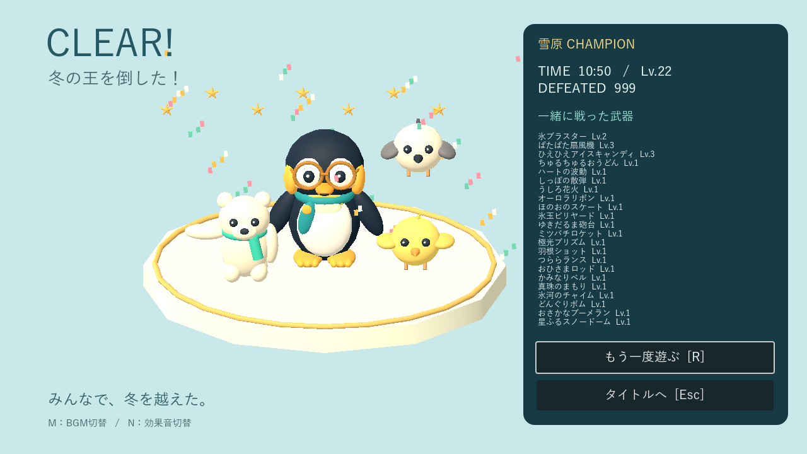


## 制御武器の再強化と城門を使うノクティス

- **ぱたぱた扇風機**：100度→160度、射程4〜5.2m→6〜8m、押し返し2〜3m→3〜4.5m。移動時間を0.25→0.6秒、風の表示を0.4→0.85秒に延長。間隔は3.2〜2.6秒から2.6〜2.0秒へ短縮しました。ダメージ1〜3と、ボス耐性・再適用制限は維持します。
- **ちゅるちゅるおうどん**：射程7〜9.8m→11〜15.4m、最大引き寄せ2→4m、復路0.6→0.9秒。ダメージは往復各3〜9から各1〜3へ下げました。捕まえた敵には麺の輪を巻き、復路のダメージを引き寄せ終了まで遅らせます。弱い敵を即座に倒してしまい、引き寄せが見えない問題を抑えました。プレイヤーから3m以内には引き込みません。
- **ゴースト**：城門に加えて城壁も通り抜けます。移動・経路判断・ノックバック・うどんの引き寄せで同じルールを使用。アリーナ外へは出ません。HP・速度・出現数は維持します。


### ノクティス：閉門・跳躍・門越しの攻撃

閉門後は閉じた門を優先して選び、反対側の床に0.8秒の着地予告を表示。0.9秒かけて門上を飛び越えます。着地先は壁外かつ予告時のプレイヤーから3.2m以上離れた場所に固定。移動中は接触攻撃も地上からの被弾もなく、着地に範囲ダメージはありません。着地後0.8秒で次の氷羽予告へ進みます。

氷羽と氷輪は閉じた門を無視して作用します。**城壁は攻撃を遮る**ので、門の前に立ち続けるより、壁の陰へ回る・氷羽を横へ避けることが重要になります。門貫通の氷羽には羽根状の装飾を追加。通常敵・雪原ボスの弾は従来どおり門で止まります。

跳躍中は手下・サポートの新規出現を延期。形態移行や中断時は安全な出発地点へ戻して地上状態を復元し、壁の中へ取り残しません。跳躍候補がなければ無理に移動せず、通常の技順へ進みます。


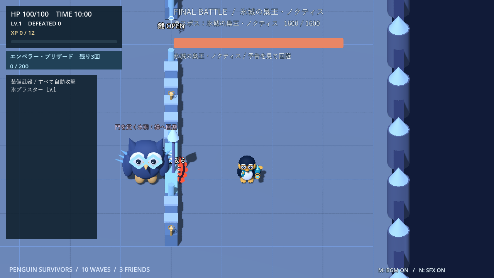

### 確認結果

`castle_control_rebalance_test.gd` で、閉門後の跳躍予告、門上の通過、着地・中断復帰、飛行中の標的除外、門を貫通する氷羽、城壁での遮断、氷輪の視線判定、10m先のうどんの捕獲、引き寄せ完了後の単発撃破を確認。制御武器・武器強化・既存武器・城・決戦増援の回帰テストも成功しています。実画面はGodot 4.7.2 / Compatibilityで撮影しました。


同条件の自動回避比較（seed73、氷ブラスターLv.3＋比較武器Lv.3、追加選択なし、最大35秒）を再実行しました。以下は扇風機構成の結果です。

| 区間 | 生存時間 | 終了HP | 撃破数 | 押し返し適用時間（延べ敵秒） |
|---|---:|---:|---:|---:|
| 雪原7:00から | 29.1秒 | 0 | 42 | 10.12 |
| 雪原の決戦 | 35.0秒 | 68 | 12 | 3.00 |
| 城7:00から | 21.4秒 | 0 | 26 | 2.92 |
| 城の決戦 | 35.0秒 | 90 | 12 | 1.78 |

前回の扇風機は雪原道中19.3秒・22撃破・押し返し0敵秒だったのに対し、今回の条件では効果が発生する機会が増えました。城はゴーストとボスも変わっているため、武器だけの厳密な前後比較ではありません。道中の低装備試験は依然として死亡します。全12ケースで壁への不正侵入はなく、退避方向がなくなる連続時間は最大0.35秒でした。通常プレイの強さを保証する数値ではなく、限定条件での点検結果です。
