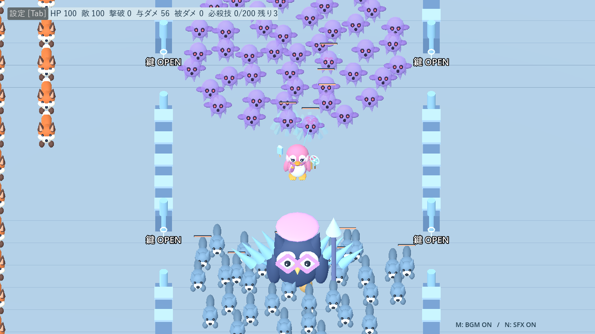
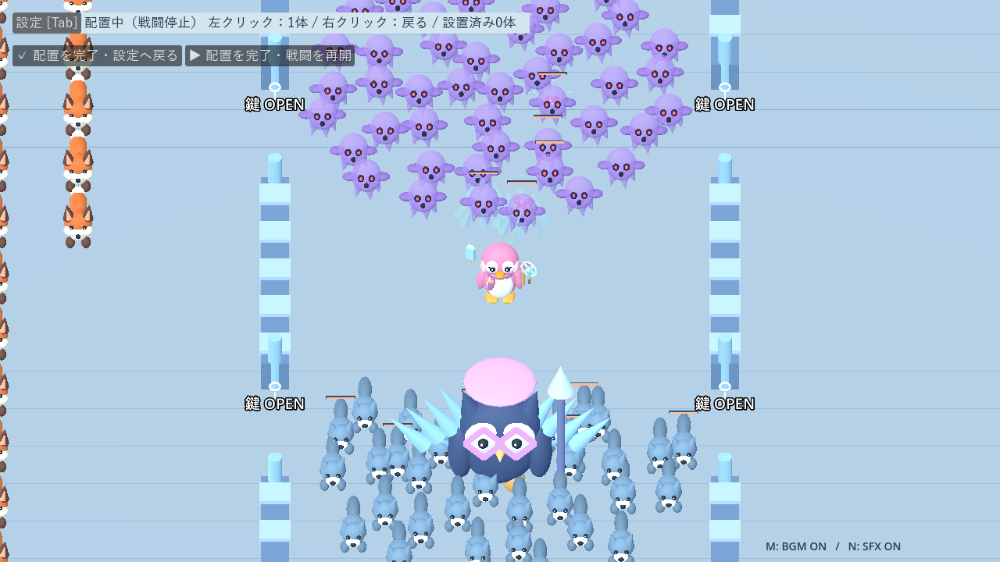

# 開発・テスト

[READMEへ戻る](../README.md) · [武器](weapons.md) · [ステージ](stages.md) · [過去の検証記録](development-history.md)

## 実行環境

- Godot 4.7.2、GDScript、Compatibilityレンダラーで確認。
- `project.godot` をGodotで開き、F5でタイトルから実行。
- モデルはPrimitive Meshから生成。外部アセット・プラグイン・Blenderは不要。
- 通常プレイにはPython不要。音源の再生成だけPython 3の標準ライブラリを使います。

`scenes/character_gallery.tscn` を開いてF6でモデル一覧を起動できます。城のモデルや新武器の実画面は各ガイドと `docs/screenshots/` にあります。

## 主な構成

| 場所 | 役割 |
|---|---|
| `scenes/title.tscn` / `scripts/title_screen.gd` | タイトル・キャラとステージの選択 |
| `scenes/main.tscn` / `scripts/main.gd` | ゲーム進行・HUD・シーン間の接続 |
| `scripts/player.gd` / `character_roster.gd` | 移動・HP・キャラ定義 |
| `scripts/weapon_catalog.gd` / `weapon_system.gd` | 基本23武器と進化8武器の定義・強化・自動発動 |
| `scripts/evolution_catalog.gd` / `evolution_book.gd` | 進化条件・継承・専用成長・レシピ表示 |
| `scripts/evolution_projectile.gd` / `fusion_attack.gd` / `evolution_models.gd` | 進化武器の攻撃・表示 |
| `scripts/weapon_attack.gd` / `advanced_attack.gd` | 武器の移動・命中・寿命 |
| `scripts/control_attack.gd` / `enemy_control.gd` / `udon_attack.gd` | 制御武器・状態異常・麺の往復と引き寄せ |
| `scripts/difficulty.gd` / `wave_director.gd` / `stage_catalog.gd` | 難易度・Wave・ステージ定義 |
| `scripts/castle_obstacles.gd` | 壁・門・経路探索・攻撃の遮断 |
| `scripts/enemy.gd` / `special_enemy.gd` / `castle_enemy.gd` | 通常敵の共通処理と固有行動 |
| `scripts/final_boss.gd` / `noctis.gd` / `final_battle_director.gd` | ラスボス・決戦増援と援護枠 |
| `scripts/game_audio.gd` / `assets/audio/` | BGM・効果音・ミュート |
| `scenes/sandbox.tscn` / `scripts/sandbox.gd` / `scripts/sandbox_ui.gd` | 練習場・配置と補充・設定UI。本編の戦闘を共用 |
| `scripts/settings.gd` / `settings_menu.gd` | 設定保存・入力割当・ポーズと味方エフェクトの濃さ |
| `tests/` | 自動テスト・自動操作による比較 |
| `tools/` | 音源生成・撮影・描画負荷の点検 |

表の短いファイル名も `scripts/` 内です。性能の正本はコードの定義値で、数値を変えるときは[武器](weapons.md)・[ステージ](stages.md)も合わせて更新します。

## 自動テストの実行

プロジェクトのルートから実行します。以下の `godot` はPATHに登録したGodot実行ファイル名です。Windowsでは使用するGodotのコンソール版exeのパスへ置き換えられます。

```sh
godot --headless --path . --script tests/contributions_test.gd
godot --headless --path . --script tests/evolution_test.gd
godot --headless --path . --script tests/settings_test.gd
godot --headless --path . --script tests/sandbox_test.gd
godot --headless --path . --script tests/weapons_test.gd
godot --headless --path . --script tests/control_weapons_test.gd
godot --headless --path . --script tests/castle_control_rebalance_test.gd
godot --headless --path . --script tests/castle_behavior_test.gd
```

| テスト | 主な確認内容 |
|---|---|
| `evolution_test.gd` | 単体Lv.2・合体Lv.1、継承・消費・2枠・分岐・命中と停止・サンドボックス |
| `settings_test.gd` | 二重の停止・ボス演出停止・設定保存・入力割当・パッド入力・味方の濃さと警告の維持 |
| `sandbox_test.gd` | キャラ分離・23武器・全敵・形態固定・補充・停止・死亡・設定保持・ランダム配置と連続クリック |
| `starfall_pool_test.gd` | 23種・ステージ16種・複数シード抽選・候補枯渇・真珠の継続と壁・メテオの待機と単発着弾 |
| `weapons_test.gd` | XP・抽選・蓄積・一時停止・武器の命中と寿命 |
| `upgrade_udon_ghost_test.gd` | Lv.5上限・候補枯渇・実際の強化値・麺・ゴースト |
| `control_weapons_test.gd` | ノックバック・凍結・耐性・中断・死亡解除 |
| `castle_control_rebalance_test.gd` | 城門跳躍・門貫通攻撃・長距離の引き寄せ |
| `castle_rules_test.gd` / `castle_behavior_test.gd` | 門・解禁順・武器遮断・敵とノクティスの挙動 |
| `pink_character_test.gd` / `bloom_test.gd` | キャラ選択・初期装備・ハート・回復必殺技 |
| `ultimate_test.gd` / `final_battle_test.gd` | 必殺技・手下・形態別の援護枠 |
| `wave_test.gd` / `support_test.gd` | Wave進行・サポートの抽選と同行 |

`control_balance_audit.gd` などの比較スクリプトは自動回避・固定装備の限定条件で動きます。通常プレイや人間の操作と同じ難易度を保証するものではありません。過去の実測値と測定条件は[検証記録](development-history.md)に保存しています。

ドキュメントのみの変更ではリンク・数値・表を確認します。挙動を変更した場合は対応テストと関連する回帰テストを実行し、表示変更はCompatibilityの実画面でも確認します。

## 音源

オリジナルの合成WAVを同梱。通常BGM・中ボス曲・ステージ別ラスボス第一／第二形態・祝勝曲があります。形態別曲は同じ再生位置から0.8秒でクロスフェード。音量・ミュートは設定ファイルへ保存し、次回起動にも引き継ぎます。M／Nは既定のミュートキーで、設定から変更できます。

再生成はプロジェクトルートで次を実行します。既存の音源ファイルを書き換えます。

```sh
python tools/generate_audio.py
python tools/generate_evolution_audio.py
```

## スクリーンショット・動画

進化の撮影は `tools/capture_evolutions.gd`。その他の撮影スクリプトは `tools/capture_starfall.gd`、 `tools/capture_castle_control_rebalance.gd` と `tools/capture_control_weapons.gd`。画面を使うため、`--headless` を付けずに実行します。撮影用に時間・装備・敵配置を設定し、`docs/screenshots/` の画像を更新します。

デモ動画の収録方法とフレーム検証は[動画のREADME](videos/README.md)へ。2026-09-20の動画は、敵の行動改善・デンの跳躍・虹プリズム・ノクティスの移動氷壁を含む72秒の映像です。撮影用に進行を制御した紹介映像です。

### サンドボックスの確認

`tools/capture_sandbox.gd` で設定画面・敵プレビュー・100体配置・配置プレビューを撮影できます。2026-09-17、Godot 4.7.2 / Compatibility / RTX 4060 Laptop GPUで実画面を確認しました。敵100体（行動停止・撮影用HP10000）、ピンク＋ハート・扇風機・アイスキャンディLv.3、城壁ありの限定条件で、ウォームアップ後120フレームは平均約6.9msでした。通常AI100体や全武器同時使用の性能保証ではありません。

サンドボックス専用テストと、キャラ・制御武器・城門跳躍・本編ラスボス進行・タイトルの回帰テストは失敗0件。実行環境では証明書ストアの読み取り警告と、一部の既存テストでも発生する終了時ObjectDB警告が出ます。




### 常時首振りと凍結色の確認

`control_weapons_test.gd` で風の常時維持・左右首振り・移動追従・同じ敵への命中間隔・強化時の境界拡大・停止を確認。凍結材質の個体分離と解凍時の復元、既存の制御・耐性テストも失敗0件。`sandbox_test.gd` も通過しました。`tools/capture_fan_freeze.gd` でCompatibilityの実画面を収録しています。

### 真珠・メテオ・ステージ抽選（2026-09-18）

専用テスト、武器、制御武器、成長、ピンクキャラ、サンドボックスの回帰テストは失敗0件。Compatibility実画面で真珠6個、メテオ予告・着弾、タイトルの16武器一覧、サンドボックス23武器を確認しました。基礎表と成長表は同じ23種を同じ順序で掲載しています。

`tests/starfall_balance_audit.gd` は同じ5回分の取得・強化（初期ブラスターLv.3＋比較武器Lv.3）で60秒測定。6分相当のキツネ／オオカミを0.5秒ごと、半径12mから投入し、プレイヤーはその場で回転。HPを毎ステップ100に戻して継続測定します。全武器比較用のサンドボックスなので本編の限定プールは適用しません。

| 地形 | 比較武器 | 撃破 | 累計被ダメージ | 実与ダメージ |
|---|---|---:|---:|---:|
| 雪原 | 真珠 | 106 | 691 | 875 |
| 雪原 | リボン | 114 | 313 | 918 |
| 雪原 | メテオ | 102 | 785 | 837 |
| 雪原 | チャイム | 111 | 645 | 903 |
| 城 | 真珠 | 104 | 749 | 855 |
| 城 | リボン | 110 | 261 | 883 |
| 城 | メテオ | 100 | 721 | 821 |
| 城 | チャイム | 109 | 504 | 883 |

HPを戻さない静止試験ではメテオ構成は約15秒で死亡し、Lv.3の初回22秒に届きませんでした。メテオは単独で近接防御を担う武器ではなく、通常火力や制御と組み合わせる必要があります。これらは固定条件の比較であり、人間の回避操作や10分間の難易度を保証する測定ではありません。

### 武器の名前・造形の整理（2026-09-18）

`weapon_models.gd` が装備と攻撃の共通モチーフを生成し、`weapon_spark.gd` はダメージを持たない氷片を最大16組まで表示します。新名称は内部IDを変更せず反映しています。`scenes/weapon_gallery.tscn` は全23装備のモデル一覧です。

- `weapon_style_test.gd`：変更前に記録した全23武器×Lv.1〜5の数値と一致。固定装備・異なる弾形状・どんぐりの表示と判定の分離・停止・解除を確認。
- 武器、制御武器、パール／メテオ・ステージ抽選、サンドボックス、ピンクキャラの関連回帰テストは失敗0件。
- `tools/capture_weapon_styles.gd` で23武器を個別撮影し、装備一覧と城の16武器＋敵予告の重なりをCompatibility実画面で確認。
- RTX 4060 Laptop GPU、1280×720、城プール16武器Lv.5、敵なし・攻撃時計停止、30フレーム準備後120フレームの表示時間は変更前 **6.94ms**、変更後 **6.94ms**（最終モデルで再計測）。表示同期を含むフレーム間隔の比較であり、GPU処理時間単体の測定ではありません。同条件の静的表示比較で、大量の敵や弾が動く戦闘負荷の保証ではありません。

実行環境の証明書ストア警告と、一部テストの終了時ObjectDB／リソース警告は残っています。現在の名前とスクリーンショットは[武器の見た目](weapon-appearance.md)を参照。過去の比較記録やデモ動画には旧名が残ります。

### サポート「デン」（2026-09-18）

4匹の抽選袋、デンの0.6秒後から6秒間隔・最大5回の着地、半径5m・単発2ダメージ・3m押し返しを追加。`den_stomp.gd` は固定12個の薄い土煙と水色の輪だけを表示し、判定はサポート本体で処理します。祝勝画面はプレイヤー＋4匹です。

`den_test.gd` で16シード・各6巡の非重複抽選、回数・範囲・潜行除外・ボス耐性・手下・壁遮断・凍結併用・押し返し待ち時間・撃破報酬・停止・死亡・ボス移行を確認。既存のサポート、決戦管理、祝勝画面の回帰テストも実行。祝勝テストの旧19武器固定値は、現在のカタログ件数に修正しました。

`tools/capture_den.gd` で登場・着地・4匹の祝勝画面を撮影。Compatibilityで敵予告と友好表示が区別でき、デンや土煙がプレイヤーを覆わない配置・密度を確認しました。モデル一覧にもデンを追加。サンドボックスのサポート選択とデモ動画の再収録は含みません。

## ポーズ・設定の検証

設定・タイトル・サンドボックス・祝勝画面・音楽・必殺技・デンの7テストを実行し、すべて成功。Compatibility実画面で音・表示タブと操作タブを確認しました。ゲームパッドは入力イベントによる確認で、物理コントローラーを使った試遊は未実施です。

## 進化・合体の追加（2026-09-19）

専用テストと関連回帰テストは通過。[進化ガイド](evolutions.md#検証記録2026-09-19)に数値・実画面・同じ選択回数での比較を記録しています。再測定は `tests/evolution_campaign_audit.gd`（自然成長）、`tests/evolution_balance_audit.gd`（Wave 4）、`tests/evolution_boss_audit.gd`（決戦）。円移動の自動操作ではボス未討伐のため、撃破時間の優劣は判定していません。

低レベル合体の調整は `tests/evolution_low_rank_audit.gd` で3シード・全周囲／正面を比較。[調整値・条件・結果](evolutions.md#低レベル合体の調整2026-09-19)に記録しています。HPを復元する固定時間試験なので、生存時間・クリア率の代用にはしません。

## 貢献リザルト

`scripts/contributions.gd` は攻撃元IDを維持して実HP変化・制御成功を集計。`contribution_panel.gd` を祝勝・死亡画面で共用します。`tests/contributions_test.gd` と関連回帰テスト、`tools/capture_contributions.gd` で検証。[集計定義と実画面](results.md)を参照してください。

## 4段階の難易度

定義は `scripts/difficulty_tiers.gd`。既存の `difficulty.gd` は経過時間の曲線を維持します。生成時に敵へIDを保持し、独立した弾・罠にも同じIDをコピー。HPは生成後一度だけ補正し、被ダメージはプレイヤー共通処理で難易度→シロクマの順に計算します。

- `tests/difficulty_tiers_test.gd`：倍率・生成経路・危険物・混在設定・タイトル／再挑戦・決戦増援。
- `tests/difficulty_campaign_audit.gd`：32ケースの序盤3分比較。生ログの保存先は `docs/benchmarks/difficulty-2026-09-19.json`。
- `tools/capture_difficulty.gd`：Compatibilityで6画面の表示確認用スクリーンショット。

[倍率表・検証結果・制限](difficulty.md)

## デン・進化演出・移動氷壁（2026-09-19）

最新のデンは狙って跳躍し、押し返し4m。上記2026-09-18のその場着地・3mは旧仕様です。`den_jump.gd` が準備・跳躍・同行の時計を管理し、命中と貢献記録は共通経路を使います。ノクティスの `ice_wall_attack.gd` は地形にせず、ボスの時計から駆動する移動攻撃です。`evolution_visuals.gd` は攻撃判定から独立した固定メッシュの表示です。

- `tests/den_noctis_upgrade_test.gd`：標的選択・着地・氷壁の安全配置と判定。
- `tests/den_noctis_audit.gd`：デン比較と6構成のノクティス試行。
- `tools/profile_evolution_visuals.gd`：変更前後の全レベル性能一致・描画比較。
- `tools/capture_den_noctis.gd`：8進化武器・デン・氷壁・31武器一覧の実画面。

[仕様・数値・測定の限界・画像](den-noctis-update.md)

## 敵の見た目・行動・予告の更新（2026-09-20）

[仕様・比較結果・モデル一覧](enemy-refresh.md)。共通の経路予告は `enemy_telegraph.gd`、能力に同期した動作は `enemy_presentation.gd` へ分離。通常カメ、オコジョ、ヤギ、シルクの行動と予告を更新しました。

追加テストは `tests/enemy_refresh_test.gd`。比較は `tools/audit_enemy_refresh.gd`、描画負荷は `tools/profile_enemy_refresh.gd`、撮影は `tools/capture_enemy_refresh.gd` です。`python tools/prepare_enemy_baseline.py` で比較用の旧版を準備できます。比較用の旧版はコミット `305a423` のscripts/scenesを `.godot/enemy-baseline/` へ複製し、内部のスクリプト・シーン参照だけをそのディレクトリへ置換して実行します。音声などのアセットは現行と共用します。

掃討の境界値・回帰確認と自動操作比較は[掃討の検証](cleanup-verification.md)を参照。
