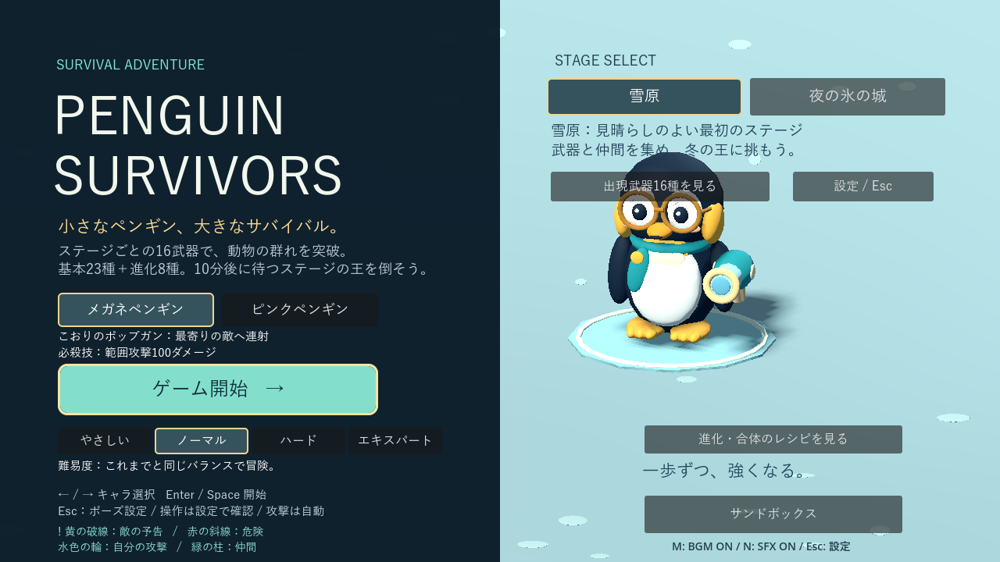
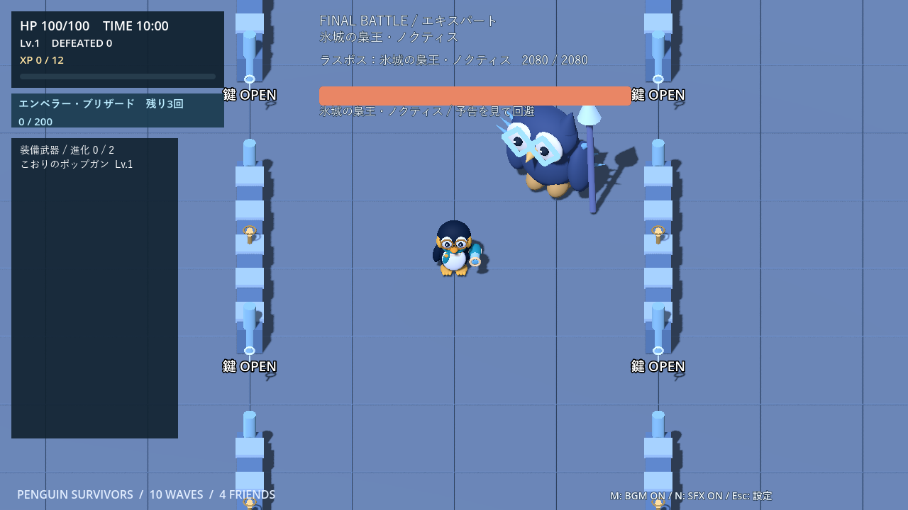
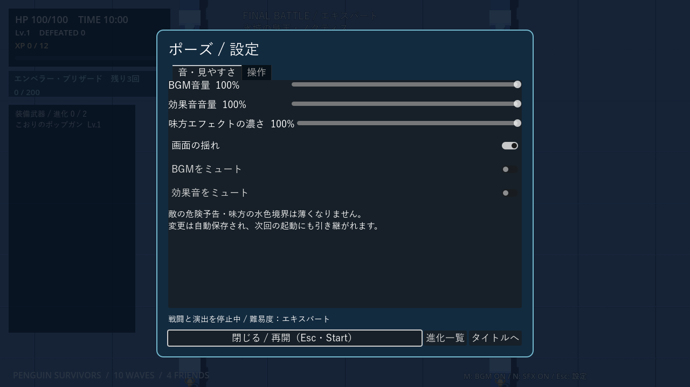
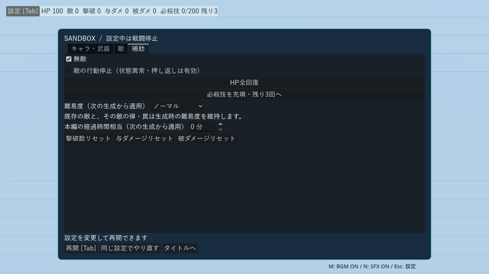

# 4段階の難易度

[READMEへ戻る](../README.md)

タイトルで選択し、両キャラ・両ステージに適用します。初回・直接ゲーム起動の既定値はノーマル。同一起動中は選択を保持し、再挑戦は同じ難易度で成長をリセットします。本編の途中変更はできません。解禁条件・専用報酬・永続保存はありません。

## 倍率

| 項目 | やさしい | ノーマル | ハード | エキスパート |
|---|---:|---:|---:|---:|
| 敵HP | 0.80 | 1.00 | 1.15 | 1.30 |
| 被ダメージ | 0.65 | 1.00 | 1.20 | 1.40 |
| 通常敵の出現予算 | 0.80 | 1.00 | 1.15 | 1.35 |
| 時刻別の通常敵上限 | 0.80 | 1.00 | 1.10 | 1.20 |
| 武器選択の必要XP | 0.80 | 1.00 | 1.00 | 1.00 |

- HPは通常敵・中ボス・ラスボス・手下に適用。既存の時間補正・特殊敵の平方根補正の後に掛け、切り上げ・最低1。最大HPも補正し、第二形態はその50％を基準にします。
- 被弾無敵を先に判定し、難易度倍率を掛けて切り上げ、その後シロクマの30％軽減を掛けて再度切り上げます。例：13ダメージ→エキスパート19→シロクマ同行中14。貢献一覧の軽減量はこの差の5（実際のHP減少を上限）です。
- 通常敵上限は切り上げ・最大100。既存のボス用1枠の予約、種類別上限、特殊敵12体、通常敵弾32発、雲6個を維持します。
- やさしいの必要XPは既存曲線の計算後に0.8倍し切り上げ。Lv.1では12→10、Lv.5では65→52。撃破XPと必殺技の200XP充填・最大3回は変わりません。
- 移動速度・弾速・予告・行動パターン、Wave構成、敵の紹介、10分後のラスボス、休息、城門、サポートは従来どおりです。

## 決戦の手下

| 項目 | やさしい | ノーマル | ハード | エキスパート |
|---|---:|---:|---:|---:|
| 第一形態の間隔 | 15秒 | 12秒 | 10秒 | 9秒 |
| 第二形態の間隔 | 12秒 | 9秒 | 8秒 | 7秒 |
| 上限：第一／第二 | 4／6 | 6／8 | 6／8 | 6／8 |

初回6秒、第一形態はアザラシ2体、第二形態は混成4体。空き枠分だけ出現し、予告・ダッシュ中は延期します。上限に達した分の出現を貯めません。

## 表示・サンドボックス

HUDのWave／ボス欄、ポーズ、クリア・死亡リザルトへ難易度名を表示します。武器・必殺技・サポートの貢献一覧も維持します。

サンドボックスの「補助」で選択。初期値は独立したノーマルで、本編の選択には影響しません。経過時間相当と合わせて**次に配置する敵**へ適用します。既存敵や、その敵が後から放つ弾・罠は生成時の難易度を保ちます。「同じ設定でやり直す」で編成全体を現在の難易度へ統一します。自動増援・出現予算・武器XPは使用しません。

## 検証

`tests/difficulty_tiers_test.gd` で4段階の全通常敵15種・中ボス8種・ラスボス2種・手下2種のHP、時間補正後の切り上げ、二重適用防止、速度と基礎攻撃の維持、第二形態のHP、各危険物の実被弾・無敵・シロクマ集計を確認します。生成元消滅後の難易度、混在配置と編成の再生成、タイトル選択・開始中の変更防止・再挑戦、XP・出現予算・決戦増援も確認します。

Godot 4.7.2 Compatibilityでタイトル・HUD・ポーズ・サンドボックス・クリア／死亡画面を撮影し、文字の収まりを確認。画像は表示確認用のシーンで、プレイ成績ではありません。

### 自動プレイ比較（2026-09-19）

両キャラ×両ステージ×2シード（17／73）×4難易度の32ケース。初期装備から自然なXP・抽選で成長し、無敵・XP加算は使いません。半径12mの円を目指す共通の移動方針、進化→初期武器強化→制御／プリズムを優先する選択で、死亡または180秒まで実行しました。表は各8ケースの平均です。

| 難易度 | 到達秒数 | 撃破数 | 被ダメージ | 武器選択回数 | 死亡数 / 8 |
|---|---:|---:|---:|---:|---:|
| やさしい | 180.2 | 71.6 | 24.8 | 3.12 | 0 |
| ノーマル | 174.2 | 85.5 | 35.4 | 2.88 | 2 |
| ハード | 175.6 | 100.1 | 57.5 | 3.38 | 1 |
| エキスパート | 163.2 | 102.6 | 88.1 | 3.62 | 4 |

やさしいは撃破数が減っても成長機会を維持し、上位ほど平均被ダメージが増えました。抽選・当たり方の違いで死亡数は厳密な順序にはなりません。固定移動は城の門への対応が苦手で、人間のプレイや10分間通しの難易度を保証する測定ではありません。決戦は別途、全難易度のHP・技ダメージ・増援周期／上限を自動テストしています。

[個別の32ケースの結果](benchmarks/difficulty-2026-09-19.json) ／ [比較スクリプト](../tests/difficulty_campaign_audit.gd)。出現乱数はシード付きですが、描画フレーム間隔・初回サポート時刻などに実行差があります。

難易度テストと、タイトル・設定・Wave・サンドボックス・決戦・演出・進化・貢献集計・城・城の行動・城の遮断ルール・特殊敵・サポートの計14スイートが成功しました。スクリプトエラーなし。環境由来の証明書警告と、終了時の既存ObjectDB／描画リソース解放警告は残っています。
