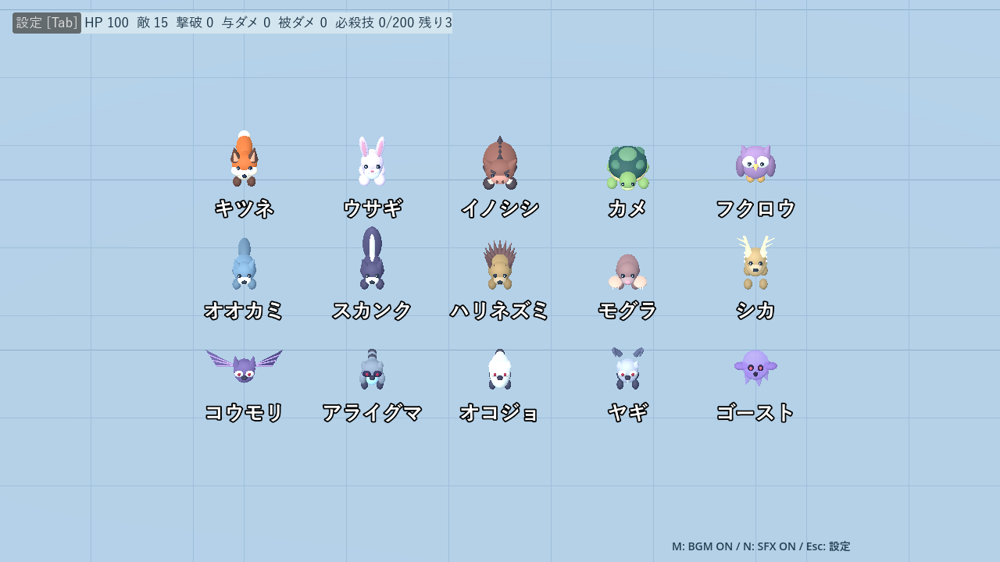
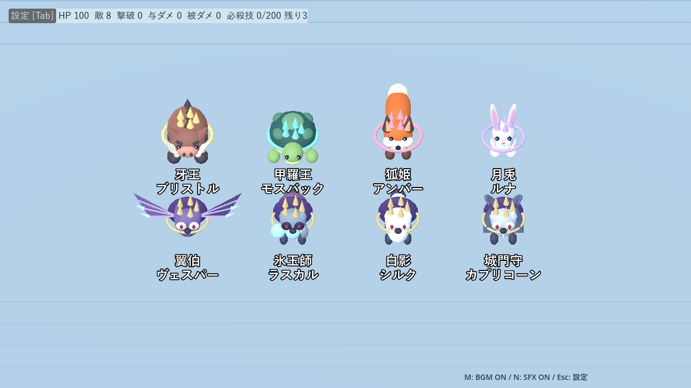
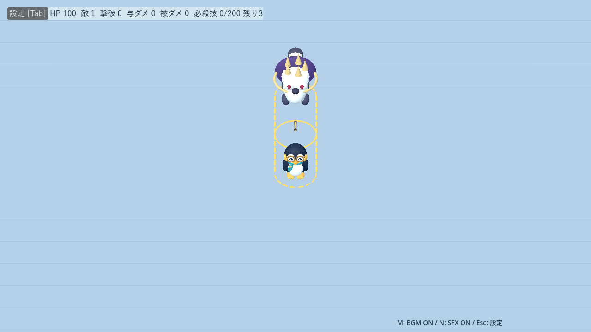
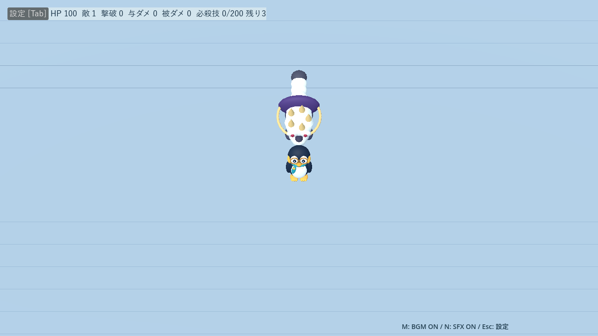
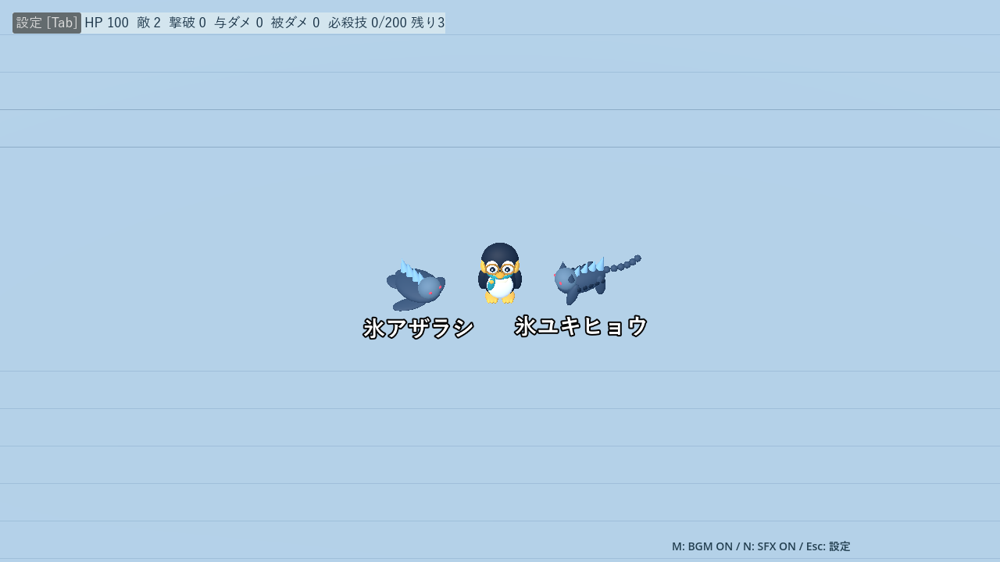
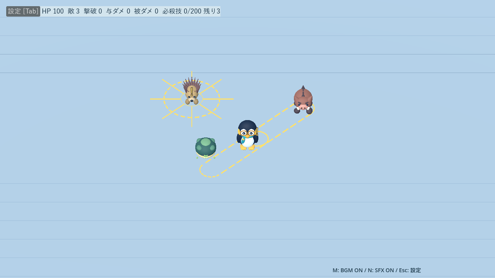

# 敵の行動・見た目・攻撃予告の改善

[README](../README.md) · [ステージ・Wave](stages.md) · [開発・検証](development.md)

## 変更内容

敵の種類・Wave編成・出現予算・撃破XP・武器性能・難易度倍率は維持しています。数値を一律に強化せず、予告と判定の一致、役割の違い、能力が伝わる動作を改善しました。

| 敵 | 変更 |
|---|---|
| キツネ／ウサギ | 切り返す体と尾、跳躍中の脚の伸縮 |
| イノシシ／ブリストル | 実際の速度・時間・半径から突進予告を作成。壁・外周で予告と移動を止める |
| カメ | 基礎HP8→6、時間HP倍率を0.75乗。4秒後から8秒周期の甲羅防御 |
| フクロウ | 射撃準備で翼を構え、発射後に振り戻す |
| オオカミ | 実際の横移動に合わせて傾く。既存の回り込み性能を維持 |
| スカンク | 雲生成前0.4秒に尻尾を上げ、生成時に短い噴出 |
| ハリネズミ | 針の逆立ちと8方向の射線。針の間を抜ける予告 |
| モグラ／シカ | 潜行時の踏ん張り・土の揺れを追加。角を構えて振る動作と判定の同期を維持 |
| コウモリ | 約2.4秒周期の大きな弧で接近。翼膜・指骨を強調 |
| アライグマ | 手持ち氷玉と腕の投擲、空の手、氷玉の補充 |
| オコジョ | 前方1m＋左右1.5mの斜め跳躍。0.6秒予告・0.35秒移動・0.35秒休止 |
| ヤギ | 4.5m以内で1秒予告、速度9m/秒で最大4mの頭突き。通常1.2秒・壁衝突1.8秒休止 |
| ゴースト | 壁・閉門通過中と直後の輪郭・短い残像。壁抜け中も無敵にはならない |

カメは準備0.4秒、防御1.2秒、解除0.4秒。防御中だけダメージを半減し、切り上げ・最低1。動作中は移動・接触を停止し、状態異常で中断します。9分の通常HPは約50→24。モスバックのHPとダメージ軽減は変更していません。

## 中ボスと決戦の手下

ブリストルの牙、モスバックの甲羅、アンバーの尾、ルナの耳、ヴェスパーの翼、ラスカルの袋と氷玉、カプリコーンの角を強調。防御中のモスバックは頭と足を引っ込め、床の防御リングを表示しません。カプリコーンは壁衝突後の休止を2秒に延長しています。

シルクは最大8m・0.65秒の低空飛び込みへ変更。高さ0.45m、予告1.2秒、経路へ20ダメージ1回。通常接触と着地爆発は重複させず、壁で停止。終了後1.5秒休止＋4秒クールダウンです。

氷アザラシは低く幅広い胴と大きなひれ、氷ユキヒョウは長い脚・肩の上下動・長い尾で区別します。固定ステータスと増援頻度は維持しています。

## 検証方法

自動テストは突進の方向固定・低FPS終点・壁停止、カメのHP・防御・中断、オコジョの斜め跳躍、ヤギの4m突進、シルクの単発命中を確認。既存の城・状態異常・サポート・進化・難易度・サンドボックス等の回帰テストも実施します。

比較用の旧版は `305a423`。両キャラ×近接／後方／自動照準×3シードを同じ自動移動で比較します。通常戦は代表Wave 3・5・8・10の編成を抜き出した20秒試験、中ボスは最大30秒、ラスボス各形態は最大60秒です。各試験はHP100・Lv.3武器3つから開始し、死亡／ボス撃破で終了します。

これは10分通しのプレイ検証ではありません。通常戦は編成を使う比較用スポーナーで最大40体、決戦はボス単体の比較です。本編の出現予算・種類別上限・決戦増援は別の回帰テストで確認します。固定の移動経路で得た結果を、人間の攻略難度や全構成のクリア保証とは扱いません。

Godot 4.7.2 / Compatibility / RTX 4060 Laptop / 1280×720で撮影・描画測定。100体の同一配置を旧→新→新→旧の順で比較し、平均と95パーセンタイルを記録します。

比較データ：[戦闘](benchmarks/enemy-refresh-2026-09-20.json) · [100体描画](benchmarks/enemy-render-2026-09-20.json)

## 比較結果

720試験（旧360／新360）。通常戦は各144試験、中ボスは各144試験、ラスボス各形態は各72試験です。構成はサンドボックスで共通装備を直接指定した比較用の組み合わせで、ステージ限定の取得可否を評価する試験ではありません。

| 通常戦の平均 | 変更前 | 変更後 |
|---|---:|---:|
| 撃破数 | 11.69 | 12.40 |
| 被ダメージ | 54.56 | 51.28 |
| 生存・計測時間（上限20秒） | 18.24秒 | 19.14秒 |
| 同時カメ数の最大値 | 2.07 | 2.26 |

カメの同時数が減ったという結果ではありません。生存時間が伸びる条件を含め、今回の短い試験で滞留の増加は小幅でした。終盤HPは抑えられていますが、長時間のカメ編成の評価は継続する余地があります。

Wave別の平均被ダメージは3＝18.39→18.00、5＝53.56→43.39、8＝72.89→68.22、10＝73.42→75.53。全体を一律に難しくする結果にはなっていません。

中ボス試験では固定の周回で被ダメージが両版とも0となり、接近攻撃の圧力評価には不足があります。シルクの経路接触・壁停止は別の直接テストで検証しています。ラスボス単体の平均被ダメージ73.56、計測時間50.29秒は変更前後で同値でした。

### 100体表示

固定メッシュを材質ごとにまとめ、翼膜・指骨・巻き角の描画呼び出しを削減しました。各180フレーム、90フレームのウォームアップ後、順番を反転した2試行の平均です。

| 指標 | 変更前 | 変更後 |
|---|---:|---:|
| 平均フレーム時間 | 6.927ms | 6.937ms |
| 95パーセンタイルの平均 | 7.327ms | 7.570ms |
| 描画呼び出し | 2034 | 2004 |

平均は約0.1%、95パーセンタイルは約3.3%増。今回の環境では10%以内でした。100体のモデルと歩行動作の比較であり、多数の武器・敵AI・予告を含む最悪条件のFPS保証ではありません。

### 種類別の接触と決戦の継続動作

[追加試験データ](benchmarks/enemy-pressure-2026-09-20.json)には各通常敵3体・30秒・攻撃なしの固定周回での被弾回数を保存しています。カメは30→12回、コウモリ33→33回、オコジョ28→31回、ヤギ21→22回。オコジョは接近能力が上がっていますが、着地休止と混成試験の結果を踏まえ、今回は追加の数値調整を行っていません。

両ラスボス・両形態について、やさしい／ノーマル／エキスパートで120秒ずつ、HPを試験用に増やして攻撃なしで継続動作を確認。攻撃開始時刻・休止時間・増援延期時間・実増援数を同データへ記録します。これは生存難度の比較ではなく、攻撃や増援が停止したままにならないことの確認です。

既存テストの「基本武器を全強化すると選択肢が尽きる」という前提は、進化導入後には成立しません。変更前でも同じ3項目が失敗することを確認し、進化2枠を使用済みにする準備へ更新しました。製品側の武器抽選は変更していません。

Godotのルート証明書ストア警告と一部既存テスト終了時のリソース警告は残っています。スクリプトエラーとは区別して記録しています。デモ動画は再収録していません。

### 近距離の中ボス比較を追加

大きな周回の限界を補うため、移動半径を10mから4mへ変更し、同じ両キャラ・3構成・3シードで旧新288試験を追加しました。[生データ](benchmarks/enemy-mid-close-2026-09-20.json)

| 中ボス | 平均被ダメージ：旧→新 | 計測終了まで：旧→新 |
|---|---:|---:|
| ブリストル | 52.67→52.67 | 13.67→13.67秒 |
| モスバック | 94.67→94.67 | 11.70→11.70秒 |
| アンバー | 100→100 | 8.17→8.17秒 |
| ルナ | 100→100 | 13.00→13.00秒 |
| ヴェスパー | 65.33→65.33 | 11.53→11.53秒 |
| ラスカル | 99.33→99.33 | 11.70→11.70秒 |
| シルク | 100→100 | 12.50→16.20秒 |
| カプリコーン | 100→96 | 17.30→27.60秒 |

計測終了は死亡・撃破・30秒上限のいずれかで、撃破時間だけの平均ではありません。変更したシルクとカプリコーンでは回避後の隙が増える傾向で、他6体の結果は同値でした。自動操作は攻撃ごとの高度な回避を行わないため、死亡率をそのまま人間の攻略難度には換算しません。

ノーマルの120秒継続試験では、グレイシャーは第一／第二形態で25／27回、ノクティスは23／22回の予告開始を記録。実際の休止時間は10.4／20.6秒、24.5／23.6秒。増援予定時刻以降に攻撃中のため待った合計は1.2／0秒、14.4／35.2秒でした。攻撃終了後に次の行動へ復帰しており、今回ラスボスの性能変更はしていません。

自動テスト23スイートで失敗0を確認。追加の近距離比較を含む計1008試験と、種類別30試験・決戦継続12試験を実施しました。
