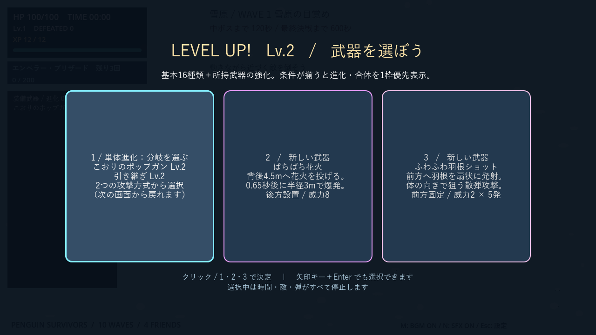
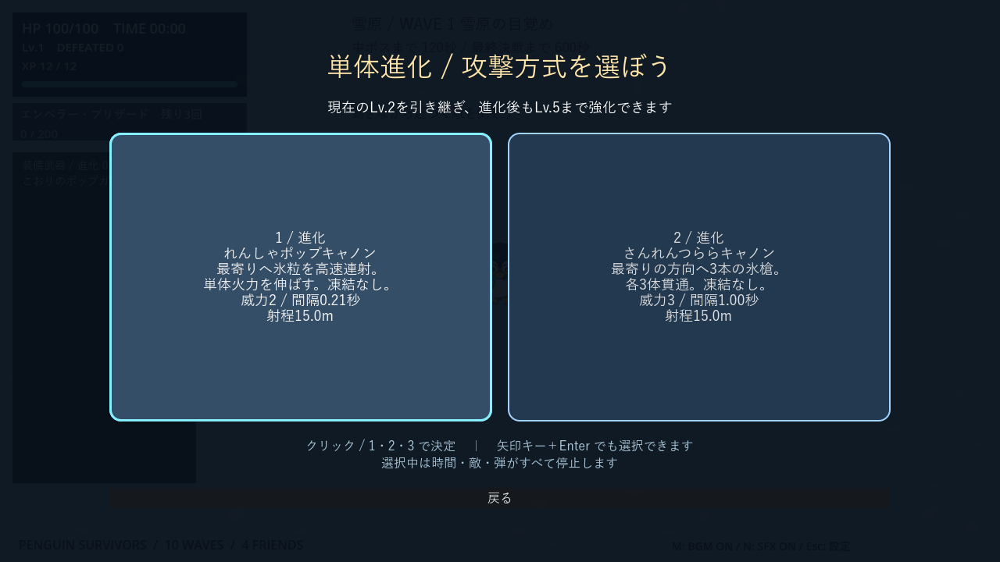
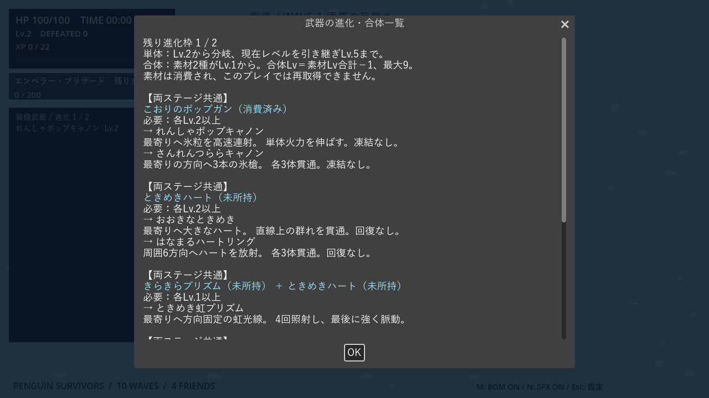
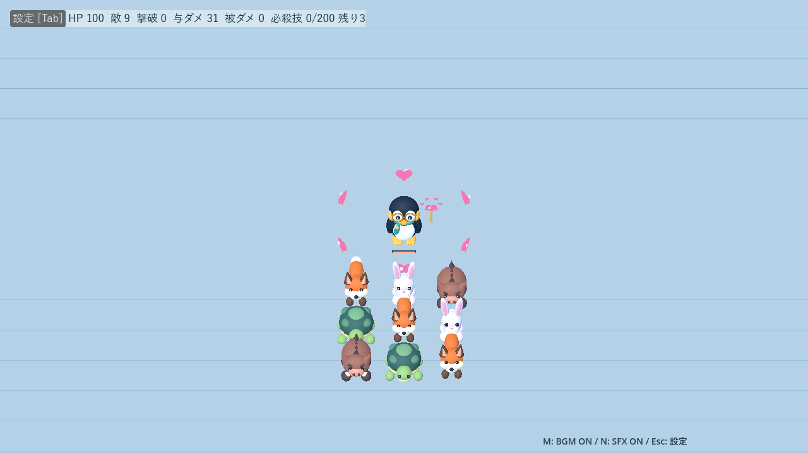
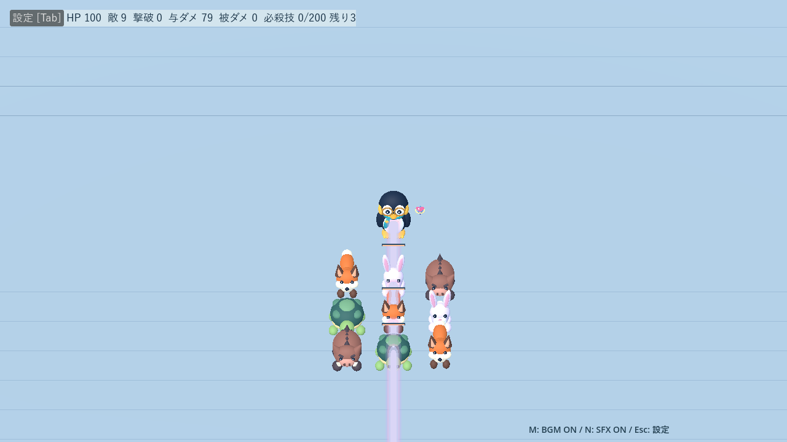
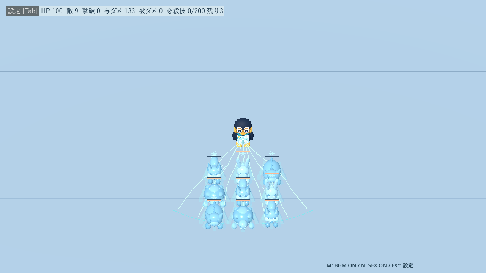
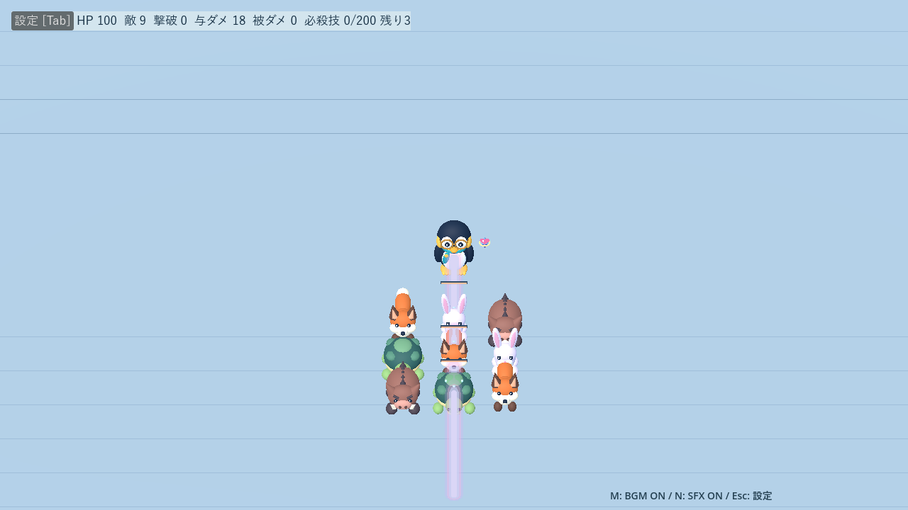
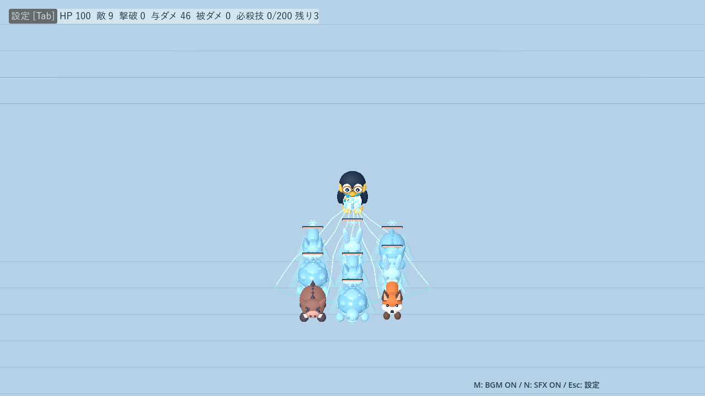
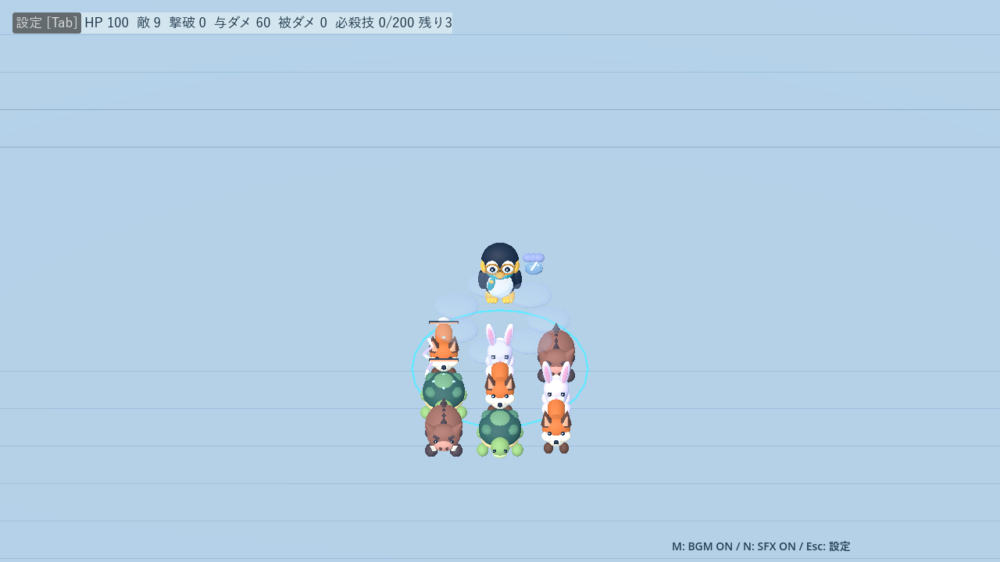
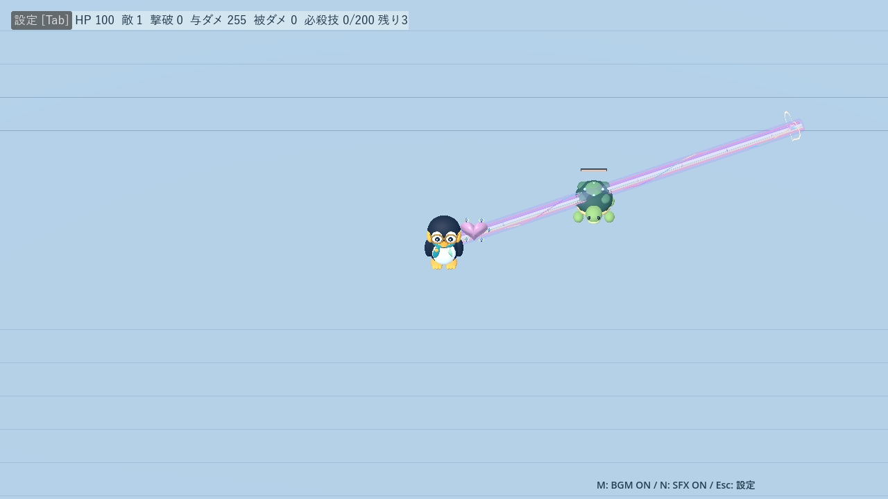

# 武器の単体進化・合体進化

[READMEへ戻る](../README.md) · [基本26武器と成長表](weapons.md) · [モデル一覧](weapon-appearance.md)

## 選び方

基本26武器・各ステージ16種類の抽選に、進化武器8種類があります。進化は必須ではありません。プリズムも単体のまま強化できます。

- **単体進化**：対象をLv.2以上にすると、次の武器選択から候補になります。カードを選んで2つの分岐から確定。現在レベルを引き継ぎ、最大Lv.5です。進化だけではレベルは上がりません。
- **合体進化**：指定素材を2つともLv.1以上で所持すると候補になります。合体Lvは **素材AのLv＋素材BのLv−1**、最大Lv.9です。1＋1ならLv.1、3＋3ならLv.5、5＋5ならLv.9。
- **合計2枠まで**。枠を使い切っても、所持する進化武器の強化は続けられます。
- 素材は攻撃・装備モデルごと置換され、そのプレイでは再取得できません。進化武器の再進化・再合体はありません。他武器の攻撃と待ち時間は維持します。
- 条件成立時は3択の1枠を優先使用。成立候補は一巡するまで重複せず提示し、残りは通常の新規取得・強化と進化武器の強化から抽選します。
- 分岐の「戻る」で同じ3択へ戻れます。確定まで経験値を消費しません。取得・強化・進化をすべて選べなくなったらHP20回復に置き換わります。
- 新しい進化武器は確定後に一度発動して通常周期へ移ります。照準対象が必要な武器は敵を待ちます。強化では待ち時間をリセットしません。

タイトルとポーズの「進化一覧」で、レシピを最初から確認できます。プレイ中は素材の所持レベル・不足条件・残り枠も表示します。サンドボックスは素材・枠の条件なしで、単体Lv.2〜5／合体Lv.1〜9を直接指定できます。





## 単体進化：両ステージ共通

| 素材 | 進化先 | 動き |
|---|---|---|
| こおりのポップガン | れんしゃポップキャノン | 最寄りへ高速連射、単体命中 |
| こおりのポップガン | さんれんつららキャノン | 最寄りの方向と左右12度へ3本、各3体貫通 |
| ときめきハート | おおきなときめき | 大きな立体ハートで直線上の群れを貫通 |
| ときめきハート | はなまるハートリング | プレイヤー前方を基準に等間隔の6方向、各3体貫通 |

| 威力／発射間隔（秒） | Lv.2 | Lv.3 | Lv.4 | Lv.5 |
|---|---|---|---|---|
| ポップキャノン | 2／0.21 | 3／0.20 | 4／0.19 | 5／0.18 |
| 三連つらら（1本） | 3／1.00 | 5／0.95 | 6／0.90 | 8／0.85 |
| 大きなハート | 5／0.85 | 7／0.80 | 8／0.75 | 10／0.70 |
| ハートリング（1発） | 3／1.40 | 5／1.30 | 6／1.20 | 8／1.10 |
| 前3種類の射程（m） | 15 | 16 | 17 | 18 |
| リングの射程（m） | 9 | 10 | 11 | 12 |
| 大きなハートの貫通数 | 5 | 6 | 7 | 8 |

氷弾は22m/秒、ハートは13m/秒。大きなハートの判定半径は0.7m。発射後は方向固定で壁・閉門に止まり、同じ弾は同じ敵に1回だけ命中します。凍結・回復はありません。素材を先に強化しても進化後に強化しても、同じレベルなら性能は一致します。




## 合体進化

| 素材 | 合体先 | ステージ |
|---|---|---|
| きらきらプリズム＋ときめきハート | ときめき虹プリズム | 共通 |
| ぱたぱた扇風機＋ひえひえアイスキャンディ | ひえひえブリザードファン | 共通 |
| くるくるパール＋ひんやりチャイム | きらきらパールチャイム | 雪原 |
| こなゆきドーム＋ぴかぴかベル | ぴかぴか雷雲ドーム | 氷の城 |

次のLv.1→9を均等補間します。威力と個数だけ切り上げ、その他は小数を保持します。基本武器の共通倍率は重ねません。

| 武器 | 成長値（Lv.1→9） |
|---|---|
| 虹プリズム | 威力4→16、間隔2.5→2.35秒、射程14→18m、幅0.6→0.65m |
| ブリザードファン | 威力1→3、到達7→9m、同一敵への送風命中間隔2.8→2.4秒、押し返し3→4.5m、冷気間隔4.1→4秒、凍結1.2→1.4秒 |
| パールチャイム | 真珠3→8個、接触威力2→4、周回半径2.3→2.8m、波紋間隔3→2.4秒、波紋半径1.2→1.8m、波紋威力2→6 |
| 雷雲ドーム | 落雷威力5→18、間隔4.5→3.8秒、雲半径3→4m、落雷半径1.5→1.6m |

- **虹プリズム**：発射方向固定。0・0.3・0.6・0.9・1.2秒に各1回判定し、最後に大きく脈動。各時点で同じ敵に1回まで。壁で光線が止まります。
- **ブリザードファン**：常時首振り送風。冷気の威力も1→3で、噴射時の送風範囲へ1回適用。凍結延長禁止・再適用待ち時間・ボスへの制御無効は元武器と共通です。
- **パールチャイム**：一周2.1秒、接触間隔0.6秒を全真珠で共有。波紋も1回の発動で命中履歴を共有し、重なっても多重命中しません。凍結・防御効果はありません。
- **雷雲ドーム**：16m以内の最寄りの位置へ固定。持続3秒、0.5秒ごとに6回落雷。雲の面積に偏りがないよう地点を抽選し、落雷だけがダメージを与えます。

地上攻撃は壁で遮断。雷は上空から着弾できますが、着弾点から壁越しにはダメージが届きません。潜行中のモグラは対象外。停止中は攻撃・表示・タイマーも停止します。





## 検証記録（2026-09-19）

Godot 4.7.2 / Compatibility。`tests/evolution_test.gd` は成立条件・素材25通りの継承・2枠・排他・候補一巡・分岐復帰・XP・各攻撃の命中数・低FPS・壁・潜行・制御耐性・停止・死亡優先・ボス形態移行／撃破・再挑戦・サンドボックス・候補枯渇を確認、失敗0件。

武器、ステージプール、サンドボックス、設定、タイトル、23武器の性能、制御武器、ピンクキャラ、回復必殺技、決戦演出の回帰テストも通過。専用撮影で選択・一覧・新8武器を実画面で確認しました。環境の証明書警告と、テスト終了時のObjectDB／RID解放警告は残っています。

### 自然な成長での初進化

`evolution_campaign_audit.gd`：seed73、初期装備から開始、通常XP、無敵なし。半径12mの円を自動移動し、成立した進化、所持進化の強化、初期武器の順で選択。必殺技は使用しません。

| ステージ／キャラ | 初進化 | 選択回数 | 撃破数 | 生存秒数 | 累計被ダメージ |
|---|---|---:|---:|---:|---:|
| 雪原／メガネ | 3:06 | 7 | 303 | 358.1 | 125 |
| 雪原／ピンク | 2:05 | 6 | 281 | 329.3 | 125 |
| 城／メガネ | 成立前に死亡 | 5 | 178 | 288.9 | 125 |
| 城／ピンク | 2:07 | 3 | 80 | 180.1 | 125 |

Lv.2条件で早い進化の例を確認。抽選補助はなく、毎回この時刻に成立する保証はありません。回復を挟むため累計被ダメージは最大HPを超えます。

### 同じ4回の選択でWave 4を60秒比較

`evolution_balance_audit.gd`：seed73、初期武器Lv.1。雪原はパール＋チャイム、城はドーム＋ベル。通常は素材Lv.2＋Lv.2、合体は素材Lv.1＋Lv.2＋合体選択で合体Lv.2。以後の選択と必殺技なし、円移動。

| ステージ／キャラ | 撃破数：通常→合体 | 被ダメージ：通常→合体 |
|---|---|---|
| 雪原／メガネ | 35→35 | 31→22 |
| 雪原／ピンク | 36→37 | 0→0 |
| 城／メガネ | 39→37 | 0→22 |
| 城／ピンク | 39→32 | 78→77 |

この初期実装の比較では、低レベル合体が通常強化を一律に上回る結果にはなっていません。これを受けて複数シードの追加比較を行い、下記の「低レベル合体の調整」で使いやすさを補いました。上の成長表は調整後の値です。

### 決戦：同じ14回の選択で比較

`evolution_boss_audit.gd`：seed73、初期武器Lv.5＋プリズムLv.3。通常は比較素材Lv.4＋Lv.3、合体は素材Lv.3＋Lv.3から合体Lv.5。同じ円移動、必殺技・追加強化なし。手下とサポートは通常進行。

| ステージ／キャラ | 生存秒数：通常→合体 | 手下撃破数：通常→合体 | ボス撃破時間 |
|---|---|---|---|
| 雪原／メガネ | 68.2→57.3 | 15→14 | 両方未討伐 |
| 雪原／ピンク | 66.8→89.4 | 14→24 | 両方未討伐 |
| 城／メガネ | 102.4→125.3 | 14→24 | 両方未討伐 |
| 城／ピンク | 101.9→121.1 | 14→23 | 両方未討伐 |

この自動操作は門・予告へ反応せず、進化の優先取得や固定装備にも偏りがあります。人間の操作による全構成のクリア難易度を検証したものではありません。ボス撃破時間の比較は未達で、今後の実プレイ調整に使う基準値です。XP曲線・敵の強さ・基本23武器の性能は変更していません。


## 低レベル合体の調整（2026-09-19）

合体は選択1回と進化枠を使い、素材2武器を失います。低レベルで手数や命中機会が減る弱点を、威力の一律増加ではなく、届きやすさ・範囲・制御で補いました。**以下はLv.1の変更。Lv.9はすべて従来どおり**で、中間レベルは新しい始点から均等補間します。通常23武器・単体進化・XP・敵性能は変更していません。

| 合体 | 変更前 → 変更後（Lv.1） | ねらい |
|---|---|---|
| 虹プリズム | 幅0.45→0.60m、発射間隔2.8→2.5秒 | 固定光線から外れる敵を拾いやすくし、次の照射までの隙を短縮 |
| ブリザードファン | 到達6→7m、同一敵への送風命中間隔3→2.8秒、冷気間隔4.8→4.1秒、凍結1→1.2秒 | 前方の敵を早めに押し返し、冷気の援護を増やす |
| 雷雲ドーム | 落雷半径1.2→1.5m | 固定した雲の中での空振りを減らす |
| パールチャイム | 変更なし | 撃破数がほぼ同等で、被ダメージにも大差がなかったため保留 |

威力・命中上限・落雷6回・方向／設置位置固定・凍結の再適用制限・壁遮断は維持しています。

### 測定条件

`tests/evolution_low_rank_audit.gd`。seed17／73／211、各40秒、4分相当のキツネ・ウサギ・イノシシ・オオカミを0.5秒ごとに計80体投入。出現用乱数を武器用乱数から分離し、同じ敵編成で比較します。

初期ポップガンLv.1＋素材2武器Lv.2ずつ（取得・強化4回）と、素材Lv.1＋Lv.2から合体したLv.2（同じ4回）を比較。HPを毎ステップ100へ戻し、通常の被弾無敵を維持したまま被ダメージを積算するため、これは生存時間やクリア率の試験ではありません。回復・必殺技・追加取得は使いません。

全周囲試験は半径6mを自動周回、正面試験は停止して前方60度から投入。虹プリズム／雷雲は城壁あり、ファン／パールは平坦な床です。「密集秒数」は3m以内に凍結・ノックバック中ではない敵が3体以上いた時間であり、退避不能を直接測るものではありません。

### 3シード平均：合体の変更前 → 変更後

| 条件／合体 | 撃破数 | 被ダメージ | 密集秒数 |
|---|---|---|---|
| 全周囲／虹プリズム | 66.0→65.7 | 270.3→280.3 | 11.0→8.3 |
| 正面／虹プリズム | 74.3→75.3 | 313.0→236.3 | 10.1→4.3 |
| 全周囲／ブリザードファン | 34.0→35.3 | 424.0→408.3 | 25.9→25.1 |
| 正面／ブリザードファン | 64.0→62.3 | 341.3→254.3 | 6.9→6.0 |
| 全周囲／雷雲ドーム | 66.7→65.7 | 404.3→369.7 | 18.6→13.6 |

ファンの正面試験では、凍結・押し返しを受けている敵の延べ時間は103.0→104.0秒。火力増よりも、敵との距離を保つ役割を重視しました。

**通常強化との比較も残しています。** 全周囲での通常構成の「撃破数／被ダメージ」は、プリズム＋ハート70.3／93.7、ファン＋アイスキャンディ39.0／312.0、パール＋チャイム69.3／174.3、ドーム＋ベル71.3／126.3。未調整のパール合体は68.0／170.7でした。正面の通常ファン構成は61.3／300.3で、調整後合体は62.3／254.3です。

固定光線や固定雷雲は、全方向へ逃げながら戦う条件では、調整後も独立した2武器の手数に劣ります。今回の調整で全状況の優位を保証したわけではありません。虹プリズムの全周囲被ダメージも改善しておらず、正面への誘導と継続強化を前提に、今後の実プレイ評価を継続します。

### 落雷の命中を個別に確認

128シード×6回＝768発。予告位置からプレイヤー方向へ2m/秒で移動するキツネ1体に対し、同じ落雷地点を使ってLv.1を比較しました。

- 半径1.2m：100／768発、**13.0%**。
- 半径1.5m：143／768発、**18.6%**。

雲の位置を追従させず、1発の威力も変えずに命中機会を増やしています。この割合は単体が雲から走り出る厳しい条件の値で、群れや通常プレイの命中率ではありません。

[全測定値・条件のJSON](benchmarks/evolution-low-rank-2026-09-19.json)に、命中イベント数、実ダメージ、接近時間、制御時間も保存しました。再実行は下記。`normal`は通常構成、`fusion`／`old`／`legacy`は調整前、`candidate`は落雷半径のみの案、`adjusted`は採用後です。

```sh
godot --headless --path . --script tests/evolution_low_rank_audit.gd
godot --headless --path . --script tests/evolution_low_rank_audit.gd -- --adjusted
godot --headless --path . --script tests/evolution_low_rank_audit.gd -- --frontal
```

調整前値は監査スクリプト内の固定値で再現します。フレーム順により細かな実測値は変動するため、単一シードの僅差を優劣とは扱いません。専用テストで拡大後の落雷境界・単発判定・成長の単調性・Lv.9維持を確認し、進化・基本23武器・制御武器の回帰テストも通過しています。

### 調整後Lv.2の実画面

`tools/capture_evolution_balance.gd` でCompatibility表示を確認しました。





## 演出の刷新（2026-09-19）

進化8武器の性能・成長値はそのまま、装備と攻撃の見た目を改善しました。虹プリズムは多面体ハート結晶・虹の層・螺旋・最後の大きなハートと結晶片。キャノンは銃口と反動、ハート弾は厚みのある多面体、ブリザードは冷気噴射、パールは立ち上る冷気、雷雲は枝分かれする放電で区別します。




[全8種の画像・検証結果](den-noctis-update.md)。モデル一覧も基本23種＋進化8種を表示します。

サンゴ浜でも共通素材による進化と、パール＋チャイムの合体を利用できます。ベルが出現しないため、雷雲ドームは城で作れます。新しい海の3武器には進化先を設けていません。
