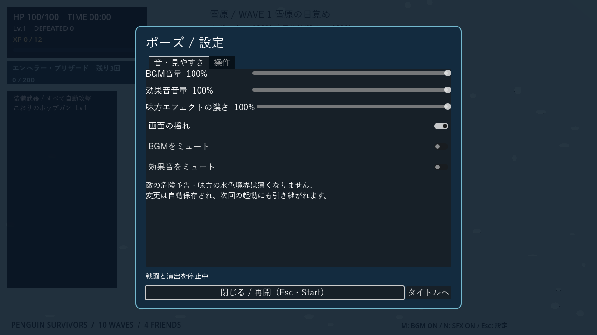
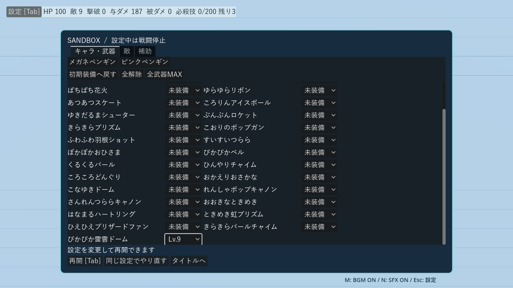
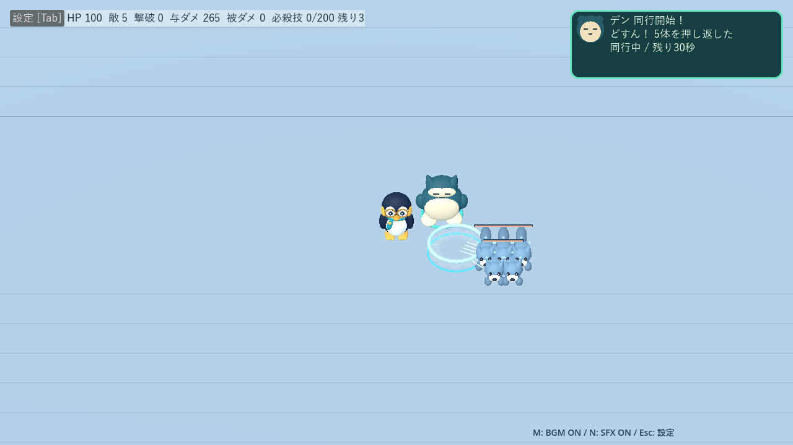
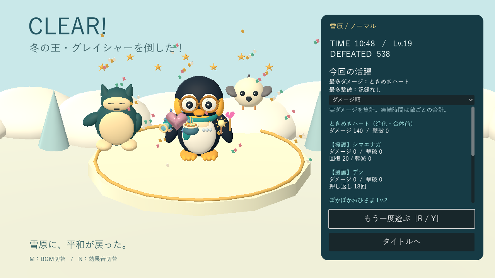

# プレイガイド

[READMEへ戻る](../README.md) · [武器](weapons.md) · [ステージ・敵](stages.md)

設定、練習場、キャラクター、援護の詳しい説明です。基本操作はREADMEを参照してください。

## ポーズ・設定

タイトルの「設定」または **Esc／パッドStart** で開きます。戦闘・敵・門・サポート・ボス演出を停止し、武器選択やサンドボックス設定中に開いた場合は、閉じても元の停止状態を保ちます。「タイトルへ」は確認後に現在のプレイを終了します。

- **音**：BGM・効果音を個別に0〜100％で調整。ミュートと音量は別々に保存します。
- **見やすさ**：味方攻撃のエフェクトを20〜100％の濃さに調整。敵の危険予告と味方の水色境界は維持。画面の揺れもOFFにできます。
- **キー変更**：移動・必殺技・再挑戦・ミュートを変更可能。重複キーと予約キー（Esc／Tab／Enter／1〜3）は使用できません。「キー配置を初期値へ戻す」で復元できます。
- **ゲームパッド**：左スティック／十字キーで移動、Xで必殺技、Startで設定、Aで決定、Bで戻る、Yでゲーム終了後に再挑戦（Xbox表記）。メニューの方向操作とボタン選択にも対応します。サンドボックスの床への配置はマウスを使用します。
- 設定は `user://settings.cfg` に自動保存。音楽はポーズ中も小さな音で継続します。プレイ途中のセーブ機能ではありません。

## サンドボックス

タイトルの「サンドボックス」から、自由に戦闘を試せる練習場へ入れます。**Tab／設定ボタン**で一時停止し、2キャラ・基本23武器と進化8種・敵編成を変更できます。

- **キャラ・武器**：個別に装備・レベルを指定。「初期装備へ戻す」「全解除」「全武器MAX」も利用できます。
- **敵**：全通常敵・手下・両ステージの中ボスとラスボスを選択。「1匹ずつ置く」では床を連続クリックして配置。「指定数をひとかたまりで置く」も選べます。配置中も戦闘停止。赤い輪は配置不可、右クリックまたは完了ボタンで設定へ戻ります。
- **ランダム配置**：選んだ種類だけ、またはいろいろな通常敵を混ぜて一括追加。20・50・100体のボタンで数を選び、配置ボタンを押します。壁・他の敵を避け、プレイヤーから5m以上離れた床へ散らします。追加後も停止したままなので、確認して「再開」できます。
- **補充**：通常敵・手下は撃破3秒後から補充可能。配置済みの編成ごとに切り替えられます。敵総数100体、ボスは合計1体までです。
- **補助**：無敵、全回復、必殺技の充填・回数回復、敵の行動停止、0〜10分相当の敵の強さを設定。強さの変更は次の生成から適用します。
- **試験情報**：HP・敵数・撃破数・実際に与えた／受けた累計ダメージ・必殺技ゲージを表示。各計測をリセットできます。

通常のWave・武器抽選・自動増援・自動サポート・クリアは停止し、ラスボスの形態も選択した状態で固定します。ノクティスの配置を開始すると城壁と4門が現れ、門操作や跳躍を試せます。通常敵を追加しても城壁は維持されます。「平坦な練習場へ戻す」またはグレイシャーの配置開始で解除できます。**地形変更は敵と攻撃を全消去し、プレイヤーを中央へ戻します。**

武器変更では味方の攻撃・設置物を消去して装備を作り直します。キャラ変更では装備構成を維持してHPと必殺技を初期化します。死亡時は設定画面の「同じ設定でやり直す」で編成を再配置できます。設定は同一起動中だけ保持し、本編の選択・成長には影響しません。

## キャラクターと必殺技

HP100・移動速度・当たり判定は共通。初期装備と必殺技が異なります。

| キャラ | 外見 | 初期武器 | 必殺技 |
|---|---|---|---|
| メガネペンギン | 黒白の体・丸メガネ・青緑のマフラー | こおりのポップガン | エンペラー・ブリザード：100ダメージ |
| ピンクペンギン | ピンクの体・眼鏡なし・薄いチークと化粧 | ときめきハート | ラブリー・ブルーム：80ダメージ＋HP20回復 |

必殺技は**撃破報酬200XP分で充填、Spaceで発動、1プレイ最大3回**。武器用XPは消費しません。満タン時には通知音と技名を表示します。

発動位置を中心に半径12mへ一度だけダメージを与え、範囲内の敵弾・毒雲を消去し、被弾無敵を最低1秒に延長。壁越しにも有効ですが、潜行中のモグラは対象外で、ボスの予告・突進は解除しません。回復の蓄積や復活はありません。

## サポート

出現後30秒以内に**2mまで近づくと、30秒間同行**します。武器枠は使いません。右上カード・ビーコン・画面外案内が目印です。

| キャラ | 援護 |
|---|---|
| シマエナガ | 同行開始と6秒ごとにHP＋5、最大25回復 |
| シロクマ | 同行中の被ダメージを30%軽減 |
| ひよこ | 0.65秒ごとに自動射撃。威力は `3 + floor(Wave番号 / 3)` |
| デン | 近くの敵へ跳び、お腹で着地。半径5mへ威力2＋4mの押し返し。最大5回 |

4匹を重複なしで一巡し、一巡の境界でも同じキャラは連続しません。最初は75〜95秒、以後は退出から110〜140秒後に出現。通常出現は9:30までで、決戦には第一形態1回・第二形態最大2回の専用枠があります。同時に1匹、安全な場所がないときは延期します。武器選択・ボス演出中は同行時間も止まります。

### デンの「どすん」援護

青緑の丸い体とクリーム色のお腹、眠そうな目が特徴。近くの敵の集まりへ狙って跳び、0.6秒の準備・跳躍後に着地します。以後6秒間隔、最大5回。敵がいなければ待機し、空振りで回数を消費しません。着地時のデンを中心に半径5mへ2ダメージを1回与え、通常敵と決戦の手下を0.6秒で4m押し返します。中ボス・ラスボスにはダメージだけ。潜行中の敵と壁・閉門越しには当たりません。

扇風機と押し返しの待ち時間を共有し、凍った敵も押せます。敵弾・毒雲は消しません。倒した敵の報酬は通常どおり加算され、専用効果音はNミュートに対応します。リザルトには、そのプレイで迎えて同行したサポートだけが登場します。

