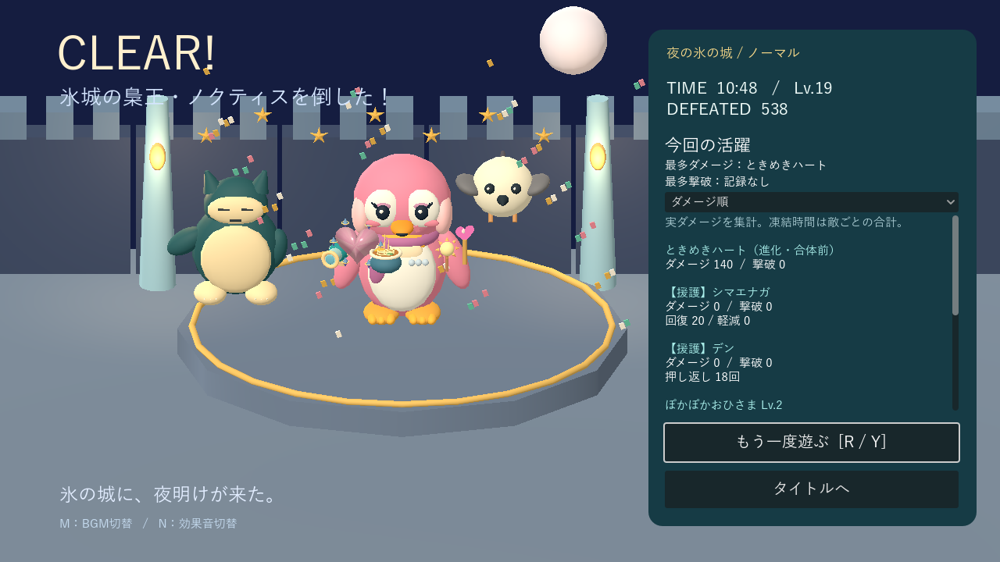
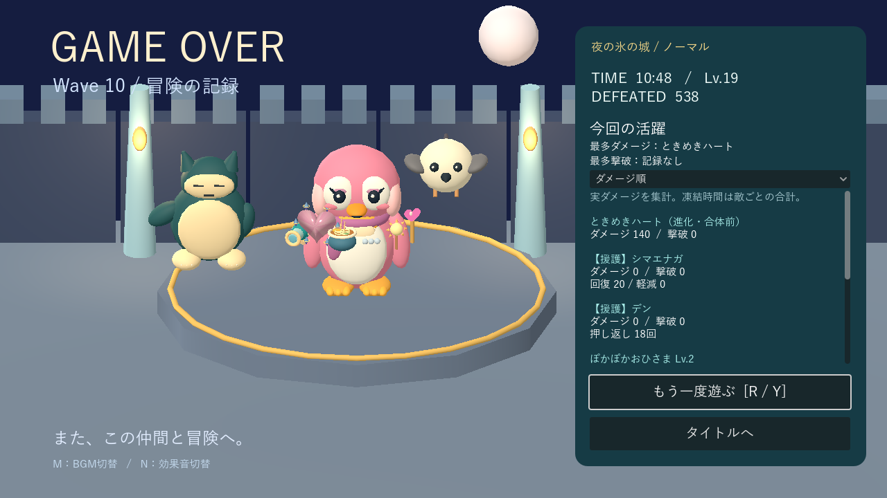

# リザルト：何が活躍したか

[READMEへ戻る](../README.md) · [武器](weapons.md) · [進化・合体](evolutions.md)

クリアと死亡の両方で、右側に「今回の活躍」を表示します。背景は雪原／夜の氷の城に合わせて切り替わり、死亡時は到達Wave・時間・レベル・撃破数も確認できます。

- 選んだペンギンに、そのプレイで所持した武器を装備飾りとして表示します。進化・合体で消費した素材も含み、戦闘中と同じモデルを使います。
- サポートは迎えて同行したキャラのみ。登場を見送ったキャラは表示せず、同行後に退出したキャラは残ります。
- クリア時は紙吹雪とジャンプでお祝いし、死亡時は紙吹雪を出さず静かな姿勢で表示します。

## 見方

- **最多ダメージ／最多撃破**：武器・必殺技・サポートを通して主力を表示。同率も示します。全て0なら「記録なし」。
- 一覧を**ダメージ順／撃破数順／凍結・押し返し回数順**に切り替え可能。長い一覧はスクロールします。
- 装備したまま使わなかった武器も0で表示。進化・合体で消費した武器は「進化・合体前」として残り、新しい武器とは別集計です。
- 「もう一度遊ぶ」「タイトルへ」を両画面に用意。再挑戦キー／パッドYも従来どおり使えます。再挑戦では全ての集計を初期化します。

## 数え方

| 項目 | 集計するもの |
|---|---|
| ダメージ | 防御・無敵処理後に実際に減った敵HP。残りHPを超える分は含めない |
| 撃破 | 最後の有効ダメージを与えた攻撃へ1回だけ加算 |
| 押し返し | ノックバックの適用に成功した回数。再適用待ち・ボス耐性などで拒否された分は除外 |
| 凍結 | 適用成功回数と、敵が実際に凍結していた延べ秒数。複数体を同時に止めればその分を合計 |
| 回復 | HP上限を超えず実際に回復した分。満タン・死亡後は0 |
| 軽減 | シロクマの軽減がなかった場合とあった場合のHP減少量の差。被弾無敵中や、致死攻撃の過剰ダメージ部分は除外 |

必殺技は武器とは別項目。シマエナガの回復、シロクマの軽減、ひよこの射撃、デンのダメージ・押し返しも個別に表示します。飛翔中の援護弾はサポートが退出した後も、そのサポートの実績として集計します。

凍結時間は武器選択・ポーズ・ボス演出中に進みません。敵が倒れた後の予定残り時間や再凍結待ち時間も加算しません。壁際での押し返しは「適用成功」であり、実際に移動できた距離の集計ではありません。

集計はそのプレイのメモリ内だけに保持します。結果のファイル保存や過去プレイ比較、途中セーブは行いません。サンドボックスの既存の試験情報は継続して利用できます。

## 表示例

以下は表示検証用のサンプル集計です。実プレイの成績・武器バランスの測定値ではありません。全31武器に加えて必殺技・サポートがあっても、一覧だけがスクロールします。

## 実装・確認

`scripts/contributions.gd` が実ダメージ・効果成功を記録し、`contribution_panel.gd` が結果の写しを表示します。敵の防御・報酬・攻撃性能の処理は共用しています。

`tests/contributions_test.gd` で過剰ダメージ、二重撃破、潜行除外、素材消費後の記録維持、子攻撃への帰属、制御成功・拒否・実時間・停止、実回復、被弾無敵・致死攻撃の軽減、必殺技、死亡表示、並べ替え、再挑戦の初期化を確認。武器・進化・制御・サポート・デン・回復必殺技・決戦・サンドボックスの回帰テストも通過しました。

Godot 4.7.2 / Compatibilityで `tools/capture_contributions.gd` を実行し、文字・スクロール・キャラクターとの非重複を確認。環境由来の証明書警告と、既存テストでも発生する終了時のObjectDB警告は残っています。

`tests/result_scene_test.gd` で両背景・勝敗・サポートなし／一部／全員・全31武器と消費素材の表示を確認。`tools/capture_results.gd` は表示確認用の固定データで撮影します。
