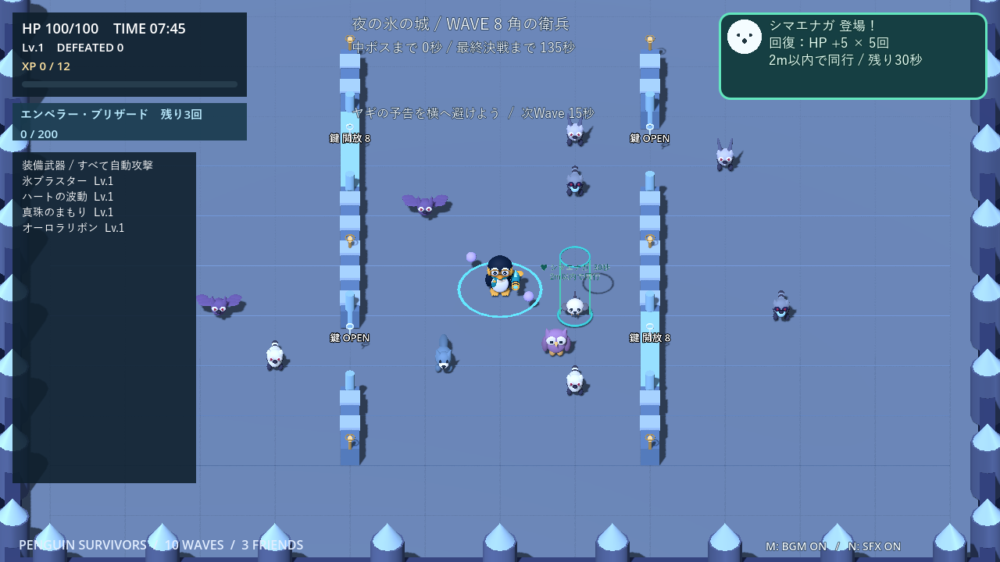
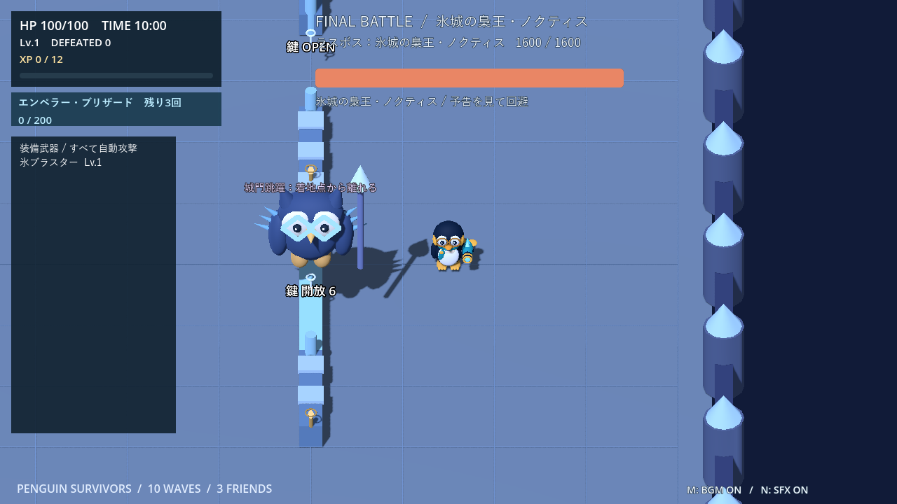
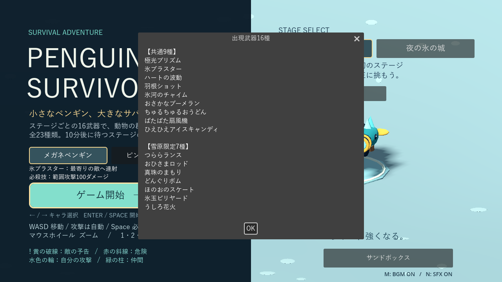

# ステージ・Wave・敵

[READMEへ戻る](../README.md) · [武器](weapons.md) · [開発・検証](development.md)

## 共通の進行

道中は60秒×10Wave。Waveごとに主役と相棒を抽選し、通常枠50%・主役30%・相棒20%を基本に編成します。敵はWaveをまたいで残ります。

- 新敵を段階的に紹介し、紹介後10秒は同種を追加しません。中ボス戦に重なった紹介は休息終了後へ延期します。
- 通常イノシシを1:30以降に1体先行紹介し、2:00まで追加しません。最初の中ボスまで最低20秒の紹介期間を設けます。
- 出現予算は基本4種がコスト1、特殊敵が2、シカ・ヤギが3。特殊敵が多いと総数が減ります。撃破XPも同じ値です。
- 敵の同時上限は最大100体、特殊敵は合計12体。オオカミは6分未満3体・以後5体、シカ・ヤギは各2体など、種類別上限もあります。
- 中ボス中は増援予算が半減。撃破でHP25回復・XP8獲得、8秒間の増援休止。その場に残った敵との戦闘は続きます。
- 10分で通常敵・中ボス・危険物を整理して決戦へ。ボス登場とHP50%の形態移行には各2秒の戦闘休止演出が入ります。

## 通常敵の特徴

| 敵 | 主な行動 | 登場ステージ |
|---|---|---|
| キツネ | ジグザグに接近 | 両方 |
| ウサギ | 跳躍して接近 | 両方 |
| イノシシ | 予告付き直線突進 | 両方 |
| カメ | 低速・高耐久 | 両方 |
| フクロウ | 距離を保ち、方向固定の予告射撃 | 両方 |
| オオカミ | 横へ回り込みながら間合いを詰める | 両方 |
| スカンク | 移動経路に毒雲を残す | 雪原 |
| ハリネズミ | 予告後に8方向の針 | 雪原 |
| モグラ | 潜って固定地点へ出現 | 雪原 |
| シカ | 予告方向へ角の衝撃波 | 雪原 |
| コウモリ | 左右に揺れて接近 | 城 |
| アライグマ | 固定地点へ氷玉を投げる | 城 |
| オコジョ | 予告後に横跳び | 城 |
| ヤギ | 予告付き突進。壁で停止 | 城 |
| ゴースト | 門・城壁を通り抜けて接近 | 城 |

オオカミはHP4を維持し、速度・接近成分・接触ダメージで圧力を出す敵です。イノシシのような直線突進はしません。

モグラは0.4秒かけて潜り、1.2秒の出現予告後に飛び出します。完全に潜った間は標的・被弾対象から外れ、出現後は最低2秒攻撃可能。出現地点は20%がプレイヤー位置、80%が周囲1.5〜4mのランダム地点で、予告後は追従しません。

シカは12m以内で停止し、1.2秒予告した方向へ速度6m/秒・射程14m・幅2.4mの衝撃波を放ちます。基本12ダメージ。横移動で避けられ、旧加速オーラはありません。

## Wave表

「＋」は主役と相棒、「／」は抽選候補です。キツネ・解禁済みウサギは通常枠にも登場します。

| Wave・開始 | 雪原 | 夜の氷の城 |
|---|---|---|
| 1・0:00 | キツネ、0:30からウサギ | キツネ＋コウモリ、0:30からウサギ |
| 2・1:00 | カメ＋フクロウ | カメ＋アライグマ |
| 3・2:00 | イノシシ＋オオカミ | イノシシ＋オコジョ |
| 4・3:00 | スカンク＋ウサギ／スカンク＋キツネ | オコジョ＋フクロウ／アライグマ＋ウサギ |
| 5・4:00 | ハリネズミ＋フクロウ／ハリネズミ＋カメ | オオカミ＋アライグマ／カメ＋フクロウ |
| 6・5:00 | モグラ＋フクロウ／モグラ＋スカンク | ゴースト＋オオカミ／ゴースト＋アライグマ |
| 7・6:00 | オオカミ＋フクロウ／イノシシ＋ハリネズミ | イノシシ＋フクロウ／オオカミ＋オコジョ |
| 8・7:00 | シカ＋オオカミ／シカ＋カメ | ヤギ＋アライグマ／ヤギ＋カメ |
| 9・8:00 | シカ＋フクロウ／モグラ＋ハリネズミ | ヤギ＋フクロウ／オコジョ＋オオカミ／ゴースト＋アライグマ |
| 10・9:00 | シカ＋イノシシ／モグラ＋スカンク／オオカミ＋ハリネズミ | ヤギ＋オオカミ／アライグマ＋フクロウ／コウモリ＋オコジョ／ゴースト＋ヤギ |

## 城門と攻撃のルール

城はX＝±8mの低い壁に各2門、計4門。門の幅は6mで、壁の南北端には常時通れる迂回路があります。

- 開始60秒は全開。その後は対角2門を交互に「2秒予告→8秒閉鎖→10秒全開」。閉鎖予告は白青の鍵と点滅です。
- 門が占有されていれば最大2秒待ち、空かなければ閉鎖を中止。挟み込み・押し出し・閉鎖ダメージはありません。
- 中ボス戦と撃破後の休息中は全開。武器選択・ボス演出中は門の時計も停止します。
- 通常の地上敵は開いた門や壁の端へ迂回。ゴーストは門も城壁も通過しますが、アリーナ外へは出ません。
- 通常の直進弾・追尾弾・光線は壁と閉門で停止。氷玉は反射、ブーメランは消滅します。
- 地上範囲攻撃は中心から壁越しには届きません。火球・落雷など上空から落ちる攻撃は向こう側の床へ着弾可能。必殺技は壁越しに作用します。
- ノクティスの氷羽・氷輪は閉門を無視しますが、城壁で遮れます。サポートは歩いて到達できる安全な床に出現します。

## 中ボス

通常は2・4・6・8分に、ステージごとに異なる4体が一度ずつ登場します。HPは100／180／260／340。戦闘が長引くと次の出現が遅れ、10分でラスボス戦へ移ります。

| 順番 | 雪原 | 夜の氷の城 |
|---|---|---|
| 1 | イノシシ「牙王・ブリストル」 | コウモリ「翼伯・ヴェスパー」：氷の扇 |
| 2 | カメ「甲羅王・モスバック」 | アライグマ「氷玉師・ラスカル」：2地点の氷玉 |
| 3 | キツネ「狐姫・アンバー」 | オコジョ「白影・シルク」：予告地点への跳躍 |
| 4 | ウサギ「月兎・ルナ」 | ヤギ「城門守・カプリコーン」：予告付き突進 |

## ラスボス

### 雪原：冬の王・グレイシャー

HP1400。叩きつけ・氷弾・予告付きダッシュを使い、HP50%で第二形態へ移行します。

第二形態は「白夜の大氷震→放射弾→ダッシュ→叩きつけ」を反復し、叩きつけの間合い外では放射弾に置き換えます。大氷震は予告開始時のプレイヤーから半径2.5m内に中心を固定し、**3秒予告・半径9m・40ダメージ1回・発動後2秒休止**。予告範囲の外へ逃げます。

### 城：氷城の梟王・ノクティス

HP1600。HP50%で第二形態へ移行し、結晶の翼と発光が変化します。

1. **門の勅令→城門跳躍**：2秒予告で対角2門を閉鎖（第一形態6秒／第二形態8秒）。閉門を優先して着地先を決め、0.8秒予告後に0.9秒で反対側へ飛び越えます。
2. **氷羽の扇**：着地後0.8秒休止し、1.2秒予告した方向へ5発／第二形態7発。速度6m/秒・12ダメージ。閉門を貫通します。
3. **月影の氷輪**：2秒予告・24ダメージ。第一形態は半径3mの1地点、第二形態は半径2.5mの3地点。予告後は追従せず、逃げ道がない配置は延期します。

氷羽・氷輪の後は1.5秒休止。門の閉鎖処理中は他の攻撃を重ねません。跳躍の着地先は予告時のプレイヤーから3.2m以上離れた床に固定し、飛行中は接触・地上からの被弾なし、着地の範囲ダメージもありません。中断時は安全な出発地点へ戻します。

### 決戦の手下・援護・クリア

| 項目 | 第一形態 | 第二形態 |
|---|---|---|
| 手下 | 氷アザラシ2体 | 氷アザラシ2体＋氷ユキヒョウ2体 |
| 出現 | 演出後6秒、以後12秒間隔 | 演出後6秒、以後9秒間隔 |
| 同時上限 | 6体 | 8体 |
| サポート枠 | 1回 | 最大2回 |

手下はプレイヤーから12〜16m、同じ120度の方向内へ配置し、ボスの予告・突進・跳躍中は出現を延期します。上限中の出現は蓄積しません。アザラシはHP10・経験値2、ユキヒョウはHP14・経験値3。形態移行時は旧手下を報酬なしで退場させます。

サポートは各形態の演出終了8秒後以降、同時に1匹。前の味方の退出完了から3秒後以降に次を呼びます。持ち越した同行サポートは新形態の枠を消費しません。

手下を倒し切る必要はなく、ボス撃破でクリア。ペンギンとサポート3匹が祝福し、時間・撃破数・レベル・取得武器を表示します。プレイヤーが同時に倒れた場合は死亡を優先します。

## ステージ別武器プール

本編は共通9種＋限定7種の各16種類から、新規取得と強化を混ぜて抽選します。**きらきらプリズムは両ステージ共通**。キャラの初期装備も共通枠です。16種類すべてLv.5ならレベルアップでHP20回復。サンドボックスでは所属に関係なく全23種類を試せます。

共通：きらきらプリズム、こおりのポップガン、ときめきハート、ふわふわ羽根ショット、ひんやりチャイム、おかえりおさかな、ちゅるちゅるおうどん、ぱたぱた扇風機、ひえひえアイスキャンディ。

| 雪原限定 | 夜の氷の城限定 |
|---|---|
| すいすいつらら | ぴかぴかベル |
| ぽかぽかおひさま | こなゆきドーム |
| くるくるパール | ゆらゆらリボン |
| ころころどんぐり | ゆきだるまシューター |
| あつあつスケート | ぶんぶんロケット |
| ころりんアイスボール | しっぽのクラッカー |
| ぱちぱち花火 | おほしさまメテオ |

雪原には羽根・つららの前方攻撃と後方の花火、城にはリボンの前方攻撃と後方散弾があります。引き寄せ・風・凍結は両ステージで利用可能です。タイトルの「出現武器16種を見る」で選択中の一覧を確認できます。

