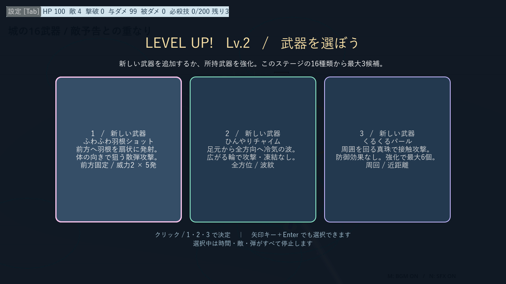
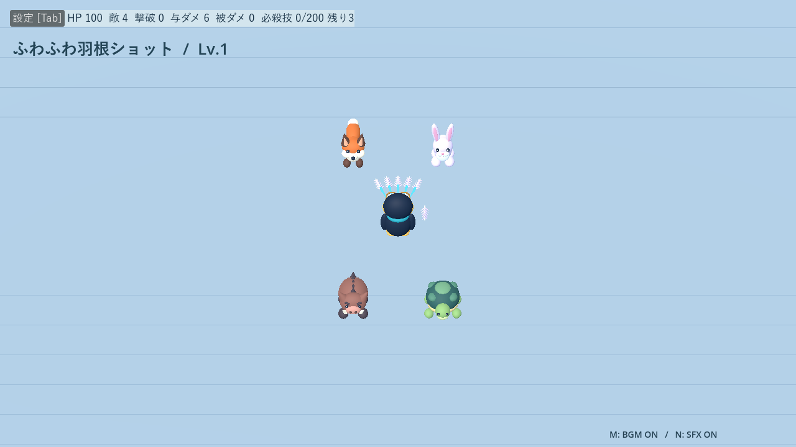
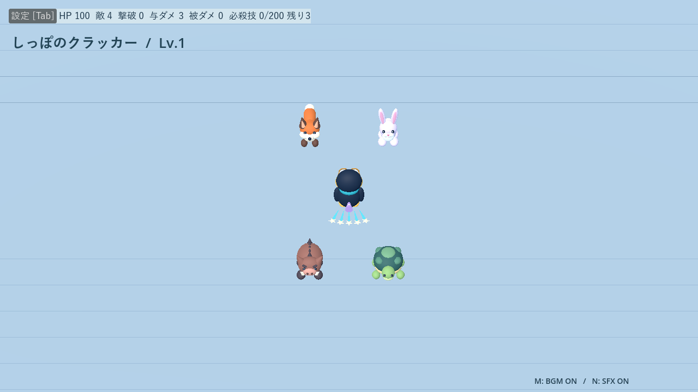
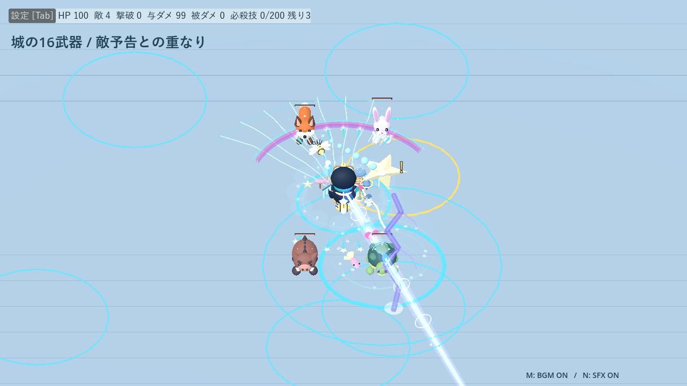
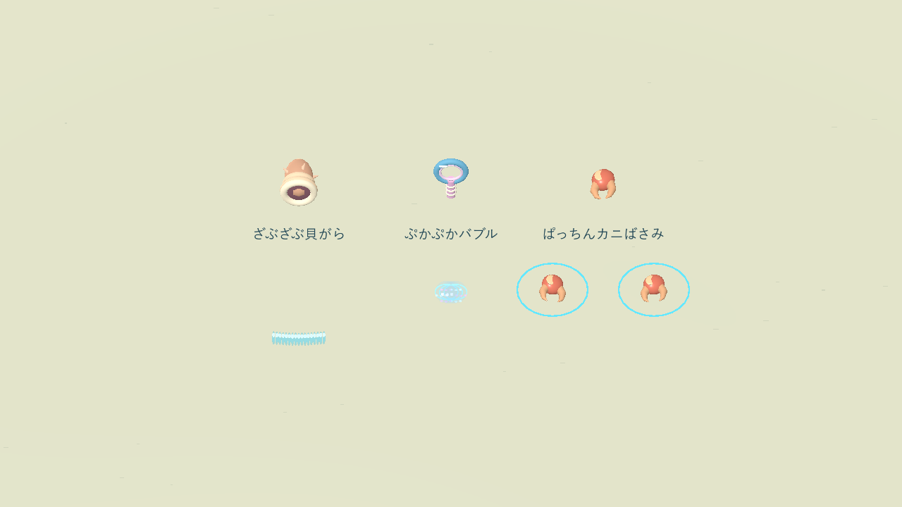
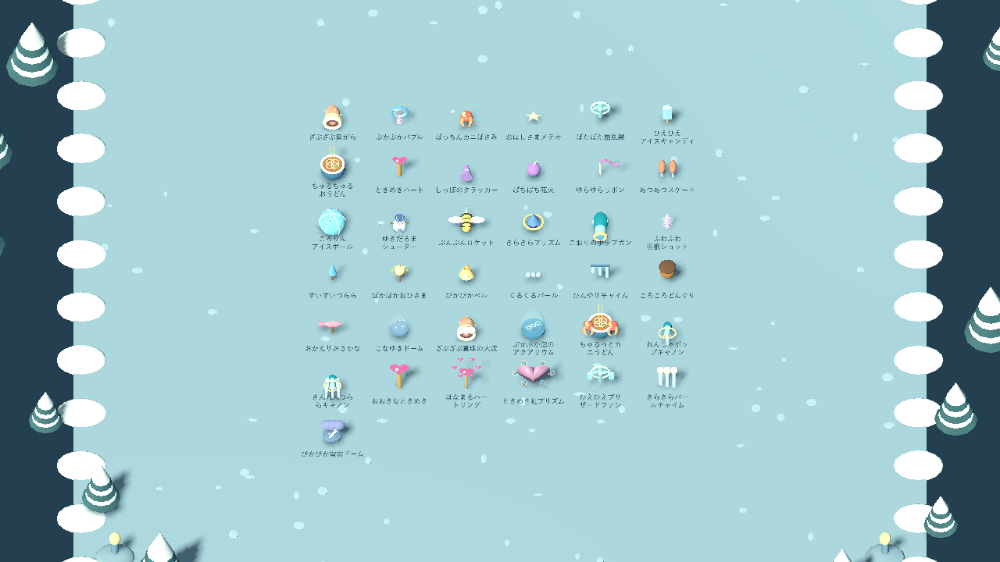

# 武器の名前と見た目

[README](../README.md) · [性能と成長](weapons.md) · [ステージ所属](stages.md)

既存23武器の名前と見た目を整理し、サンゴ浜専用の3武器を加えて基本26武器になりました。**凍結はアイスキャンディと、その合体先ブリザードファンだけ**。くるくるパールは接触攻撃で、防御・ダメージ軽減はありません。

## 名前の対応と個別の実画面

| 以前の名前 | 現在の名前 | 実画面 |
|---|---|---|
| 氷ブラスター | こおりのポップガン | [攻撃を見る](screenshots/weapon-style-frost.png) |
| ハートの波動 | ときめきハート | [攻撃を見る](screenshots/weapon-style-heart.png) |
| 羽根ショット | ふわふわ羽根ショット | [攻撃を見る](screenshots/weapon-style-fan.png) |
| つららランス | すいすいつらら | [攻撃を見る](screenshots/weapon-style-spear.png) |
| おひさまロッド | ぽかぽかおひさま | [攻撃を見る](screenshots/weapon-style-ember.png) |
| かみなりベル | ぴかぴかベル | [攻撃を見る](screenshots/weapon-style-lightning.png) |
| 真珠のまもり | くるくるパール | [攻撃を見る](screenshots/weapon-style-orbit.png) |
| 氷河のチャイム | ひんやりチャイム | [攻撃を見る](screenshots/weapon-style-nova.png) |
| どんぐりボム | ころころどんぐり | [攻撃を見る](screenshots/weapon-style-mine.png) |
| おさかなブーメラン | おかえりおさかな | [攻撃を見る](screenshots/weapon-style-boomerang.png) |
| 星ふるスノードーム | こなゆきドーム | [攻撃を見る](screenshots/weapon-style-storm.png) |
| オーロラリボン | ゆらゆらリボン | [攻撃を見る](screenshots/weapon-style-whip.png) |
| ほのおのスケート | あつあつスケート | [攻撃を見る](screenshots/weapon-style-trail.png) |
| 氷玉ビリヤード | ころりんアイスボール | [攻撃を見る](screenshots/weapon-style-bounce.png) |
| ゆきだるま砲台 | ゆきだるまシューター | [攻撃を見る](screenshots/weapon-style-turret.png) |
| ミツバチロケット | ぶんぶんロケット | [攻撃を見る](screenshots/weapon-style-seeker.png) |
| 極光プリズム | きらきらプリズム | [攻撃を見る](screenshots/weapon-style-beam.png) |
| しっぽの散弾 | しっぽのクラッカー | [攻撃を見る](screenshots/weapon-style-rear_fan.png) |
| うしろ花火 | ぱちぱち花火 | [攻撃を見る](screenshots/weapon-style-rear_bomb.png) |
| ちゅるちゅるおうどん | 変更なし | [攻撃を見る](screenshots/weapon-style-udon.png) |
| ぱたぱた扇風機 | 変更なし | [攻撃を見る](screenshots/weapon-style-gust.png) |
| ひえひえアイスキャンディ | 変更なし | [攻撃を見る](screenshots/weapon-style-popsicle.png) |
| おほしさまメテオ | 変更なし | [攻撃を見る](screenshots/weapon-style-starfall.png) |

## 見分け方

- **装備と攻撃**：装備の飾りは固定位置で軽く上下するだけ。パールだけが周回して接触ダメージを与えます。手持ち・どんぶり・首振り扇風機の配置は従来どおりです。
- **前方と後方**：羽軸のある羽根は前方へ、クラッカーの星形紙片は背後へ飛びます。
- **ベルとチャイム**：稲妻飾りの丸いベルはランダム落雷。長さの違う氷の管3本は周囲へ冷気の波を広げます。
- **雪と星**：こなゆきドームは固定地点の雪片による継続攻撃。メテオは巨大な星が1回着弾します。
- **雪だるま**：にんじんの鼻とは別の砲口が敵へ向き、雪玉を撃ちます。
- **どんぐり**：足元へ短く転がるのは表示だけ。待ち伏せ爆弾の判定位置は固定で、移動し続けません。
- **氷と凍結**：氷粒やつららは命中すると砕けます。敵全体が氷色になり結晶に包まれるのはアイスキャンディの凍結状態です。

Godotで `scenes/weapon_gallery.tscn` を開きF6で装備モデルを一覧できます。キャラクターのモデル一覧にも武器一覧ボタンを追加しました。個別の攻撃はサンドボックスで試せます。

## 進化武器のモデル

基本23武器の装備と別に、進化先8種の専用装備・攻撃モデルを追加しました。サンドボックスで個別に確認できます。

| 進化武器 | 装備と攻撃 | 実画面 |
|---|---|---|
| れんしゃポップキャノン | 太い銃口と光輪、氷粒の高速連射 | [見る](screenshots/evolution-pop_cannon.png) |
| さんれんつららキャノン | 三連の砲身、白い芯の氷槍 | [見る](screenshots/evolution-triple_cannon.png) |
| おおきなときめき | 大きなハート杖と立体的な貫通弾 | [見る](screenshots/evolution-big_heart.png) |
| はなまるハートリング | ハートの花輪、6方向への放射 | [見る](screenshots/evolution-heart_ring.png) |
| ときめき虹プリズム | ハート型飾りと結晶、虹色の光線 | [見る](screenshots/evolution-rainbow_heart.png) |
| ひえひえブリザードファン | 氷菓を付けた扇風機、流線と冷気 | [見る](screenshots/evolution-blizzard_fan.png) |
| きらきらパールチャイム | 真珠付きの氷の管、周回する真珠と波紋 | [見る](screenshots/evolution-pearl_chime.png) |
| ぴかぴか雷雲ドーム | 雲と稲妻を入れたドーム、薄い雷雲と折れ線の稲妻 | [見る](screenshots/evolution-thunder_dome.png) |

## サンゴ浜の新モデル

貝がらは巻き貝から水色の波、バブルは輪付きの泡吹き棒から透明な泡、カニばさみは左右の赤いハサミで攻撃します。[性能と成長](weapons.md)・[敵6種と中ボス4体、オクト](beach.md)。

### 海の3武器の形と動き

- ざぶざぶ貝がら：暗い開口部・厚い縁・突起のある巻き貝。前方へ広がる波に白い波頭と薄い裾を付けています。
- ぷかぷかバブル：握り模様付きの泡吹き棒と二重の輪。漂う泡に淡い桃色・水色の反射光を追加しています。
- ぱっちんカニばさみ：左右の爪を独立した関節にし、命中時の閉じた状態から開く動きを追加。水色の輪が実際の範囲です。

表示のみの変更で、威力・周期・射程・命中回数は維持。Compatibility実画面と `beach_combat_test.gd`（失敗0件）で確認しています。

## 海の合体モデル

真珠の大波は真珠を抱いた巻き貝と巻き上がる波頭、アクアリウムは泡を閉じ込めた水槽と薄い水のドーム、カニうどんは左右にハサミが付いたどんぶりと巻き付く麺で素材を表現します。[仕様と個別実画面](evolutions.md#サンゴ浜の合体進化)。

