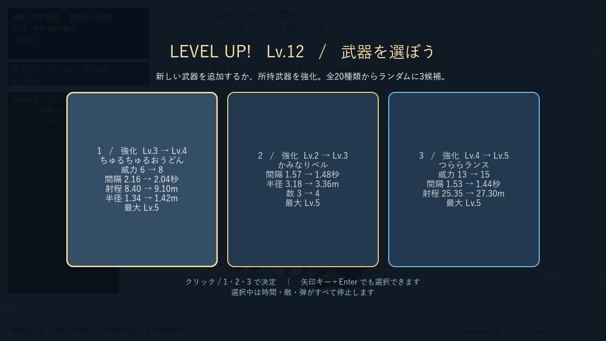
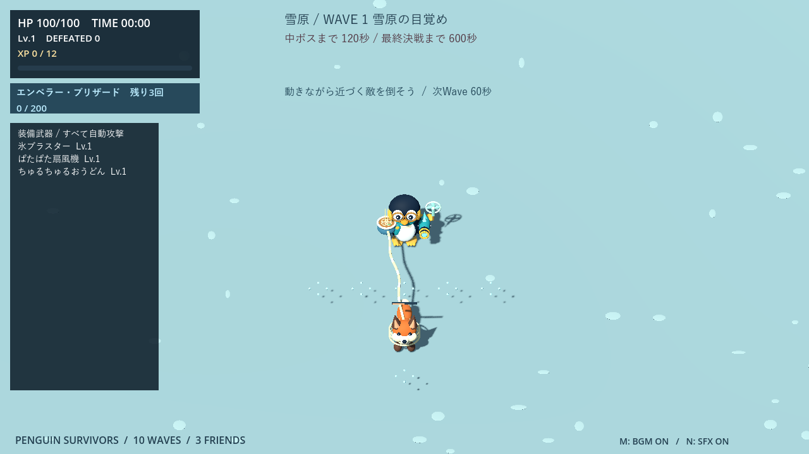
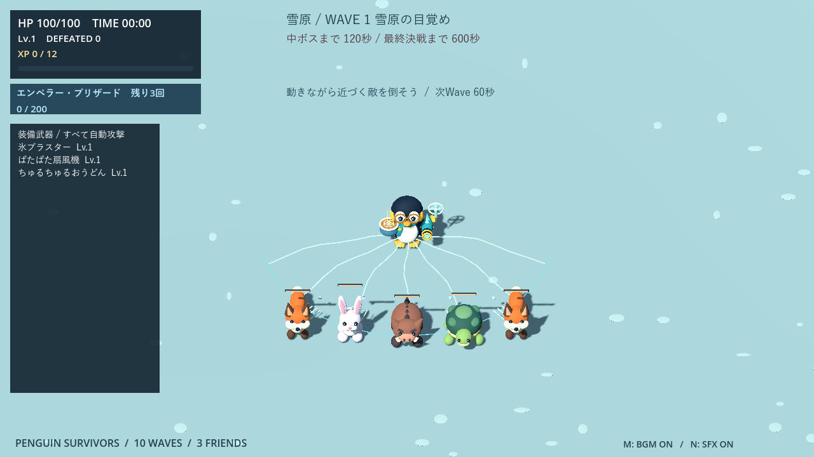
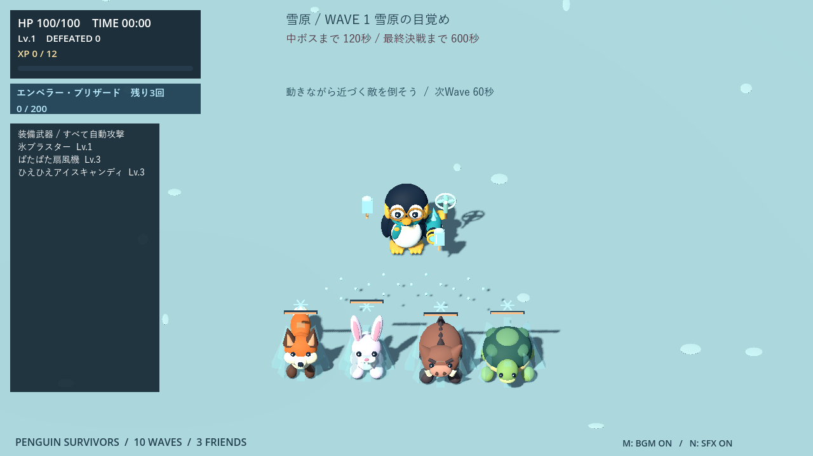
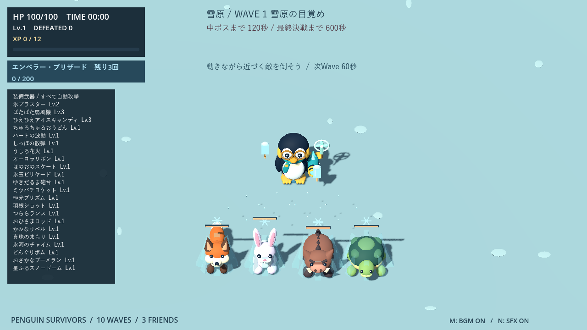

# 武器とアップグレード

[READMEへ戻る](../README.md) · [ステージ](stages.md) · [過去の検証記録](development-history.md)

## 入手と成長

敵を倒すとXPを獲得し、新規武器と所持武器の強化を混ぜた最大3候補から1つ選びます。選択中は戦闘が停止。装備は置き換えず蓄積し、最大22種類を同時に使えます。

- 必要XPは現在レベルをLとして `12 + 8×(L−1) + ceil(1.3×(L−1)²)`。最初は12、次は22。余剰XPは持ち越します。
- 武器はLv.5が上限。最大強化済みは抽選から除外し、候補が2種類以下ならその数を表示します。
- 全武器MAX後は、レベルアップをHP20回復に置き換えます。
- 両キャラとも全武器を入手可能。キャラ固有なのは初期装備と必殺技です。

## 基礎性能一覧

数値はLv.1。自動照準は発射時に狙う方式を指し、発射後の追尾とは異なります。

| 武器 | 攻撃 | 初期ダメージ | 初期間隔 |
| --- | --- | --- | --- |
| ちゅるちゅるおうどん | 11m以内へ麺を伸ばし、周囲を巻き込んで戻る | 往路1＋復路1 | 2.4秒 |
| ぱたぱた扇風機 | 前方160度・6mの敵を3m押し返す | 1 | 2.6秒 |
| ひえひえアイスキャンディ | 自動照準の直進弾。半径1.3mを1秒凍結 | 1 | 3.8秒 |
| ハートの波動 | 12m以内の最寄りへ方向固定の直進弾。最大3体貫通 | 2 / 体 | 0.65秒 |
| 氷ブラスター | 最寄りの敵への連射。メガネペンギンの初期装備 | 1 | 0.28秒 |
| 羽根ショット | 体の前方へ扇状に5発を同時発射 | 2 / 発 | 1.25秒 |
| つららランス | 体の前方へ発射し、直線上の敵を貫通 | 5 | 1.8秒 |
| おひさまロッド | 前方8mの固定地点に0.7秒後に落下・爆発。半径3.2m | 6 | 2.1秒 |
| かみなりベル | 画面内のランダム3地点へ予告付き落雷。各半径3m | 5 / 落雷 | 1.65秒 |
| 真珠のまもり | 半径2.2mを2つの真珠が周回 | 2 / 命中 | 4秒ごとに更新 |
| 氷河のチャイム | 半径4.2mまで広がる全方位の輪 | 2 / 体 | 2.8秒 |
| どんぐりボム | 足元に設置。0.65秒後に作動可能、接近で半径3mの爆発 | 4 | 2.3秒 |
| おさかなブーメラン | 最寄りの敵の方向へ固定楕円を一周して手元へ帰還。往路・復路に各1回命中 | 2 / 命中 | 2.2秒 |
| 星ふるスノードーム | 最寄りの敵の位置に半径2.6m・3.2秒間の固定攻撃範囲を設置 | 1 / 0.6秒 | 3.8秒 |
| オーロラリボン | 前方120度・約3.8mを薙ぎ払い。発動時の向きを保持 | 7 / 体 | 1.6秒 |
| ほのおのスケート | 移動中の足元に半径1.25mの炎。4秒持続、0.8m以上離して設置 | 2 / 0.6秒 | 0.65秒 |
| 氷玉ビリヤード | 最寄りへ撃ち、アリーナ外周で反射。5秒間の貫通弾 | 3 / 命中 | 2.7秒 |
| ゆきだるま砲台 | 8秒間固定され、12m以内の敵へ0.55秒ごとに射撃 | 2 / 発 | 8秒 |
| ミツバチロケット | 3発の追尾弾。3秒間飛行し、標的が倒れると再探索 | 2 / 発 | 2.5秒 |
| 極光プリズム | 最寄りに向けて長さ12mの固定光線。1.3秒間、直線上を継続貫通 | 3 / 0.6秒 | 3.4秒 |
| しっぽの散弾 | 体の背後へ5発を扇状に発射 | 3 / 発 | 1.7秒 |
| うしろ花火 | 背後4.5mへ弧を描いて投げ、0.65秒後に半径3mで爆発 | 8 / 体 | 2.7秒 |

### 狙い方

- **自動照準・追尾・自動設置**：氷ブラスター、ハート、うどん、アイスキャンディ、ブーメラン、スノードーム、氷玉、砲台、ハチ、プリズム。発射後も標的を追うのはミツバチロケットです。
- **前方固定**：羽根、つらら、火球、リボン、扇風機。WASDで向きを合わせ、停止中は最後の向きを使います。
- **後方固定**：しっぽの散弾、うしろ花火。
- **周囲・足元**：真珠、チャイム、どんぐり、スケート。
- **画面内ランダム**：かみなりベル。敵の位置には依存しません。

前方・後方攻撃は発動後に向きを変えても弾道・着弾点を変えません。氷玉は反射し、ブーメランは固定した楕円を一周してから現在の手元へ戻ります。各武器の壁との関係は[城のルール](stages.md)を参照してください。

## アップグレード

### 武器アップグレード方針

**1回の強化が、新しい武器を1つ取ることと同じくらい魅力的な選択になること**を目標にします。新規取得は攻撃方向や対処できる状況を増やし、強化は得意な攻撃の威力・届く距離・巻き込める数を伸ばします。少数の武器を育てる構成と、多種類を組み合わせる構成の両方を成立させる方針です。

- **武器の特徴に合わせて伸ばす。** 直線弾は威力・射程・貫通数、散弾や追尾弾は威力・発射数、範囲攻撃は威力・半径、設置武器は威力・持続を中心に強化します。往復武器は到達距離も伸ばし、元の攻撃方式を保ちます。
- **連射速度だけに頼らない。** 間隔短縮に加えて、届かなかった敵に届く、群れをまとめて倒せるなど、使い勝手にも変化を付けます。
- **複数の倍率が重なる武器は成長を分散する。** 威力・弾数・範囲・持続を同時に大きく増やすと強くなりすぎるため、多発系は威力を伸ばす段階と数を増やす段階を分けます。範囲拡大も、半径以上に面積が増えることを考慮します。
- **完成形をLv.5に置く。** 新規取得のLv.1から4回の強化で完成。最大強化後は抽選対象から外し、別の武器を取得・育成する余地を残します。
- **選ぶ前に効果が分かる表示にする。** 強化候補には、今回変わる威力・間隔・射程・半径・数・持続・貫通数などの変更前後を表示します。

バランスは、同じ選択回数を使った構成同士で比較します。単体への火力だけでなく、群れの処理、攻撃の当てやすさ、前方・後方の対応、城の壁との相性も評価します。「全武器の数値上の火力を同じにする」という意味ではなく、状況と遊び方によって新規取得と強化のどちらにも選ぶ理由がある状態を目指します。過去の比較条件と実測値は[検証記録](development-history.md)に残しています。

### 最大Lv.5、武器に応じて成長

威力に加えて各武器の得意な性能を伸ばします。射程・範囲や攻撃数も増やし、新武器で攻撃方向を増やすか、得意な武器へ集中投資するかを選べます。既存20武器の間隔短縮は最大20%（氷ブラスター・真珠は10%）に抑えています。制御用の2武器は、後述の専用成長表を使用します。

| 武器・系統 | Lv.1 → Lv.5の主な変化 |
|---|---|
| 氷ブラスター | 威力1→5、照準射程12→16.8m |
| ハートの波動 | 威力2→6、射程12→16.8m、貫通3→5体 |
| 羽根ショット／しっぽの散弾 | 威力2→4／3→6、5→7発、射程13.6→19.04m |
| つららランス | 威力5→15、射程19.5→27.3m |
| おひさまロッド／うしろ花火 | 威力6→18／8→24、爆発半径3.2→3.968m／3→3.72m |
| かみなりベル | 威力5→9、3→5地点、半径3→3.72m |
| オーロラリボン | 威力7→21、薙ぎ払い距離3.8→5.32m |
| ほのおのスケート | 威力2→6、半径1.25→1.55m、持続4→5.2秒 |
| 氷玉ビリヤード | 威力3→9、持続5→6.5秒 |
| ゆきだるま砲台 | 威力2→6、照準射程12→16.8m、持続8→10.4秒 |
| ミツバチロケット | 威力2→4、3→5匹、照準射程12→16.8m、持続3→3.9秒 |
| 極光プリズム | 威力3→9、射程12→16.8m、持続1.3→1.69秒 |
| 真珠のまもり | 威力2→4、2→4個、旋回半径2.2→3.08m |
| 氷河のチャイム | 威力2→6、半径4.2→5.208m |
| どんぐりボム | 威力4→12、半径3→3.72m、待機8→10.4秒 |
| おさかなブーメラン | 威力2→6、到達距離9.1→12.74m、寿命2.4→3.12秒 |
| 星ふるスノードーム | 威力1→3、半径2.6→3.224m、持続3.2→4.16秒 |
| ちゅるちゅるおうどん | 威力1→3（往復各1回）、射程11→15.4m、巻き込み半径1.2→1.488m |

多発系はLv.2・4で威力、Lv.3・5で数を伸ばし、同じレベルで両方を急増させない設計です。最大強化武器は候補から外れます。全22武器MAX時だけ、レベルアップをHP20回復へ置き換えます。

## 制御効果のある武器

### ちゅるちゅるおうどん

射程11〜15.4m。麺が0.35秒で伸び、0.9秒で巻き戻ります。先端付近を巻き込み、同じ敵に往路・復路で各1回まで命中。往復それぞれの威力はLv.1で1、Lv.5で3です。

最初につかんだ通常敵に麺の輪を巻き、最大4m引き寄せます。プレイヤーから3m以内には引き込まず、つかんだ敵への復路ダメージは引き寄せ終了時に適用。ボスは引き寄せません。潜行中のモグラは対象外です。

麺は壁・閉門で停止し、通常敵の引き寄せも壁で止まります。ゴースト自身は壁を通過できます。ノックバック中は引き寄せより押し返しを優先します。

### ぱたぱた扇風機

発動時の位置・向きを固定して、前方160度の敵へ1回攻撃。0.6秒かけて外向きに押し返します。敵がいなくても発動するため、発動に合わせて追手へ向き直ると退避路を作れます。

| 武器Lv. | 1 | 2 | 3 | 4 | 5 |
|---|---:|---:|---:|---:|---:|
| ダメージ | 1 | 2 | 2 | 3 | 3 |
| 間隔（秒） | 2.6 | 2.45 | 2.3 | 2.15 | 2.0 |
| 到達距離（m） | 6 | 6.5 | 7 | 7.5 | 8 |
| 押し返し（m） | 3 | 3 | 3.5 | 4 | 4.5 |

同じ敵への重ね掛けはなく、終了後0.6秒は再ノックバック不可。城壁・閉じた門・アリーナ端で止まり、追加の衝突ダメージはありません。ゴーストは門と城壁を通過できます。うどんの引き寄せよりノックバックを優先します。

### ひえひえアイスキャンディ

12m以内の最寄りの敵へ、発射方向を固定した氷菓を1発放ちます。速度11m/秒・判定半径0.3m・最大飛距離12m。最初に命中した敵の位置で砕け、周囲へ1回だけダメージと凍結を与えます。直撃と破裂の二重ダメージはありません。

| 武器Lv. | 1 | 2 | 3 | 4 | 5 |
|---|---:|---:|---:|---:|---:|
| ダメージ | 1 | 2 | 2 | 3 | 3 |
| 間隔（秒） | 3.8 | 3.6 | 3.4 | 3.2 | 3.0 |
| 破裂半径（m） | 1.3 | 1.45 | 1.6 | 1.75 | 1.9 |
| 凍結時間（秒） | 1.0 | 1.0 | 1.2 | 1.2 | 1.4 |

凍結中の命中で時間は延びず、解凍後2秒は再凍結不可。ダメージは受け続けます。壁・閉じた門・射程終端では破裂せず消え、爆風も壁を越えません。

### 状態異常のルールと強化方針

ノックバック・凍結は通常敵と決戦の手下に有効です。中ボス・ラスボスにはダメージだけを与えます。

- 凍結中は移動・攻撃・行動タイマー・接触ダメージを停止。敵を狙うこととダメージを与えることは可能です。攻撃を受けても解凍しません。
- ノックバック中も通常行動と接触ダメージを停止。効果を受けた敵は、自身の予告・突進・横跳びを中断して1秒休止します。凍結中は休止の時計も止まります。
- 発射済みの敵弾・毒雲・独立した着弾予告は消しません。凍った敵も押し返せますが、凍結時間は延長しません。
- 完全に潜ったモグラには無効。潜り始めの演出中なら中断し、地上へ戻します。
- 武器選択とボス演出中は状態と表示も停止。死亡・退場・勝利・再挑戦で解除します。
- 火力を専用の低い成長表に制限し、範囲・押し返し距離・凍結時間へ強化価値を配分。強化カードには特殊効果の変更前後も表示します。
- 氷の結晶は凍結中に表示し、解凍時に砕けます。再凍結待ち中は小さく薄い雪の結晶だけ残ります。専用の風音・発射音・破裂音はNミュートに対応。

## 組み合わせの例

| 構成 | 使い方 |
|---|---|
| リボン＋真珠＋扇風機 | 敵へ向き直り、近距離を攻撃しながら退避路を作る |
| 後方散弾＋花火＋スケート | 追手を背後の攻撃や炎へ誘導する |
| 砲台＋ドーム＋アイスキャンディ | 凍結した敵へ設置攻撃を重ねる |
| ハチ＋ブラスター＋氷玉 | 自動照準を使い、移動と回避へ集中する |
| うどん＋チャイム | 引き寄せた敵を周囲の攻撃で迎撃する |

制御武器だけで火力武器を置き換えると撃破が遅くなります。特に扇風機は前方攻撃なので、逃げ続けるだけでは活かせません。
